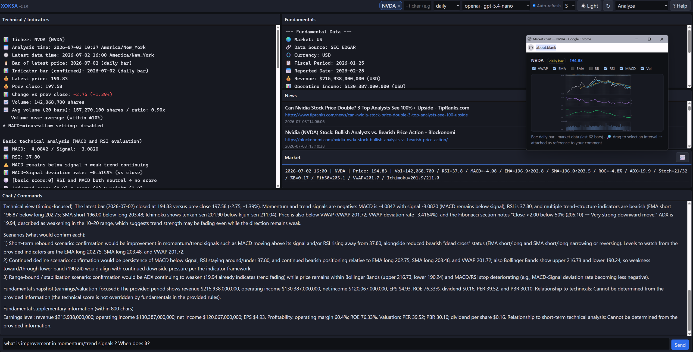
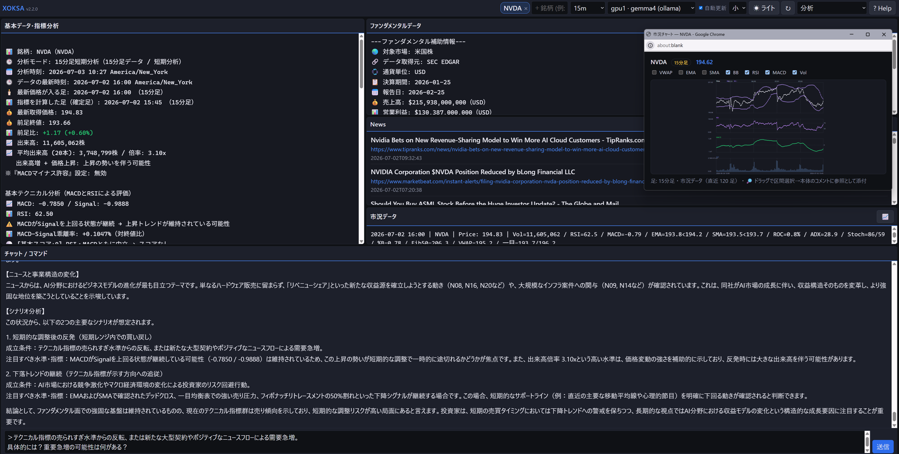

# xoksa v2.9.10

[日本語ドキュメントはこちら。](#ja)

> **Language sync:** English and Japanese descriptions are both authoritative. If a requirement, restriction, exception, command behavior, or operational rule appears in only one language, treat it as applying to both; the missing side is a documentation defect to be updated.

**Technical indicators, company fundamentals, and market news — on one screen. Whatever you don't understand, just ask the AI.**

XOKSA is for anyone who wants to read a stock more clearly — from first-timers to seasoned traders. **Especially if you're starting out**, this is the point: the three things you'd otherwise look up in three different places — **technical** (stock-indicator analysis), **fundamental** (a company's basic figures), and **news** (recent headlines that could move the price) — are together in your browser, and when a term or a number isn't clear, you ask in plain language and get an answer grounded in the real data. As you go deeper, the analysis is yours to tune.

> **XOKSA is not a tool that screens the market and recommends stocks.** For the stocks *you* choose, it lays out what you need to analyse them, compare them, and narrow the field. The investment decision is yours.

  

## ✨ What you can do

- **Ask in plain language** — pull up a stock and ask what's going on; you get a clear answer, not a one-way verdict.
- **The numbers are not the AI's** — every figure is computed by a program written in Rust; the AI's job is to explain those values, not to produce them. XOKSA then checks the AI's answer against those values and removes what does not match. It is a check on the output, not a proof that nothing can slip through — [what it detects, and what it does not](docs/dev-prog/security-design.md), is written down.
- **See it, then ask about it** — drag-select part of the interactive chart and ask the AI about exactly that window.
- **It won't pick for you** — no buy/sell calls; it lays out the chart, indicators, and news so *you* read the situation and decide.
- **Grows with you** — when you want more depth: per-indicator weights, stance (buyer/seller/holder), timeframes 1m–monthly, rule backtesting with an always-on Buy & Hold benchmark, multi-timeframe reads, JP/US fundamentals (J-Quants / SEC EDGAR) + copyright-safe news, and your choice of AI (OpenAI / Gemini / Claude / local Ollama — even a multi-AI "Forum"; a small local model is usable because every number is computed by the program, not the model, and an integrity guard removes figures that do not match the computed values).
- **Yours, on your machine** — everything runs locally; open source (MIT), free to use and modify, commercial or personal.

---

## ⚡ Quick Start

XOKSA ships in **two forms** from the [Releases page](https://github.com/Kozo2000/XOKSA/releases) — pick one. Both are the same tool over one engine and give identical results.

**Desktop app — recommended for most people.** Download it for your system (Windows / macOS) and launch it. Open **Settings** — a separate settings app — to enter your keys (no terminal, nothing else to install), then click **Connect** to open the dashboard.

**CLI — for automation, scripting, and pipelines.** Download the `xoksa` binary, configure it once (`xoksa --init`, or edit `xoksa.env`), then run — e.g. `xoksa -t 9434.T`, or `xoksa serve --ui` for the browser dashboard.

The full walkthrough (API keys, settings) is in the **[Setup Guide](./docs/manual/setup.md)**; every command is in the **[Command Reference](./docs/manual/command-reference.md)**.

---

## 🌐 The dashboard (main experience)

The **local browser dashboard** is the primary way to use XOKSA (`xoksa serve --ui`) — the source-of-truth analysis plus an interactive chart, news, and a chat box, served on your own machine.

It auto-refreshes when you change symbol or timeframe (no "Analyze" button), remembers your theme / font / layout, and the chat runs the same slash-commands you can use in the terminal. Saved backtest rules are kept in a small local file; `--private` runs a no-trace session (nothing written to disk).

→ **[Usage Guide](./docs/manual/usage-guide.md)** — the dashboard, chat commands, and the local LLM.

## 🛡 Reliability & Security

Reliability, security, and reproducibility are taken seriously and implemented with care — memory safety, careful secret handling, deterministic calculations, and a strict source-of-truth (SOT) data model. Market data is fetched from Yahoo with a labelled Stooq fallback (daily) for resilience when Yahoo is unavailable.

**Every shipped release is inspected against the exact binary you download.** A documented shipping inspection covers build integrity, source and dependency gates, security headers, penetration tests, an SBOM, and a multi-engine malware scan — each measured on that binary's hash and recorded per release. In-development lines pass the source and dynamic layers first; the binary-bound checks are recorded once that release's binaries are frozen for shipping. See the [**Security, Reliability & Shipping Inspection**](./docs/dev-prog/security-assessment.md) record. Deeper engineering details are in the **Design and Detailed Specifications** below.

---

## 🚀 Setup and Usage Guides

Guidelines for making the most of xoksa.

Read them in this order:

1. [**Setup & Integration Guide**](./docs/manual/setup.md) — start here: installation, API keys, and using xoksa's output (CSV / JSON / pipelines) in your own tools
2. [**Usage Guide**](./docs/manual/usage-guide.md) — then this: the dashboard (GUI), chat and every slash command (incl. alerts), and the local LLM (Ollama)
3. [**Analysis Guide**](./docs/manual/analysis-guide.md) — the deep one: how to read a stock, every indicator and the total score, and ready-to-use strategies
4. [**Command Reference**](./docs/manual/command-reference.md) — lookup: the full option list and execution examples

## 🛠 Design and Detailed Specifications

For those interested in internal structure and security.

- [**Design Philosophy and Architecture**](./docs/dev-prog/design-philosophy.md)
- [**System Architecture Overview**](./docs/dev-prog/system-design.md) — how the engine, data providers, and the two front-ends fit together
- [**Security Design**](./docs/dev-prog/security-design.md) — threat model, data classification, and the design-level controls
- [**Security, Reliability & Shipping Inspection**](./docs/dev-prog/security-assessment.md) — data sources & failover, the point-in-time security review + dynamic-testing playbook, and the per-release shipping-inspection evidence
- [**Source Code Map**](./docs/dev-prog/source-map.md) — a file-by-file map of the codebase, for navigating or contributing
- **Version Management** — Two documents cover version changes. They serve different purposes:
  - [**CHANGELOG.md**](./CHANGELOG.md) — Follows a defined format ([Keep a Changelog](https://keepachangelog.com/en/1.0.0/)); records the facts of each change.
  - [**version-history.md**](./docs/dev-prog/version-history.md) — Free-form notes from the development team: content the team wants to preserve in history and communicate to users.

---

## ⚠️ Important Notice Regarding Investment (Disclaimer)

xoksa is a "judgment support tool" that presents objective analysis results based on technical indicators and news, and is not intended for investment solicitation.

- **Your own responsibility**: All investment decisions must be made at your own responsibility. Analysis results from this tool do not guarantee profits.
- **Accuracy of information**: Errors may occur in external market data APIs and LLM outputs.
- **Market data source**: The default market data source uses a Yahoo Finance-compatible public endpoint, with a labelled Stooq fallback (daily only) for resilience. Since neither is a connection that presupposes stability as an official API, it may become unavailable without notice due to specification changes, restriction tightening, or response format changes by the provider.
- **Liability**: The author assumes no responsibility for any losses arising from the use of this tool.

---

## 🤝 Usage Request

xoksa is freely available under the MIT License. However, we would be happy to hear from you when using it, for the following reasons:

- To understand how users are leveraging the tool, strengthening future feature improvements and support.
- We may be able to provide consultation and advice on commercial use or production environment usage.

### 🌟 Contact

We especially welcome contact in the following cases:

- Sharing results / achievements from using the software.
- Inquiries about commercial use or customization needs.

📧 **Email**: info@xoksa.jp

---

## 🤖 AI-assisted development

XOKSA is designed, specified, and reviewed by its human author. The implementation is written with AI coding assistants — **Claude Code** (Anthropic) and **Codex** (OpenAI) — and every change, regardless of who typed it, passes the same gates: the author's review, the test suite, dependency scanning, and the per-release shipping inspection measured on the exact shipped binaries. (This is about how XOKSA is *built*; how the app uses AI at *runtime* — computed numbers, AI explains only — is described above.)

---

## ⚖️ License (MIT License)

This project is published under the **MIT License**. It can be freely used for commercial and personal purposes.

Copyright (c) 2026 Kozo2000

---

# xoksa v2.9.10

> **言語同期:** 英語と日本語の記載はいずれも有効です。要件・制約・例外・コマンド挙動・運用ルールが片方の言語にだけ存在する場合でも、両方に適用されます。欠落している側は文書不備として更新対象です。

**テクニカル指標・企業のファンダメンタル・関連ニュースを、ひとつの画面で。わからないことは、AIに聞くだけ。**

XOKSA は、株を読み解きたい人のための道具です——初心者から上級者まで。**特に、始めたばかりの人**にうれしいのは、ふだんなら別々に調べる3つ——**テクニカル**（株式の指標分析）・**ファンダメンタル**（企業の基礎情報）・**ニュース**（株価に影響しそうな最新ニュース）——が同じ画面にそろっていて、わからない用語や数値をふつうの言葉でAIに聞けること。答えは実際のデータに基づいて返ります。そして慣れてきたら、分析は自分好みに調整できます。

> **XOKSA は市場から銘柄を選定・推薦するツールではありません。** 利用者が選んだ銘柄について、分析・比較・候補の絞り込みに必要な材料を提示します。最終的な投資判断は利用者自身が行います。

  

## ✨ できること

- **ふつうの言葉で聞ける** — 銘柄を開いて「今どうなってる？」と聞くだけ。一方的な結論ではなく、分かる答えが返る。
- **数値は AI のものではない** — すべての数値は Rust 言語で記述されたプログラムが算出します。AI の仕事はその値を説明することであって、値を出すことではありません。XOKSA は AI の回答をその確定値と照合し、合わない箇所を取り除きます。これは出力に対する検査であって、何もすり抜けないことの証明ではありません——[何を検出し、何を検出しないか](docs/dev-prog/security-design.md)は文書に明記しています。
- **見て、その場を聞く** — 対話的チャートで気になる区間をドラッグ選択し、まさにそこについて AI に質問。
- **銘柄は選んでくれない** — 売り買いは指図しない。チャート・指標・ニュースを並べ、状況を読んで判断するのは*あなた*。
- **あなたと一緒に育つ** — もっと踏み込みたくなったら：指標ごとの重み、スタンス（買い/売り/保有）、足（1分〜月足）、Buy&Hold 併記のルールバックテスト、マルチタイムフレーム、日米ファンダ（J-Quants / SEC EDGAR）＋著作権に配慮したニュース、AI も自由に選択（OpenAI / Gemini / Claude / ローカル Ollama、複数 AI の合議「Forum」も。数値はすべてプログラム側で計算するので小さなローカルモデルでも実用になり、確定値と合わない数値は整合性ガードが取り除きます）。
- **あなたの手元で** — すべてローカル動作。オープンソース（MIT）で自由に使える・改変できる。

---

## ⚡ Quick Start

XOKSA は [Releases ページ](https://github.com/Kozo2000/XOKSA/releases) から**2つの形態**で配布します。どちらか選んでください——同じエンジン上の同じツールで、結果は同一です。

**デスクトップアプリ — 多くの人におすすめ。** お使いのOS（Windows / macOS）用をダウンロードして起動するだけ。**設定**（独立した設定アプリ）を開いてキーを入力し（ターミナル不要・別途インストール不要）、**接続**を押すとダッシュボードが開きます。

**CLI — 自動化・スクリプト・パイプライン向け。** `xoksa` バイナリをダウンロードし、一度だけ設定（`xoksa --init` または `xoksa.env` を編集）してから実行——例 `xoksa -t 9434.T`、ブラウザのダッシュボードは `xoksa serve --ui`。

APIキー・各種設定を含む手順は **[セットアップガイド](./docs/manual/setup.md)**、全コマンドは **[コマンドリファレンス](./docs/manual/command-reference.md)** にあります。

---

## 🌐 ダッシュボード（主役）

XOKSA の主役は**ローカルのブラウザ・ダッシュボード**です（`xoksa serve --ui`）——確定(SOT)分析に加え、対話的なチャート・ニュース・チャット欄。あなたの PC 上で動きます。

銘柄や足を変えると自動更新（手動 Analyze 不要）、テーマ／フォント／レイアウトを記憶し、チャットはターミナル版と同じスラッシュコマンドが使えます。保存したバックテストのルールは小さなローカルファイルに保存されます。`--private` は痕跡を残さない実行（ディスクに何も書きません）。

→ **[使い方ガイド](./docs/manual/usage-guide.md)** — ダッシュボード・チャットコマンド・ローカルLLM。

## 🛡 信頼性とセキュリティ

信頼性・セキュリティ・再現性を重視し、丁寧に実装しています——メモリ安全性、機密情報の慎重な取り扱い、決定的な計算、厳格な確定データモデル（SOT）。市場データは Yahoo から取得し、Yahoo が使えないときの堅牢化としてラベル付きの Stooq フォールバック（日足）を備えます。

**出荷する各リリースは、配布する現物のバイナリそのものを検査してから出しています。** 出荷検査として、ビルド整合性・ソースと依存の各ゲート・セキュリティヘッダ・侵入テスト・SBOM・多エンジンのマルウェアスキャンを、そのバイナリのハッシュに紐づけて実測し、リリースごとに記録します。開発中のラインはまずソース層・動的層の検査を通し、バイナリに紐づく項目はそのリリースのバイナリを出荷用に確定した時点で記録します。詳細は[**セキュリティ・信頼性・出荷検査**](./docs/dev-prog/security-assessment.md)の記録をご覧ください。より踏み込んだ実装の詳細は、下記の**設計・詳細仕様**（開発者向けドキュメント）に記載しています。

---

## 🚀 導入と活用ガイド

xoksaを最大限に活用するためのガイドラインです。

この順に読んでください。

1. [**セットアップ・連携ガイド**](./docs/manual/setup.md) — まずここから：導入・APIキー・出力（CSV / JSON / パイプライン）の他ツール活用
2. [**使い方ガイド**](./docs/manual/usage-guide.md) — 次にこれ：ダッシュボード（GUI）・チャットと全スラッシュコマンド（アラート含む）・ローカルLLM（Ollama）
3. [**分析ガイド**](./docs/manual/analysis-guide.md) — 読み込む1冊：銘柄の読み方・各指標と総合スコア・実戦で使える戦略
4. [**コマンドリファレンス**](./docs/manual/command-reference.md) — 逆引き：全オプション一覧と実行例

## 🛠 設計・詳細仕様

内部構造やセキュリティに関心がある方はこちらを参照してください。

- [**設計思想とアーキテクチャ**](./docs/dev-prog/design-philosophy.md)
- [**システム・アーキテクチャ概要**](./docs/dev-prog/system-design.md) — エンジン・データプロバイダ・2つのフロントエンドの組み合わせ方
- [**セキュリティ設計**](./docs/dev-prog/security-design.md) — 脅威モデル・データ分類・設計レベルの防御
- [**セキュリティ・信頼性・出荷検査**](./docs/dev-prog/security-assessment.md) — データソースとフェイルオーバー・時点セキュリティレビュー＋動的テスト playbook・リリース別の出荷検査証跡
- [**ソースコードマップ**](./docs/dev-prog/source-map.md) — ファイル単位のコード地図。読解・コントリビュート用
- **バージョン管理** — バージョンごとの変更内容は以下の2つのドキュメントで確認できます。それぞれ目的が異なります。
  - [**CHANGELOG.md**](./CHANGELOG.md) — 定められたフォーマットに従い、変更した事実を記述しています。
  - [**version-history.md**](./docs/dev-prog/version-history.md) — 開発側が履歴に残したい内容・ユーザーに伝えたい内容を自由記載で記述しています。

---

## ⚠️ 投資に関する重要事項（免責事項）

xoksaはテクニカル指標やニュースを基に客観的な分析結果を提示する「判断支援ツール」であり、投資勧誘を目的としたものではありません。

- **自己責任**: 投資判断は必ずご自身の責任で行ってください。本ツールによる分析結果は利益を保証するものではありません。
- **情報の正確性**: 外部市場データAPIやLLMの出力には誤差が生じる可能性があります。
- **市場データ取得元**: 既定の市場データ取得元は Yahoo Finance 互換の公開エンドポイントを利用し、堅牢化のためラベル付きの Stooq フォールバック（日足のみ）を備えます。いずれも公式APIとしての安定性を前提とした連携ではないため、提供元の仕様変更・制限強化・レスポンス形式変更により、予告なく利用できなくなる可能性があります。
- **損害賠償**: 本ツールの利用により生じたいかなる損失についても、作者は一切の責任を負いません。

---

## 🤝 ご利用に関するお願い

xoksaはMITライセンスのもとで自由に利用可能です。しかし、以下の理由からご利用いただく際にはぜひご連絡いただければ幸いです：

- ユーザーの活用方法を知ることで、今後の機能改善やサポート体制を強化するため。
- 商用利用やプロダクション環境での利用についても、協議やアドバイスをご提供できる場合があります。

### 🌟 ご連絡先

特に以下のケースでのご連絡をお待ちしております：

- ソフトウェアを利用した実績／成果の共有。
- 商用利用やカスタマイズニーズの相談。

📧 **Email**: info@xoksa.jp

---

## 🤖 AI 支援開発

XOKSA の設計・仕様・レビュー・最終判断は人間の作者が行っています。実装コーディングは AI アシスタント——**Claude Code**（Anthropic）と **Codex**（OpenAI）——の支援で書かれており、誰が書いた変更であっても同じゲート（作者レビュー・テストスイート・依存スキャン・出荷現物ハッシュに紐づく出荷検査）を通ります。（これは XOKSA の*作り方*の話です。アプリが*実行時*に AI をどう使うか——数値は計算、AI は説明のみ——は上記のとおりです。）

---

## ⚖️ ライセンス (MIT License)

本プロジェクトは **MIT License** の下で公開されています。商用・個人利用を問わず、自由にご活用いただけます。

Copyright (c) 2026 Kozo2000
