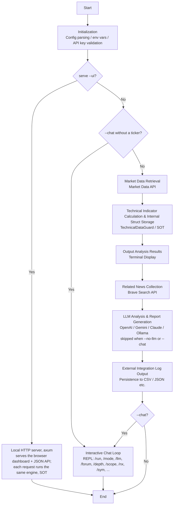
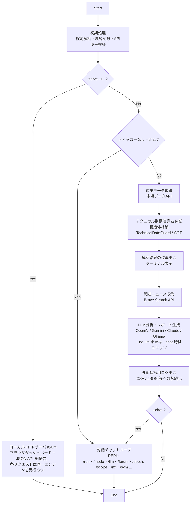

# Design Philosophy

[日本語ドキュメントはこちら。](#ja)

> **Language sync:** English and Japanese descriptions are both authoritative. If a requirement, restriction, exception, command behavior, or operational rule appears in only one language, treat it as applying to both; the missing side is a documentation defect to be updated.

This document records the background, design decisions, and guiding principles behind xoksa's development. **The principles stated here constitute absolute rules for this project.** All implementation decisions must be consistent with them.

---

## 0. Technology Selection: Why Rust

Context: a solo project today, designed to scale to a team later.

Two requirements narrowed the field before any language was named. The engine must be **fast with zero-overhead abstractions and no VM tax**, and it must have **no GC pauses** — deterministic latency and explicit lifetime control instead of runtime garbage collection. That left **C++ and Rust**; both meet the performance and control requirements, so the deciding question was maintenance and safety over time.

**C++ was seriously considered.** It remains a first-class option with a deep ecosystem and outstanding performance, and in capable hands it ships robust systems every day. Choosing Rust is not a claim of superiority — it is a claim of fit for a solo workflow today and smooth collaboration tomorrow.

What decided it:

- **Failures surface at compile time.** Ownership/borrowing and the borrow checker turn aliasing and lifetime mistakes into compile errors rather than late tickets. For a single maintainer that means time spent on domain logic instead of chasing memory hazards afterwards. (The *security* consequence of the same property is §4.4; this is the selection rationale.)
- **Type-safe plumbing with minimal glue.** `clap` (CLI), `reqwest` (HTTP), and `serde` (JSON) mapped cleanly onto xoksa's needs, keeping behaviour predictable without heavy scaffolding.

Built to welcome a team later: modular structure with typed domain models keeps responsibility boundaries clear, a fixed toolchain with `rustfmt` / `clippy` reduces review friction, and FFI remains available if existing C/C++ libraries ever need binding.

C++ would also have been viable with disciplined idioms, sanitizers, and thorough reviews. Given a solo maintainer and short release cycles, leaning on compile-time guarantees aligned better with the project's risk profile and cadence.

**Bottom line:** xoksa uses Rust so one person can ship safely today and a team can build on it tomorrow — not because C++ can't, but because this stack fits these constraints.

---

## 1. Development Motivation: Overcoming Hallucinations

A major challenge in applying AI (LLMs) to financial analysis is "plausible falsehoods (hallucinations)."
xoksa was designed with the purpose of fundamentally increasing analysis reliability — not by having the LLM make "raw guesses," but by **providing "verified, objective data" as context**.

- **Truth over Guesswork**: Technical indicator calculations are not delegated to the LLM; only data backed by rigorous numerical computation in Rust is passed.
- **Objective Analysis**: Logical reasoning based on pure numerical data, free from emotions and biases, is drawn from the AI.

---

## 2. Runtime Flow Chart

xoksa's main process proceeds according to the following flow.



---

## 3. Configuration Initialization and Priority

Setting values are evaluated in the following priority order, with higher tiers overriding lower tiers:

1. **Command-Line Options (highest priority)** — temporary execution-time changes
2. **`xoksa.env` (environment configuration file)** — user's persistent settings
3. **Hardcoded Defaults** — stable initial state when no explicit setting is present

The `-I` (`--no-env-indicators`) option deliberately ignores indicator settings in `.env` and runs with default values — a calibration function for returning to the tool's objective perspective.

---

## 4. The Core of Architecture: SOT (Source of Truth)

SOT is the most important concept in this design. All implementation decisions are measured against it.

### 4.1 Data Integrity: TechnicalDataGuard

This is one of the **two** boundaries around confirmed data; the fundamental side is [§4.5](#45-fundamental-data-one-validated-way-in), of a different shape for the same reason.

`TechnicalDataGuard` securely encapsulates acquired data and calculation results, preventing unauthorized overwrites while providing consistent values to all output paths.

- **Single-execution calculation**: Each indicator is calculated exactly once per execution cycle. The same pre-calculated data is shared across all output formats — terminal display, LLM prompt, CSV/JSON log, and the Web UI / JSON API — ensuring consistency regardless of how many times or in what form a value is presented.
- **Access restriction**: Direct access to internal data structures is restricted. All access is forced through the guard, structurally preventing unintended overwrites and data inconsistencies.
- **Limited interface**: Only the minimum necessary read/write interfaces for each process are exposed, maintaining data integrity.

### 4.2 Code Redundancy Rejection

Redundancy in code is rejected. When functionality is needed, reusing existing functions is prioritized over creating new implementations. Duplicate functions accumulate subtle behavioral differences over time, introduce latent bugs when copies drift out of sync, and make maintenance a game of whack-a-mole.

**Rule**: Before writing any new utility function, verify that an equivalent does not already exist in the codebase. If one exists, promote it to `pub(crate)` and share it. "Called from a different module" does not justify duplication. The location of the caller is irrelevant — what matters is that one implementation exists in exactly one place.

### 4.3 Code Readability

Code must be written so that any engineer can understand it without explanation. Verbose branching and deeply nested structure actively degrade maintainability and review quality.

**Rules**:
- Do not overuse `if` chains for language or condition branching. Consolidate into a single `match` block per logical unit.
- Do not nest loops or conditional blocks beyond two levels. Flatten structure using early returns, pattern matching, and guard clauses.
- Every line added will be read by another engineer. Write for the reader, not the compiler.

### 4.4 Security-First

Given the nature of handling financial data and API keys:

- **Memory safety**: Rust's type system and ownership model prevent memory leaks and segmentation errors structurally.
- **Boundary sanitization**: External inputs (ticker symbols, news queries, file paths) are subject to permitted character restrictions and control character removal.
- **API key handling**: Keys are obtained on-demand immediately before use and zeroed from memory immediately after via the `zeroize` crate. Keys are never held in memory at rest or exposed in logs or debug output.

For full detail on security implementation, see [security-design.md](./security-design.md).

### 4.5 Fundamental Data: One Validated Way In

Fundamental data (`FundamentalData`) has its own access boundary, of a different shape from `TechnicalDataGuard` but for the same reason: confirmed data must be reachable only through a validated path.

- **No unchecked way in.** Every field is private and every write path validates what it writes, so data that has not passed the checks cannot be displayed, logged or handed to an LLM. The initial construction from a provider's result is concentrated in `build`, which takes the in-flight `FundamentalInputs`; `Default` yields an empty value with no figures; a later BPS or price update goes through a validated public method that refreshes the dependent ratios with it. The guarantee is that no entrance skips the checks, not that there is only one entrance. Non-finite figures are refused; a legitimate zero and a meaningful negative (a loss, a negative EPS) are kept.
- **Ratios derived inside the confirmed data, once.** PER / PBR / ROE are computed in `build`, from validated inputs — not separately in each provider path and not per display path. Division by zero and overflow leave a ratio undefined rather than producing infinity, and the percentage helpers return nothing rather than a non-finite value.
- **Derived values cannot go stale.** The price a ratio came from travels with it, and a changed input or price recomputes the ratios, so a ratio cannot survive beside inputs that have moved on.

> **Why this changed.** This section used to argue that no boundary was needed because the data was *build-once-read-many* and validated at the fetch/parse boundary. Both halves stopped holding: the ratios are recomputed when the price moves (so there **is** a write surface), and the same PER/PBR/ROE formulas had been duplicated in each provider path, which is exactly the divergence a single construction path prevents. The shape differs from the technical guard — a validated constructor rather than a setter-per-field wrapper — because the data's lifecycle differs; the guarantee is the same.

---

## 5. Reasons for Adopting Async Processing (`tokio`)

The main function proceeds sequentially from data retrieval to LLM analysis. `tokio` is adopted for two reasons:

- **Ecosystem compatibility**: Major Rust network I/O libraries (`reqwest`) presuppose async execution. Using standard async patterns maintains code readability and maintainability.
- **Foundation for parallel comparison**: The true value of an in-process async runtime lies in future inter-ticker correlation analysis. `tokio` is selected as the foundation for controlling multiple async tasks within a single context.

---

## 6. Tool Positioning

### Decision support, not stock recommendation

xoksa **never recommends or picks stocks** — by deliberate design, not omission. Many AI stock tools drift the other way: the AI chooses the ticker, states a verdict up front, and nudges you to take it on faith. For a tool you run yourself, on your own money, that is exactly the wrong thing to automate.

xoksa was built for a different, concrete problem: you look at a chart and don't know what to read; you understand what an indicator *means* but can't tell what it implies *for this stock*; and in that moment you want to ask someone — not for a verdict, but to understand the reasoning. So xoksa's job is to **organize the material for judgment** — chart, indicators, news, all reduced to source-of-truth numbers computed in Rust — and let the AI *explain* them, so **you** read the situation and decide. It hands you the basis for a decision, never the decision.

This is a rule about **initiative, not silence.** xoksa never *volunteers* a stock pick or a buy/sell verdict, and never prescribes specific entry, profit-taking, or stop-loss order prices. But when you *explicitly ask* for a judgment — "is now a good time to buy?" — it does not retreat into a non-answer: it gives a grounded, conditional read — which way the data leans and the level or condition that would change that read — stated as a view on the computed data, not a guarantee. The decision, and the order, stay yours.

### Approachable for beginners, deep for experts

The primary benefit is concrete and beginner-facing: the three things a newcomer would otherwise look up separately — **technical** (indicator analysis), **fundamental** (a company's basic figures), and **news** — are brought onto one screen, and anything unclear can be asked of the AI in plain language. Nothing has to be configured to get a first answer.

Depth is opt-in, not upfront: per-indicator weights, buyer/seller/holder stance, timeframes, rule backtesting, multi-timeframe reads, and the choice of AI (cloud or local) are all available when wanted. The same tool therefore serves a beginner and grows into an expert instrument without splitting into a second product. This is a design constraint, not marketing copy: **complexity must never be a prerequisite for the first answer.**

### Design Principles
- **Flexibility**: Advanced customizability via CLI options — and the GUI honors the same settings (one config).
- **Transparency**: Users can always track what calculations were performed and what news was referenced.

### One Engine, Multiple Front-Ends (UX / engine separation)

The presentation layer and the calculation engine are deliberately decoupled. All analysis — market-data fetch, indicator computation, and the LLM call — lives in a single engine binary (`xoksa`), the sole source of truth for every number. Each front-end is a thin layer that drives that one engine and renders what it produces; none computes anything itself, so all yield **identical results (SOT)**.

```
CLI ──┐
      ├──▶  xoksa engine   (data · indicators · LLM = the single source of truth)
GUI ──┘
```

- **CLI**: scripting, pipelines, and embedding as a backend for other tools — the most universal integration method — with native performance and minimal intermediary overhead.
- **Local browser dashboard (GUI)**: a Rust/WASM (Leptos) presentation layer that talks to the engine only over the JSON API. It is served by the binary's **own built-in HTTP server (axum)** — **no Apache/nginx, no separate application server, and no language runtime (Node/PHP/Python)**. Local-first (default host `127.0.0.1`; `--host` binds elsewhere for remote / API use).
- **Desktop app (GUI)**: a **Tauri** connection shell that hosts the engine's dashboard in an OS-native WebView, with a companion **settings app** (`xoksa-setup`) for configuration. Neither links any engine code: the desktop launches the `xoksa` engine binary shipped beside it as a child process (`xoksa serve`), and the settings app drives the engine's config subcommands (`xoksa apply-config`, `config-json`, …). Together they lower the barrier for users who won't open a terminal.
- **Why this matters**: a feature added or changed once propagates to every surface, and the SOT boundary guarantees a command never behaves differently across CLI, dashboard, and desktop.

### Why a Separate Desktop Binary, and Why Tauri

Making the desktop app a **separate binary** (its own workspace) is deliberate, for two reasons:

- **The CLI stays lean and self-contained.** A GUI needs an OS WebView and a windowing toolkit; folding those into the `xoksa` CLI would bloat a tool whose value is being one small, dependency-light, scriptable executable. Keeping the desktop in its own crate means the CLI binary gains **zero** Tauri/WebView dependency. The result is two artifacts over one engine — a lean CLI for automation and integration, a friendly app for interactive use. Neither surface is *more capable* than the other: the analysis is identical (SOT). They differ only in **how you drive it** — the CLI slots into batch jobs, pipelines, and other command-line tools; the desktop app is for interactive, point-and-click use.
- **One engine, no fork.** The desktop links no engine code — its crate has no dependency on `xoksa`, so it cannot compile any analysis logic. It drives the single engine binary as a child process, exactly as the CLI drives it directly. There is one engine, so SOT holds across all front-ends by construction.

**Why Tauri.** Tauri is a mature, widely-used, Rust-native desktop platform, chosen over the alternatives for reasons that fit this project:

- **Rust-native.** The front-end is Rust, so launching and speaking to the Rust engine binary is a small, typed boundary — the engine subcommands (the desktop: `serve`; the settings app: `apply-config`, `config-json`, …) — with no second language runtime to manage.
- **OS-native WebView, small footprint.** Tauri renders through the platform WebView (WebView2 / WKWebView / WebKitGTK) instead of bundling a whole browser (as Electron does), keeping the app small and its dependency surface modest — consistent with xoksa's lean-binary values.
- **Refined look & feel on a proven platform.** Using a well-established, excellent platform let us give beginners a polished, native-feeling window and setup experience — a refined **look and feel** — without hand-rolling GUI plumbing or forking the engine. The presentation improves; the SOT engine underneath does not change.
- **Least-privilege, signable.** Tauri's capability model grants the WebView only what it needs, and its bundler produces signable, distributable packages per OS — both important for a beginner-facing app (see [security-design.md §6](./security-design.md)).

---

## 7. LLM Integration Philosophy

### 7.1 Truth Over Guesswork

The LLM's role is strictly limited to explaining pre-calculated Rust results in natural language. It does not perform calculations, make decisions, or create facts:

- Numerical calculations, scoring, market data formatting, and fundamental value retrieval are completed on the Rust side before the LLM is called.
- The LLM receives only verified, objective data as context.
- Mandatory guard constraints (`CHAT_CONSTRAINT`, system prompt rules) structurally suppress fact creation outside the provided input data.

**General reasoning vs. fabricated facts — what the guard actually forbids.** The prohibition is on *fabricating ticker-specific facts*: inventing numbers, news, events, dates, or proper nouns not in the input, or restating them as confirmed. It is **not** a ban on thinking. The LLM may reason with general market, macro, seasonal, and geopolitical concepts, and may engage a premise the user raises (e.g. "if there's a summer lull and a Gulf-shipping disruption…"), as long as it is framed as general reasoning and never presented as a confirmed fact about the ticker. This is exactly what the `/scope` axis governs (narrow → input only; wide → general reasoning welcome). Provided **news titles** may likewise be used as topic/sentiment signals; only article *bodies* are off-limits (they are not fetched). A guard that refused all of this would be a safety scissor that cannot cut — safe and useless. The line held is fabrication, not thought.

**Forecasting (opt-in):** As an analysis-support tool, xoksa provides a forecasting capability, switchable per session via `/cast` (off / soft / bold). The prices, scores, and thresholds that form the basis of any forecast are the confirmed values computed by the program; the LLM never rewrites or fabricates those computed values themselves. A forecast is a forward projection grounded on the confirmed values, labeled as a prediction and kept distinct from confirmed data. Likewise, `/depth` (shallow / mid / deep) tunes how far the LLM interprets the confirmed data, without introducing any new numbers.

### 7.2 News Inputs: Titles and URLs Only

News handling intentionally avoids full article ingestion by default. This is both an engineering decision and a copyright-risk control:

- XOKSA passes news titles, publication time when available, and URL as confirmation candidates.
- Article bodies are not fetched, stored, summarized, or sent to the LLM by the standard news flow.
- The LLM may classify titles by confirmation priority, but must not imply that it read the article body or infer unverifiable content from the title alone.
- News triage output is intentionally plain text. Markdown tables, ruled layouts, and ASCII-art-like formatting are avoided because CLI output is displayed as raw text; URLs are separated with blank lines for readability.
- URLs are shown so users can follow the original publisher when a title appears important.

This keeps the LLM's role aligned with SOT: it can organize what XOKSA retrieved, but the article content itself is not treated as read evidence unless the user separately provides it.

### 7.3 Local LLMs as Assistants

Local LLMs (Ollama) are treated as assistants that explain results already calculated by Rust — not as computing principals. When local LLM output quality fluctuates, the product's responsibility is not to optimize for each model, but to:

- Treat `TechnicalDataGuard`, fundamental retrieval results, and news input as Source of Truth.
- Never delegate numerical calculations, unit conversions, recalculations, or price target derivations to the LLM.
- Avoid hardcoded branching by model name. Handle capability differences with Ollama-common parameters and API-response-based detection, not model-name conditionals.
- Adapt to the host and the model's runtime behaviour instead of asking the user to tune it. Two examples, both keyed on the runtime response rather than the model name: (a) when Ollama refuses a request because the model plus its `num_ctx`-driven KV cache does not fit in memory, the request steps `num_ctx` down (32768 → 16384 → … → 2048) and retries, so a local model runs on the machine it is on rather than returning a hard out-of-memory error; (b) when a reasoning model spends its whole `num_predict` budget on hidden thinking and returns an empty answer (`done_reason=length`), the request retries once with reduced reasoning effort (`think=low`) so a usable answer fits. This is the same API-behaviour-driven retry principle as the guard (§7.4).

### 7.4 Output Consistency and Guard Design

For Ollama output, xoksa performs consistency checks to detect and exclude problematic content while preserving safe explanations. The approach is graduated: superior models can naturally explain input values; with unstable models, only detected dangerous content is dropped.

Guard logic responds to API behavior (e.g., `temperature` not supported → retry without it), not model names. This ensures the guard remains valid as models evolve without requiring code changes.

See [usage-guide.md](../manual/usage-guide.md) for operational details, benchmark usage, and debug commands.

### 7.5 Debate Mode: LLM Opinions as Non-SOT Review Material

Chat mode can switch LLM engines during a session. Debate mode uses that property to let one LLM critically review another LLM's response, while preserving the same SOT boundary:

- Other LLM responses are treated as **opinions**, not facts.
- XOKSA's Rust-computed indicators, retrieved market/fundamental data, and loaded news remain the only Source of Truth.
- Debate Buffer stores bounded excerpts only, not the full transcript, to avoid uncontrolled token growth.
- Guard boilerplate and `/forum crit` responses are not stored back into Debate Buffer; the buffer should contain review targets, not self-referential meta-output.
- `/forum crit` uses a dedicated prompt with SOT Coverage (`technical`, `fundamental`, `news_titles`) and reviews only the latest Debate Buffer entry. If a claim is not covered by SOT, it is labeled unverified rather than treated as fact.
- The default mode is `summary`; users can switch to `claims` for detailed claim extraction, or disable with `off`.
- No model-name-specific tuning is used. Debate mode is a generic prompt-context feature and must work across cloud and local LLMs.

This design lets XOKSA act as a critical thinking workspace without allowing prior model output to contaminate the data layer.

---

## 8. Architecture Overview

The engine is split into focused modules: `config`, `market`, `technical`, `llm`, `news`, `render`, `render_indicators`, `app`, `output`, `prompt`, `bootstrap`, `traits`, `utils`.

Chat lives in a `chat/` directory (`mod`, `exec`, `guard`, `help`, `council`, `ticker`, `llm`, `news_extra`, `report`, `prompt`, `run`) with `ChatSession` and the unified dispatch (`ChatSession::execute`) at its core.

A local Web UI is layered on **without coupling to the engine**: an axum HTTP server (`server/`) exposes a small JSON API, and a standalone Rust/WASM (Leptos) crate (`webui-leptos/`, excluded from the native workspace) renders the dashboard against that API — presentation only. The same unified dispatch backs both the CLI and the Web chat (SSE), so commands behave identically (§6). See [usage-guide.md](../manual/usage-guide.md).

The current module structure is detailed in [source-map.md](./source-map.md). Feature additions and architectural changes by version are recorded in [version-history.md](./version-history.md).

### 8.1 Data Source Abstraction (Provider Seam)

Market data acquisition is isolated behind the `PriceFetcher` trait (`traits.rs`). The trait's only output is the provider-neutral `MarketDataSnapshot`; provider-specific response shapes (e.g. Yahoo Finance's `chart.result[0]` JSON) are parsed inside the implementation and never leak past the boundary. This keeps the rest of the engine — indicators, scoring, rendering — independent of where the bars came from.

Provider selection is centralized to a single extension point: the `PriceFetcherKind` enum and the `build_price_fetcher()` factory in `market.rs`. Call sites (`main.rs`, `chat/mod.rs`) construct their fetcher only through the factory and never name a concrete provider. Adding a new source — for example a brokerage API — means adding one enum variant, one trait implementation, and one factory arm; no call site changes.

- **Why enum dispatch, not `dyn`**: the `PriceFetcher` trait uses `async fn in trait`, which is awkward with trait objects. Provider count is bounded, so enum dispatch is the simpler and more transparent choice.
- **SOT consistency — one analysis, one provider**: a `MarketDataSnapshot` is always adopted whole from a single provider. Bars are never spliced across providers within one analysis. This preserves the numerical equivalence guaranteed by `TechnicalDataGuard` (§4.1): mixing a close price from one source with a high from another would silently corrupt every downstream indicator. The failover below honours this: even when the fallback vendor is used, the snapshot comes whole from that one source — never mixed.
- **The seam is now exercised — Yahoo primary, Stooq fallback**: the abstraction described above is no longer speculative. There is now a second provider (`StooqPriceFetcher`) wired in as a **labelled fallback** through the `PriceFetcherKind::Failover` variant: `build_price_fetcher()` composes Yahoo as primary with Stooq behind it, and a successful Yahoo fetch always wins. Stooq is used only on genuine Yahoo failure, its free feed here is daily-only (intraday/weekly/monthly return an error rather than substituting daily bars), and because it is a different vendor its numbers may differ slightly — so a snapshot adopted from Stooq is clearly labelled in the output. The `PriceFetcher` trait output stays the same provider-neutral `MarketDataSnapshot`, so nothing downstream changes. See [security-assessment.md Part A.2](./security-assessment.md) for the operational behaviour.

When a provider is used as a fallback, the source actually used must be surfaced in the displayed output (render layer, `Vec<String>`), consistent with the transparency principle in §6.

### 8.2 Stateless by Design (No Database)

xoksa keeps no database. Every analysis, backtest, and chart is computed fresh from the market-data provider each time — there is no local store of accumulated results, and nothing is ever read back from one to feed a calculation. A personal tool can't run continuously while the market is open, so a self-accumulated record would always be full of gaps; the provider is the single source, fetched on demand. What *is* written to disk is a short, enumerable list — none of it ever read back into a calculation: the diagnostics log (`logs/xoksa-error.log`), the analysis log when you ask for one (`--save-technical-log`, CSV/JSON), a report file when you ask for one (`--out`), the prompt dump when you ask for one (`--debug-prompt`), your saved backtest rules (`~/.xoksa.strategies.json`), your chat-input history (`~/.xoksa_history`, 0600), and `xoksa.env` itself — written by `--init` / the setup form / `apply-config`, and appended to when you save an alert rule from the dashboard. **`--private` suppresses all of it**: a no-trace session writes no log, no strategies file, no alert rule, and no history file (arrow-key recall still works, in memory).

### 8.3 Single Source, Multiple Platforms (Platform-Difference Absorption)

xoksa is **one source tree that compiles for every supported platform** — Windows, macOS, and Linux. There is no separately-maintained Windows build and macOS build; there is one codebase, compiled per target. All analysis logic, SOT, numerical computation, rendering, and LLM handling are platform-independent and identical in behavior across OSes.

Where an operating system genuinely differs, the difference is absorbed by a **small, bounded set of compile-time conditionals (`#[cfg(...)]`)** — the platform arm is selected at build time, introducing no runtime OS-forking and no duplicated source. The complete set of seams:

- **Engine binary name (desktop):** `xoksa.exe` on Windows, `xoksa` elsewhere.
- **Open-a-URL-in-the-default-browser (desktop):** `open` (macOS) / `rundll32 url.dll,FileProtocolHandler` (Windows) / `xdg-open` (Linux) — each invoked with an explicit argument vector and **no shell**, so a URL query string cannot inject a command.
- **Console-window suppression (desktop):** the engine child process is spawned with `CREATE_NO_WINDOW` on Windows only, so a GUI launch does not flash a console.
- **Credential-store registration:** the native keyring store is selected per OS — `windows-native` / `apple-native` / `linux-keyutils` — and registered at startup (`keystore.rs`). The meta-crate that would have pulled an embedded SQL database is deliberately not used (see [security-design.md §2](./security-design.md)).
- **Windows resource embedding (`build.rs`):** the app icon / manifest / version resource is embedded only on Windows.
- **File-permission hardening:** the `0600` tightening on history / log / `xoksa.env` is **`#[cfg(unix)]` only**; the Windows binary relies on the OS ACL model instead (see [security-design.md §5](./security-design.md)).
- **Diagnostics-log fallback directory:** when the working directory is not writable, the log goes to `%PROGRAMDATA%\xoksa\logs` on Windows and `/tmp/xoksa` elsewhere — never the user's home.
- **Atomic config replace:** on Windows the backup destination is removed before `rename`, because Windows `rename` fails when the destination exists.
- **TLS backend:** Windows uses the OS SChannel via `native-tls` (no bundled OpenSSL) — also per [security-design.md §5](./security-design.md).

**Rule:** OS differences must stay confined to narrow `#[cfg]` seams like these. New platform-specific behavior is added as one more conditional at the exact boundary that differs — never by forking a code path, duplicating a module, or maintaining a parallel per-OS source. One source, compiled everywhere; the platform layer is a thin seam, not a second product.

### 8.4 Observation-Based Refresh (Data-Change Detection)

The dashboard does not busy-poll on a fixed wall clock. It refreshes by **observation**: it tracks the data source's own update time and moves at that source's granularity, not an arbitrary internal timer. Yahoo publishes intraday data at roughly one-minute granularity, so a confirmed or observed value cannot change faster than that — polling every few seconds would only re-fetch and re-analyze identical numbers.

The mechanism has two halves that share one cadence:

- **Browser side** — the dashboard polls at 60 seconds (the source's ~1-minute granularity). Refreshing faster changes nothing, so it doesn't.
- **Server side** — a short-lived in-memory cache, keyed by `(lang | timeframe | symbol)` with a 60-second TTL, answers a poll inside the window from the last build instead of re-running the fetch + indicator analysis + fundamental call. A cached answer is flagged (`from_cache`) so a client can tell it apart from a freshly-computed one. Only the per-client model badge is re-applied on a cache hit, so a shared entry still shows the caller's own LLM selection (SOT).

What the user sees is the **source's own data time** (`market_data_latest_time`), which advances only when the source publishes newer data — never an internal poll or cache clock. The user should reason about *when the data is from*, not about a refresh timer, so the internal cadence is deliberately not surfaced. A bounded lag is acceptable here by design: this is decision-support, not a physics-grade real-time feed, and a few seconds of delay does not change a confirmed value.

The same data-change principle governs the **chat/analysis LLM's grounding** — the technical data (indicators, price, analysis context) the model reasons over. That buffer *is* refreshed, but on a gate tied to the bar interval (`autoreload_secs`: a 1-minute bar → 60 s, 5-minute → 300 s, …; daily/weekly/monthly → a 300 s fallback), **not on every chat turn**. Outside the Japanese intraday path an indicator does not change until a new bar forms, so re-fetching and re-analyzing more often would only reproduce identical values. (On Japanese intraday timeframes the real-time quote does move the forming bar, so a re-fetch inside the bar can differ — the gate deliberately keeps the cadence at the bar interval, trading a little immediacy for a reading that does not flicker mid-bar.) So a long-open chat re-grounds when the bar advances — it neither answers from the snapshot it opened with nor re-runs the analysis needlessly between bars.

This preserves SOT. Cached or fresh, every response is the same single `TechnicalDataGuard` snapshot; the cache never mutates a computed value — it only avoids recomputing one that cannot have changed — and no value is ever invented to fill the interval. Consistent with §8.2, this is a bounded freshness cache measured in seconds, not a database: nothing is read back to *change* a calculation, only to skip repeating an identical one.

---

## Related Documents

| Document | Location | Purpose |
| :--- | :--- | :--- |
| Security Design | [security-design.md](./security-design.md) | Security and data integrity implementation details |
| Version History | [version-history.md](./version-history.md) | Feature additions and architectural changes by version |
| Source Map | [source-map.md](./source-map.md) | Module structure and file ownership |
| Reliability | [security-assessment.md](./security-assessment.md) | Data sources, failure/fallback behavior, reproducibility scope |
| Usage Guide | [../manual/usage-guide.md](../manual/usage-guide.md) | Dashboard (GUI), chat & commands (incl. alerts), local LLM (Ollama) |

---

<a id="ja"></a>

# 設計・開発思想 (Design Philosophy)

> **言語同期:** 英語と日本語の記載はいずれも有効です。要件・制約・例外・コマンド挙動・運用ルールが片方の言語にだけ存在する場合でも、両方に適用されます。欠落している側は文書不備として更新対象です。

本ドキュメントは、xoksaの開発における背景、設計判断、および指針となる原則を記録します。**ここに記載された原則は、このプロジェクトの絶対的なルールです。** すべての実装判断はこれらと整合しなければなりません。

---

## 0. 技術選定：なぜ Rust か

前提：現在は個人開発、将来のチーム開発を見据えた設計。

言語名を挙げる前に、2 つの要件で候補が絞られた。エンジンは**ゼロコスト抽象で高速、かつ VM のオーバーヘッドを持たない**こと、そして **GC による停止がない**こと——実行時のガベージコレクションではなく、予測可能なレイテンシと明示的なライフタイム管理を採る。ここで残るのは **C++ と Rust** であり、性能と制御の要件はどちらでも満たせるため、決め手は長期のメンテナンス性と安全性になった。

**C++ も真剣に検討した。** エコシステムと性能は第一級で、熟練の現場では高信頼なプロダクトが日々生まれている。Rust を選んだのは優劣の主張ではなく、**個人開発の運用と将来の協調開発への適合**という判断である。

決め手となった点：

- **失敗がコンパイル時に出る。** 所有権／借用と borrow checker により、エイリアシングやライフタイムの不整合は後日の障害票ではなくコンパイルエラーになる。個人開発では、後追いのメモリ不具合ではなくドメインロジックに時間を使えることを意味する。（同じ性質の*セキュリティ*上の帰結は §4.4。ここに書くのは選定理由である。）
- **型安全で配線が少ない。** `clap`（CLI）・`reqwest`（HTTP）・`serde`（JSON）が要件に素直に合い、重いボイラープレートなしに挙動を予測可能に保てた。

将来のチーム化に備えた作り：モジュール分割と型付きドメインモデルで責務境界を明確にし、`rustfmt` / `clippy` の固定ツールチェーンでレビュー摩擦を下げ、必要なら既存の C/C++ 資産と FFI で連携できる余地を残している。

C++ でも、作法・サニタイザ・レビューを徹底すれば成立した。ただし個人開発 × 短いリリースサイクルという前提では、コンパイル時保証に寄りかかる方がリスクと手戻りを抑えられると判断した。

**結論：** xoksa が Rust を使うのは、**今日ひとりで安全に出せて、明日チームで拡張できる**ため。C++ にできないからではなく、この制約にこのスタックが合うからである。

---

## 1. 開発の動機：ハルシネーションの克服

金融分析におけるAI（LLM）の活用には、「もっともらしい嘘（ハルシネーション）」という大きな課題があります。
xoksaは、LLMに「生の推測」をさせるのではなく、**「検証済みの客観的データ」をコンテキストとして提供する**ことで、分析の信頼性を根本から高めることを目的として設計されました。

- **Truth over Guesswork**: テクニカル指標の計算をLLMに任せず、Rustによる厳密な数値計算によって裏付けられたデータのみを渡します。
- **Objective Analysis**: 感情やバイアスを排した、純粋な数値データに基づいた論理的な推論をAIから引き出します。

---

## 2. 実行フローチャート

xoksaのメインプロセスは以下のフローで進行します。



---

## 3. 設定の初期化と優先順位

設定値は以下の順序で評価され、より上位層が下位層を上書きします。

1. **Command-Line Options（最優先）** — 実行時の一時的な変更
2. **`xoksa.env`（環境設定ファイル）** — ユーザーの恒久的な設定
3. **Hardcoded Defaults（既定値）** — 明示的な設定がない場合の安定した初期状態

`-I`（`--no-env-indicators`）オプションは、`.env` に記述されたインジケーター設定をあえて無視してデフォルト値で動かすキャリブレーション機能です。「個別カスタマイズの偏りが気になる」と感じた際に、ツール標準の客観的な視点へワンタッチで立ち返ります。

---

## 4. アーキテクチャの核心：SOT（Source of Truth）

SOTはこの設計における最重要コンセプトです。すべての実装判断はこれを基準に測られます。

### 4.1 データ完全性：TechnicalDataGuard

これは確定データを囲む**2 つ**の境界の一方です。ファンダメンタル側は [4.5](#45-ファンダメンタルデータ入口を1本にする) にあり、形は違いますが理由は同じです。

`TechnicalDataGuard` は、取得データと計算結果をセキュアにカプセル化し、不正な書き換えを防ぎながら、すべての出力パスへ一貫した値を提供します。

- **一回限りの計算**: 各指標は実行サイクル中に一度だけ計算されます。計算済みデータはターミナル表示・LLMプロンプト・CSV/JSONログ・Web UI / JSON API など、すべての出力形式で共有され、形式によらず一貫した数値を保証します。
- **直接アクセスの制限**: 内部データ構造体への直接アクセスを制限し、必ずガードを経由するよう強制します。これにより、意図しないデータの書き換えや不整合の発生を構造的に防止します。
- **インターフェースの限定**: 各処理に応じた最小限のリード/ライトインターフェースのみを公開し、データ整合性を維持します。

### 4.2 コードの冗長化否定

コードにおいては冗長化を否定します。機能が必要な時、既存関数の再利用を優先することで、潜在的なバグの防止やメンテナンス向上を期待します。重複した関数は時間とともに微妙な挙動の差異を蓄積し、コピー間で同期が外れた際に潜在的なバグとして顕在化し、保守を困難にします。

**ルール**: 新しいユーティリティ関数を書く前に、同等のものがコードベースに存在しないか必ず確認します。存在する場合は `pub(crate)` に昇格させて共有します。「呼び出し元のモジュールが違う」は重複を正当化する理由になりません。呼び出し元の場所は関係なく、実装は一箇所だけ存在することが重要です。

### 4.3 コードの視認性

コードは説明なしにエンジニアが理解できるように記述します。冗長な分岐とネストの深い構造は、保守性とレビュー品質を著しく損ないます。

**ルール**:
- 言語や条件による分岐に `if` 文を多用しない。論理的な単位ごとに一つの `match` ブロックへ集約する。
- ループや条件ブロックのネストは2段階を超えない。早期リターン・パターンマッチ・ガード節により構造を平坦化する。
- 追加したコードはすべて別のエンジニアが読む。コンパイラのためではなく、読み手のために書く。

### 4.4 Security-First

金融データやAPIキーを扱う性質上：

- **メモリ安全性**: Rustの型システムと所有権モデルが、メモリリークやセグメントエラーを構造的に防止します。
- **境界サニタイズ**: 外部入力（ティッカー記号、ニュースクエリ、ファイルパス）に対し、許可文字の制限や制御文字の排除を行います。
- **APIキーの扱い**: キーは使用直前にオンデマンドで取得し、使用後は直ちに `zeroize` クレートでゼロ埋め消去します。キーは常駐メモリに保持せず、ログやデバッグ出力にも露出させません。

実装の詳細については [security-design.md](./security-design.md) を参照してください。

### 4.5 ファンダメンタルデータ：入口を1本にする

ファンダメンタルデータ（`FundamentalData`）は、`TechnicalDataGuard` とは形の違うアクセス境界を持ちます。理由は同じで、確定データには検証を経た経路からしか到達できないようにするためです。

- **検査を飛ばせる入口が無い。** 全フィールドを非公開にし、書き込む経路はいずれも書き込む値を検証するので、検査を通っていないデータは表示・ログ・LLM への受け渡しに到達できません。プロバイダの取得結果からの初期構築は `build` に集約し、そこが取得途中の `FundamentalInputs` を受け取ります。`Default` は数値を持たない空の値を作るだけ。BPS と価格の後からの更新は検証付きの公開メソッドを通り、依存する比率もあわせて更新します。保証しているのは「入口が1つ」ではなく「検査を飛ばせる入口が無い」ことです。非有限値は排除し、正常なゼロと、赤字・負の EPS のような意味のある負値は保持します。
- **比率は確定データの内側で一度だけ導出。** PER・PBR・ROE は `build` の中で検証済み入力から計算します（プロバイダ経路ごとにも、表示経路ごとにも計算しません）。ゼロ除算とオーバーフローは無限大を出さず未定義とし、百分率のヘルパは非有限値ではなく「無し」を返します。
- **派生値が古くならない。** 比率の元になった価格を一緒に保持し、入力または価格が変われば再計算するので、比率だけが古いまま残ることはありません。

> **この節が変わった理由。** 以前は「**build-once-read-many** であり、取得・パース境界で検証済みだから境界は不要」と論じていました。その前提の両方が崩れました——価格が動けば比率を再計算する（つまり書き込み面が**ある**）、そして同じ PER・PBR・ROE の式が各プロバイダ経路に重複していた（構築経路を1本にすることで防げる、まさにその乖離）。テクニカルのガードとは形が違います（フィールドごとのセッターではなく、検証済みコンストラクタ）が、データのライフサイクルが違うだけで、保証するものは同じです。

---

## 5. 非同期処理（`tokio`）の採用理由

メイン関数はデータ取得からLLM分析まで逐次実行で進行します。それでも `tokio` を採用するのは2つの理由からです。

- **エコシステムへの適合**: 主要なRustネットワークI/Oライブラリ（`reqwest` 等）は非同期実行を前提とします。標準的な非同期パターンを使うことでコードの可読性と保守性を維持します。
- **将来の並列比較への布石**: アプリケーション内で非同期ランタイムを持つ真の価値は、将来の銘柄間相関分析にあります。複数の非同期タスクを単一コンテキストで制御するための基盤として `tokio` を選択しています。

---

## 6. ツールとしての立ち位置

### 判断支援であって、銘柄推薦ではない

xoksa は**銘柄の推薦・選定を一切行いません**。これは機能の欠落ではなく、意図的な設計です。世の多くのAI株式分析は逆方向に流れがちで、AIが銘柄を選び、結論を先に提示し、それを鵜呑みにさせます。自分のお金で自分が使う道具で、それを自動化するのは最も危ういことです。

xoksa が向き合ったのは別の具体的な悩みです——チャートを見ても何を見ればいいか分からない、指標の*意味*は分かっても*この銘柄*にとって何を示すのか落とし込めない、そしてその場で誰かに聞きたくなる。ただし欲しいのは結論ではなく、根拠の理解です。だから xoksa の仕事は**判断の材料を整理すること**——チャート・指標・ニュースを Rust で算出した SOT の数値に落とし込み、AI にはそれを*説明*させる——であり、**あなた自身**が状況を読み、判断します。渡すのは判断の土台であって、判断そのものではありません。

これは**沈黙の規則ではなく、初動の規則**です。xoksa は銘柄選定や売買の断定を自分から*切り出さず*、具体的なエントリー・利確・損切りの注文価格を指示しません。しかしユーザーが*明示的に*判断を問うたとき——「今は仕込みどきか？」——には、無回答へ逃げません。データが今どちらへ傾いているか、そしてその見立てが変わる水準・条件までを、確定データの**読み**として（保証ではなく）示します。判断と注文はあなたに残ります。

### 初心者に開かれ、上級者に深く

主要なベネフィットは具体的で、初心者に向いています——初心者ならふだん別々に調べる3つ、**テクニカル**（指標分析）・**ファンダメンタル**（企業の基礎情報）・**ニュース**——を同じ画面にまとめ、わからないことはふつうの言葉で AI に聞ける。最初の答えを得るのに設定は要りません。

深さは前提ではなく任意です——指標ごとの重み、買い/売り/保有のスタンス、足、ルールバックテスト、マルチタイムフレーム、AI の選択（クラウド／ローカル）は、必要になったときに使えます。だからこの道具は初心者に応え、第二の製品に分裂することなく上級者の道具へと育ちます。これはマーケティング文句ではなく設計上の制約です——**最初の答えに、複雑さを前提としてはならない。**

### 設計原則
- **Flexibility**: CLIオプションによる高度なカスタマイズ性。GUIも同じ設定（単一コンフィグ）を尊重します。
- **Transparency**: どのような計算が行われたか、どのようなニュースが参照されたかをユーザーが常に追跡可能であること。

### 単一エンジン・複数フロントエンド（UXとエンジンの分離）

表現層と計算エンジンを意図的に疎結合にしています。市場データ取得・指標計算・LLM 呼び出しといった分析はすべて単一のエンジンバイナリ `xoksa` にあり、これがあらゆる数値の唯一の出所です。各フロントエンドは、その一つのエンジンを動かし、産物を描画する薄い層にすぎず、どれも自分では計算しないため、**結果は完全に一致（SOT）**します。

```
CLI ──┐
      ├──▶  xoksa engine   (データ取得・指標計算・LLM ＝ 数値の唯一の出所)
GUI ──┘
```

- **CLI**: スクリプト・パイプライン・他ツールのバックエンド組み込み（最も普遍的な連携手段）。仲介レイヤーのオーバーヘッドが少なくネイティブ性能。
- **ローカル・ブラウザダッシュボード（GUI）**: JSON API 経由でのみエンジンと話す Rust/WASM（Leptos）の表示層。**バイナリ内蔵のHTTPサーバ（axum）が配信**し、**Apache/nginx などの外部Webサーバも、アプリサーバも、言語ランタイム（Node/PHP/Python）も不要**。ローカルファースト（既定ホストは `127.0.0.1`。`--host` で他アドレスにもバインド可＝リモート/API 用途）。
- **デスクトップアプリ（GUI）**: エンジンのダッシュボードを OS ネイティブの WebView でホストする **Tauri** 接続シェル。設定用に付属の**設定アプリ**（`xoksa-setup`）を備える。どちらもエンジンのコードを一切リンクせず、デスクトップは隣に置かれた `xoksa` バイナリを子プロセスとして起動し（`xoksa serve`）、設定アプリがエンジンの設定サブコマンド（`xoksa apply-config`／`config-json`／…）を駆動する。ターミナルを開かない利用者の敷居を下げる。
- **なぜ重要か**: 機能を一度足す/変えればすべての面に伝播し、SOT 境界により「同じコマンドが CLI・ダッシュボード・デスクトップで違う挙動になる」ことが起きません。

### なぜ別バイナリにしたか、そしてなぜ Tauri か

デスクトップアプリを**別バイナリ（独自 workspace）**にしたのは意図的で、理由は2つです:

- **CLI を軽量・自己完結のまま保つ。** GUI は OS の WebView とウィンドウツールキットを要する。それを `xoksa` CLI に畳み込めば、「小さく・依存が薄く・スクリプト可能な1実行ファイル」という価値を肥大化させる。デスクトップを別クレートに保つことで、**CLI バイナリの Tauri/WebView 依存はゼロ**。結果は「一つのエンジン上の二成果物」——自動化・連携に向く軽量 CLI と、対話利用に向く親しみやすいアプリ。**どちらが高機能ということはなく、分析は同一（SOT）**。違いは「**どう動かすか**」だけ——CLI はバッチ処理・パイプライン・他のコマンドラインツールと連携でき、デスクトップアプリは対話的（クリック操作）に使う。
- **一つのエンジン・フォークなし。** デスクトップはエンジンのコードを一切リンクしない——そのクレートは `xoksa` に依存しないため、分析ロジックをコンパイルできない。CLI がエンジンを直接動かすのと同じく、デスクトップは唯一のエンジンバイナリを子プロセスとして動かす。エンジンは一つなので、SOT は構造上すべての front-end で保たれる。

**なぜ Tauri か。** Tauri は成熟し広く使われる Rust ネイティブのデスクトップ基盤で、本プロジェクトに合う理由で採用しました:

- **Rust ネイティブ。** フロントエンドが Rust なので、Rust 製エンジンバイナリの起動と受け渡しは小さく型付いた境界（エンジンのサブコマンド。デスクトップは `serve`、設定アプリは `apply-config`／`config-json`／…）で済み、第二の言語ランタイムを抱えずに済む。
- **OS ネイティブ WebView・小さいフットプリント。** Electron のようにブラウザ一式を同梱せず、OS の WebView（WebView2 / WKWebView / WebKitGTK）で描画するため、アプリは小さく依存も控えめ——xoksa の軽量バイナリの価値観と一致。
- **実績ある基盤で洗練したルック&フィール。** よく利用される優れた基盤を使うことで、初心者に磨かれたネイティブ感のある窓・セットアップという**ルック&フィール**を、GUI 配管を自作せず・エンジンをフォークせず提供できた。見た目は洗練され、土台の SOT エンジンは変わらない。
- **最小権限・署名可能。** Tauri の capability により WebView へ必要な権限だけを付与でき、bundler が OS 別の署名可能な配布パッケージを生成する（初心者向けアプリに重要。[security-design.md §6](./security-design.md) 参照）。

---

## 7. LLM統合の設計思想

### 7.1 Truth Over Guesswork

LLMの役割は、Rustが事前に計算した結果を自然言語で説明することに厳格に限定されます。計算も判断も事実の創作も行いません。

- 数値計算・スコアリング・市場データの整形・ファンダメンタル値の取得と整形は、LLMが呼び出される前にRust側で完結します。
- LLMは検証済みの客観的データのみをコンテキストとして受け取ります。
- 必須注入するガード制約（`CHAT_CONSTRAINT`・システムプロンプトルール）が、入力データの外での事実創作を構造的に抑止します。

**一般的な推論と、事実の捏造は別——ガードが本当に禁じるもの。** 禁止しているのは*銘柄固有の事実の捏造*です。入力にない数値・ニュース・イベント・日付・固有名詞を作る、またはそれらを確定事実として述べること。*思考そのもの*を禁じてはいません。LLM は一般的な市場・マクロ・季節性・地政学の概念を用いて推論してよく、ユーザーが挙げた前提（例:「夏枯れと湾岸の物流混乱があれば…」）にも応じてよい。ただし一般論としての推論であることを明示し、銘柄の確定事実としては提示しないこと。これはまさに `/scope` 軸が制御します（narrow＝入力のみ／wide＝一般推論を歓迎）。提供された**ニュースのタイトル**も同様に、話題・センチメントの手掛かりとして使ってよく、禁止は記事*本文*だけ（本文は取得しません）。これらを一律に拒む guard は「切れない安全ハサミ」——安全だが無意味です。守る一線は捏造であって、思考ではありません。

**将来予測（オプトイン）:** 分析支援ツールである以上、xoksa は将来予測の機能を有します。セッション単位で `/cast`（off / soft / bold）により切り替えます。ただし、その予測根拠となる価格・スコア・閾値は本プログラムが計算した確定値をベースとし、LLM がそれらの確定値自体を創作・書き換えることはありません。予測は確定値を根拠とした前向きの外挿であり、「予測」として確定値と明確に区別します。同様に `/depth`（shallow / mid / deep）は、新たな数値を持ち込むことなく、確定データの解釈をどこまで踏み込むかを調整します。

### 7.2 ニュース入力はタイトルとURLのみ

標準のニュース処理では、記事全文を取り込みません。これはシステム負荷の抑制であると同時に、著作権リスクを避けるための設計判断です。

- XOKSA はニュースタイトル、取得できた公開時刻、URLを確認候補としてLLMへ渡します。
- 標準のニュースフローでは、記事本文を取得・保存・要約・LLM送信しません。
- LLMはタイトルを確認優先度で仕分けできますが、記事本文を読んだ前提の評価や、タイトルだけでは検証できない内容推測をしてはいけません。
- ニュース仕訳の出力はベタ打ちのテキストを前提にします。CLIではLLM出力をそのまま表示するため、Markdown表・罫線・ASCIIアート状の整形を避け、URLは前後に空行を置いて読みやすくします。
- URLを併記し、重要そうなタイトルはユーザーが出版元で確認できるようにします。

この設計により、LLMはXOKSAが取得した候補を整理する役割に留まり、記事本文そのものを読んだ証拠として扱うことはありません。

### 7.3 ローカルLLMは補助者

ローカルLLM（Ollama）は、Rustが計算済みの結果を説明する補助者として扱います。計算主体ではありません。ローカルLLMの出力品質が揺らぐ場合でも、プロダクト側の責務は以下を守ることです。

- `TechnicalDataGuard`・ファンダメンタル取得結果・ニュース入力をSource of Truthとする。
- 数値計算・単位変換・再計算・独自価格目標算出をLLMに任せない。
- モデル名に応じたハードコード分岐を避け、Ollama共通パラメータとAPIレスポンスに基づく能力検出で扱う。
- ユーザーの手動調整に頼らず、ホストとモデルの実行時挙動に適応する。いずれもモデル名ではなく実行時応答を判断材料とする。(a) モデル本体と `num_ctx` 由来のKVキャッシュがメモリに収まらずOllamaがリクエストを拒否した場合、`num_ctx` を段階的に下げて再試行する（32768 → 16384 → … → 2048）。ハードなメモリ不足エラーで止めず、その機体で動く範囲までコンテキストを縮める。(b) 推論モデルが `num_predict` の生成予算を隠れた思考で使い切り本文が空（`done_reason=length`）になった場合、思考量を抑えて（`think=low`）1回だけ再試行し、使える回答が収まるようにする。§7.4 のAPI挙動駆動の再試行と同系統。

### 7.4 出力整合性とガード設計

Ollama出力に対して、xoksaは整合性チェックを行い、問題のある箇所を除外しながら安全な説明を保持します。アプローチは段階的です。優秀なモデルは入力値をそのまま説明でき、不安定なモデルでは危険な箇所だけが落とされます。

ガードロジックはAPIの挙動（例：`temperature` 非対応 → なしで再送）に応答し、モデル名には対応しません。これによりモデルが進化してもコード変更なく有効性が維持されます。

**なぜこの機構を用意したか**（原理）：数値はコード側でSOTとして計算するため、LLMは数値の記憶・変換ではなく**解釈に専念**でき、比較的小さなローカルモデルでも実用的な出力が得られる。本ガードはその出力を安心して使うための安全網である。設計原理と根拠は [security-design.md](./security-design.md) §1「完全性（LLM出力の整合性ガード）」を参照。

詳細な操作手順・ベンチマーク・デバッグコマンドについては [usage-guide.md](../manual/usage-guide.md) を参照してください。

### 7.5 Debate Mode：LLM見解を非SOTの検討材料として扱う

チャットモードでは、セッション中にLLMエンジンを切り替えられます。Debate mode はこの性質を利用し、あるLLMの回答を別のLLMに批判的に検討させます。ただし、SOTの境界は維持します。

- 他LLMの回答は**見解**であり、事実ではない。
- XOKSA の Rust 側で計算した指標、取得済み市場・ファンダメンタルデータ、ロード済みニュースだけを Source of Truth とする。
- Debate Buffer は全文履歴ではなく、制限された抜粋だけを保持し、トークン量の無制御な増加を避ける。
- ガード注記や `/forum crit` の回答は Debate Buffer に再保存しない。バッファに保持するのは批評対象であり、自己参照するメタ出力ではない。
- `/forum crit` は専用プロンプトを使い、SOT Coverage（`technical`, `fundamental`, `news_titles`）と直近の Debate Buffer 1件だけを照合対象にする。SOTで確認できない主張は事実扱いせず、未確認として分類する。
- 既定値は `summary`。詳細なクレーム抽出が必要な場合は `claims` に切り替え、無効化する場合は `off` を指定する。
- モデル名に応じた個別チューニングは行わない。Debate mode はクラウドLLM・ローカルLLM共通のプロンプト文脈機能として扱う。

この設計により、XOKSA はクリティカルシンキングの場として機能しながら、過去のLLM出力がデータ層を汚染しないようにしています。

---

## 8. アーキテクチャ概要

エンジンは役割ごとのモジュールに分割されています：`config`・`market`・`technical`・`llm`・`news`・`render`・`render_indicators`・`app`・`output`・`prompt`・`bootstrap`・`traits`・`utils`。

チャットは `chat/` ディレクトリ（`mod`・`exec`・`guard`・`help`・`council`・`ticker`・`llm`・`news_extra`・`report`・`prompt`・`run`）にあり、`ChatSession` と統一ディスパッチ（`ChatSession::execute`）を中核に置きます。

ローカル Web UI は**エンジンに結合せず**に載せています：axum の HTTP サーバ（`server/`）が小さな JSON API を公開し、独立した Rust/WASM（Leptos）クレート（`webui-leptos/`、ネイティブ workspace から除外）がその API に対してダッシュボードを描画します（表示専用）。同じ統一ディスパッチが CLI と Web チャット（SSE）の両方を駆動するため、コマンドは同一に振る舞います（§6）。[usage-guide.md](../manual/usage-guide.md) を参照。

現在のモジュール構成の詳細は [source-map.md](./source-map.md) を参照してください。バージョン別の機能追加と設計変更の経緯は [version-history.md](./version-history.md) に記録されています。

### 8.1 データ源の抽象化（プロバイダの縫い目）

市場データ取得は `PriceFetcher` トレイト（`traits.rs`）の背後に隔離されています。トレイトの出力はプロバイダ中立な `MarketDataSnapshot` のみであり、プロバイダ固有のレスポンス形状（例：Yahoo Finance の `chart.result[0]` JSON）は実装内部でパースされ、境界の外へ漏れることはありません。これにより、指標計算・スコアリング・レンダリングといったエンジンの他部分は、バーの取得元から独立した状態を保ちます。

プロバイダの選択は単一の拡張点に集約されています。`market.rs` の `PriceFetcherKind` enum と `build_price_fetcher()` ファクトリです。呼び出し側（`main.rs`・`chat/mod.rs`）はファクトリ経由でのみ fetcher を構築し、具象プロバイダを直接名指ししません。新しいデータ源（例：証券会社API）の追加は、enum バリアント1つ・トレイト実装1つ・ファクトリのアーム1つを足すだけで済み、呼び出し側の変更は不要です。

- **なぜ `dyn` ではなく enum dispatch か**：`PriceFetcher` トレイトは `async fn in trait` を使用しており、トレイトオブジェクトとの相性が良くありません。プロバイダ数は有限なので、enum dispatch がより単純で透明な選択です。
- **SOT の一貫性 — 1分析につき1プロバイダ**：`MarketDataSnapshot` は常に単一プロバイダから丸ごと採用します。1回の分析の中でバーをプロバイダ間で継ぎ接ぎすることは決してありません。これは `TechnicalDataGuard`（§4.1）が保証する数値等価性を守るためです。あるソースの終値と別ソースの高値を混在させれば、下流のすべての指標を無告知で汚染してしまいます。以下のフェイルオーバーもこれを守ります：代替ベンダーを使う場合でも、スナップショットはその単一ソースから丸ごと来る——混ぜることはありません。
- **縫い目は実運用に入った — Yahoo を主、Stooq をフォールバック**：上記の抽象化はもはや投機的ではありません。2社目のプロバイダ（`StooqPriceFetcher`）が、`PriceFetcherKind::Failover` バリアントを通じて**ラベル付きフォールバック**として組み込まれました：`build_price_fetcher()` が Yahoo を主・Stooq をその背後に合成し、Yahoo 取得が成功すれば常にそちらが勝ちます。Stooq は Yahoo が本当に失敗した場合のみ使われ、ここでの無料フィードは日足のみ（分足/週足/月足は日足で代用せずエラーを返す）、別ベンダーゆえ数値がわずかに異なり得るため、Stooq から採用したスナップショットは出力に明確にラベル表示されます。`PriceFetcher` トレイトの出力は同じプロバイダ中立な `MarketDataSnapshot` のままなので、下流は何も変わりません。運用時の挙動は [security-assessment.md Part A.2](./security-assessment.md) を参照。

プロバイダをフォールバックとして使用した際は、実際に使用したデータ源を表示出力（render層・`Vec<String>`）に明示する必要があります。§6 の透明性原則との整合のためです。

### 8.2 ステートレス設計（データベースなし）

xoksa はデータベースを持ちません。分析・バックテスト・グラフは毎回、市場データ・プロバイダから新規取得して計算します——蓄積した結果をローカルに貯める仕組みはなく、そこから読み戻して計算に使うこともありません。個人ツールは市場が開いている間ずっと起動し続けられないため、自前で貯めた記録は常に歯抜けになります。だから唯一の情報源はプロバイダで、必要時に取得します。ディスクへ書くものは短く列挙できる範囲に限られ、いずれも計算に読み戻されません：診断ログ（`logs/xoksa-error.log`）、求めたときの分析ログ（`--save-technical-log`・CSV/JSON）、求めたときのレポート（`--out`）、求めたときのプロンプトダンプ（`--debug-prompt`）、保存したバックテストのルール（`~/.xoksa.strategies.json`）、チャット入力の履歴（`~/.xoksa_history`・0600）、そして `xoksa.env` 本体——`--init`／設定フォーム／`apply-config` が書き、ダッシュボードでアラートルールを保存すると追記されます。**`--private` はそのすべてを抑止します**：無痕跡セッションはログも戦略ファイルもアラートルールも履歴ファイルも書きません（↑↓キーでの呼び戻しはメモリ上で従来どおり動きます）。

### 8.3 単一ソース・複数プラットフォーム（プラットフォーム差分の吸収）

xoksa は **単一のソースツリーを、対応するすべてのプラットフォーム（Windows・macOS・Linux）向けにコンパイルします**。Windows 版と macOS 版を別々に保守しているのではなく、コードベースは一つで、ターゲットごとにコンパイルするだけです。分析ロジック・SOT・数値計算・レンダリング・LLM 処理はすべてプラットフォーム非依存で、OS をまたいで挙動は同一です。

OS が本当に異なる箇所は、**小さく有界なコンパイル時条件分岐（`#[cfg(...)]`）**で吸収します。プラットフォームのアームはビルド時に選択されるため、実行時の OS 分岐もソースの重複も生じません。分岐点の全一覧：

- **エンジン実行ファイル名（デスクトップ）:** Windows では `xoksa.exe`、それ以外は `xoksa`。
- **既定ブラウザで URL を開く（デスクトップ）:** `open`（macOS）／`rundll32 url.dll,FileProtocolHandler`（Windows）／`xdg-open`（Linux）。いずれも明示的な引数配列で **シェルを介さず**起動し、URL のクエリ文字列からコマンドを注入できません。
- **コンソール窓の抑止（デスクトップ）:** エンジンの子プロセス起動に Windows でのみ `CREATE_NO_WINDOW` を付与し、GUI 起動時に黒窓が出ないようにします。
- **資格情報ストアの登録:** ネイティブ keyring ストアを OS 別に選択し（`windows-native`／`apple-native`／`linux-keyutils`）、起動時に登録します（`keystore.rs`）。組込 SQL データベースを引き込むメタクレートは意図的に使いません（[security-design.md §2](./security-design.md) 参照）。
- **Windows リソースの埋め込み（`build.rs`）:** アイコン／マニフェスト／バージョンリソースの埋め込みは Windows のみ。
- **ファイル権限の厳格化:** 履歴／ログ／`xoksa.env` への `0600` 付与は **`#[cfg(unix)]` のみ**。Windows バイナリは持たず、OS の ACL モデルに委ねます（[security-design.md §5](./security-design.md) 参照）。
- **診断ログのフォールバック先:** 作業ディレクトリが書込不可のとき、ログは Windows では `%PROGRAMDATA%\xoksa\logs`、それ以外では `/tmp/xoksa` へ出します（ユーザーのホームには書きません）。
- **設定ファイルの原子的置換:** Windows では宛先が存在すると `rename` が失敗するため、バックアップ先をあらかじめ削除してから rename します。
- **TLS バックエンド:** Windows は `native-tls` 経由で OS の SChannel を使用（OpenSSL 同梱なし）。これも [security-design.md §5](./security-design.md) に記載。

**ルール:** OS 差はこのような狭い `#[cfg]` 分岐点に閉じ込めること。新たなプラットフォーム固有の挙動は、差が生じるまさにその境界に条件分岐を一つ足す形で追加し、コードパスをフォークしたり・モジュールを複製したり・OS 別の並行ソースを保守してはならない。ソースは一つ、どこでもコンパイルする——プラットフォーム層は薄い縫い目であって、第二の製品ではない。

### 8.4 観測ベースの更新（データ変化検知）

ダッシュボードは固定時計での空ポーリングをしません。**観測**で更新します——データ源自身の更新時刻を追い、恣意的な内部タイマーではなくその源の粒度で動きます。Yahoo のイントラデイ・データは約1分粒度で公開されるため、確定値も観測値もそれより速くは変わりません——数秒ごとに問い合わせても、同じ数値を取り直して再計算するだけです。

仕組みは一つの周期を共有する二つの側からなります：

- **ブラウザ側** — 60秒間隔でポーリングします（源の約1分粒度）。それより速く更新しても何も変わらないので、しません。
- **サーバ側** — `(lang｜足種｜銘柄)` をキーとする短命なメモリ内キャッシュ（TTL 60秒）が、その窓の中の要求を、取得＋指標分析＋ファンダメンタル取得をやり直さずに直近ビルドから返します。キャッシュ回答にはフラグ（`from_cache`）を付し、新規計算と区別できます。ヒット時に再適用するのは per-client のモデルバッジだけで、共有エントリでも呼び手自身の LLM 選択が表示されます（SOT）。

ユーザーが見るのは**データ源自身のデータ時刻**（`market_data_latest_time`）で、これは源が新しいデータを公開したときだけ進みます——内部のポーリングやキャッシュの時計ではありません。ユーザーが考えるべきは*そのデータがいつのものか*であって更新タイマーではないため、内部の周期は意図的に見せません。ここでの有界な遅延は設計上許容されます：これは判断支援であって物理級のリアルタイム配信ではなく、数秒の遅れが確定値を変えることはありません。

同じデータ変化の原則が、**チャット/分析の LLM のグラウンディング**——モデルが推論するテクニカルデータ（指標・価格・分析コンテキスト）——にも及びます。**はい、そのバッファは更新されます——ただし「毎ターン」ではなく、足間隔に紐づくゲート（`autoreload_secs`：1分足→60秒、5分足→300秒…／日足・週足・月足→300秒のフォールバック）ごとに**。日本株の分足を除けば、指標は新しい足が立つまで変化しないので、より頻繁に再取得・再分析しても同じ値を再現するだけです。（日本株の分足ではリアルタイム気配が形成中の足を動かすため、足の途中で再取得すると値は変わり得ます。それでもゲートは意図的に足間隔のままにしています — 即時性を少し譲る代わりに、足の途中でちらつかない読みを得るためです。）よって長時間開いたチャットは足が進んだときに再グラウンディングし、開いた時点のスナップショットで答え続けることも、足の間に無駄に再分析することもありません。

これは SOT を保ちます。キャッシュでも新規でも、どの応答も同一の単一 `TechnicalDataGuard` スナップショットです。キャッシュが計算済みの値を書き換えることはなく——変わり得ないものの再計算を避けるだけ——間隔を埋めるために値を創作することもありません。§8.2 と整合的に、これは秒単位の有界な鮮度キャッシュであってデータベースではありません：計算を*変える*ために読み戻すのではなく、同一の計算の繰り返しを省くためだけのものです。

---

## 関連ドキュメント

| ドキュメント | 場所 | 目的 |
| :--- | :--- | :--- |
| セキュリティ設計 | [security-design.md](./security-design.md) | セキュリティとデータ完全性の実装詳細 |
| バージョン履歴 | [version-history.md](./version-history.md) | バージョン別の機能追加と設計変更 |
| ソースマップ | [source-map.md](./source-map.md) | モジュール構成とファイル担当 |
| 信頼性 | [security-assessment.md](./security-assessment.md) | データソース・失敗時/フォールバック挙動・再現性の範囲 |
| 使い方ガイド | [../manual/usage-guide.md](../manual/usage-guide.md) | ダッシュボード（GUI）・チャットとコマンド（アラート含む）・ローカルLLM（Ollama） |
