<a id="en"></a>

# 📘 XOKSA Setup Guide

[日本語はこちら。](#ja)

XOKSA is an app that automatically computes and shows technical analysis, scores, and charts for stock prices. **Section 1 is the Quick Start** (get up and running); **Sections 2–5 are the details.** The screens shown are the Windows ones; the Mac edition looks the same apart from the install step.

---

## 1. Quick Start

Install it, launch it, and enter what you need on the settings screen — that's all it takes. Follow the steps below in order and your setup is done.

### 1.1 Download and install

The download page is the Releases page: **https://github.com/Kozo2000/XOKSA/releases/latest**. It lists one file per OS — `.dmg` for Mac, `.msi` for Windows. Click the name of the file you need. The manuals ship as a separate `xoksa-manuals-<version>.zip` on the same page; unzip it wherever you like and read them offline.

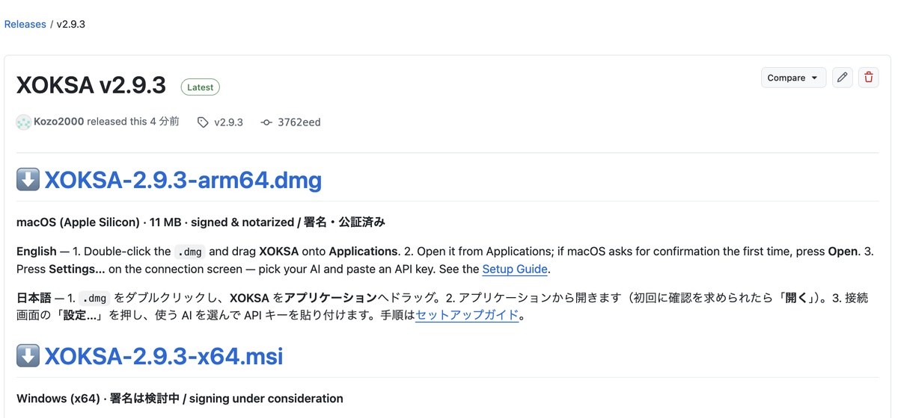

**On Windows**
1. On the download page (→ the Releases link), download the one Windows installer (the file ending in ".msi").
2. Double-click that file to open the installer (shown in English). Proceed with "**Next**", and press "**Finish**" at the end (if "Launch XOKSA" is checked, XOKSA starts right away).

→ The full XOKSA set is installed (three parts: the analysis engine, the desktop screen, and the settings app).

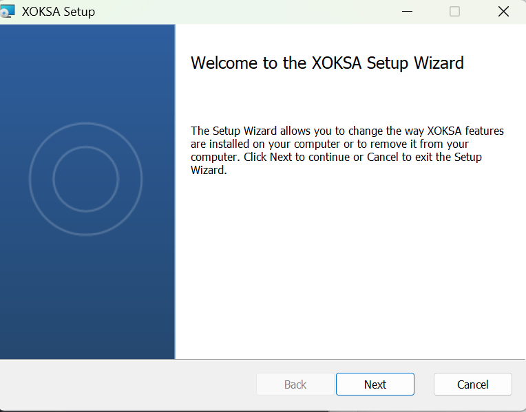

**On Mac (Apple Silicon)**
1. On the download page (→ the Releases link), download the one Mac disk image (the file ending in ".dmg").
2. Double-click it. A window opens showing **XOKSA** and the **Applications** folder — drag XOKSA onto Applications, then eject the disk image (the ⏏ next to "XOKSA" in the Finder sidebar).

→ The same three parts are installed inside XOKSA.app, so there is nothing else to install.

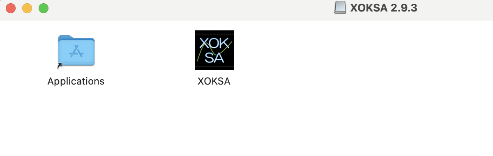

### 1.2 Launching XOKSA

**On Windows** — double-click the "XOKSA" icon created in the Start menu (and on the desktop) to launch it.

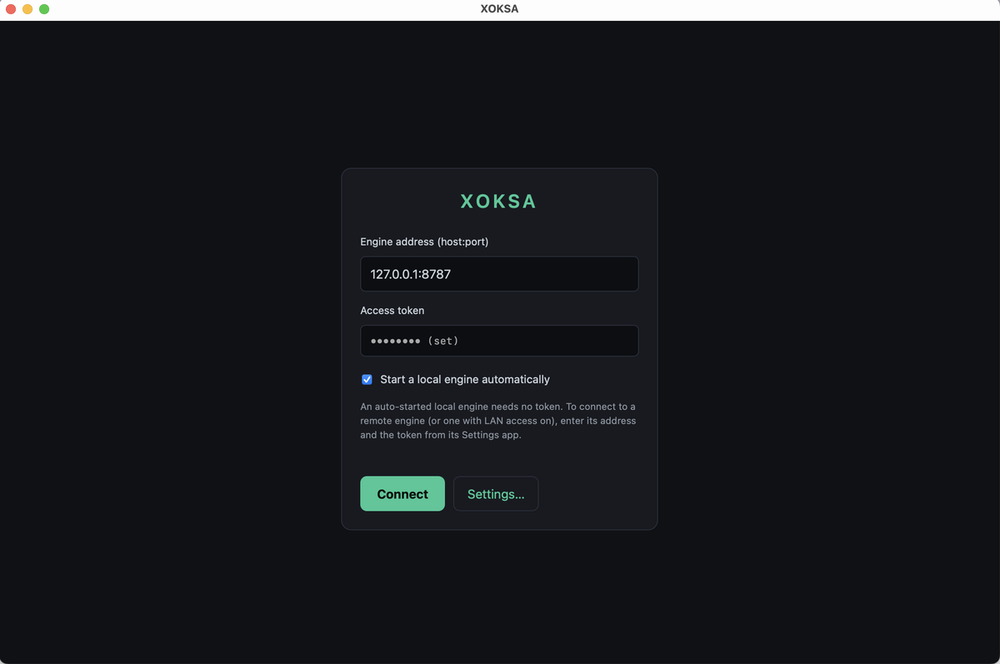

**On Mac** — open XOKSA from the Applications folder (or Launchpad). If macOS asks for confirmation the first time, press "**Open**". The same connection screen shown above opens.

### 1.3 Opening the settings app

On the first screen (the connection screen), press "**Settings…**" to open the settings app. The first time, it asks for a password.

> ⚠️ **The initial password is `XOKSA_password`.**
> Enter this to log in first. **Once you are in, be sure to change it to your own password under "Access" in the settings app** (do not keep using the initial password).

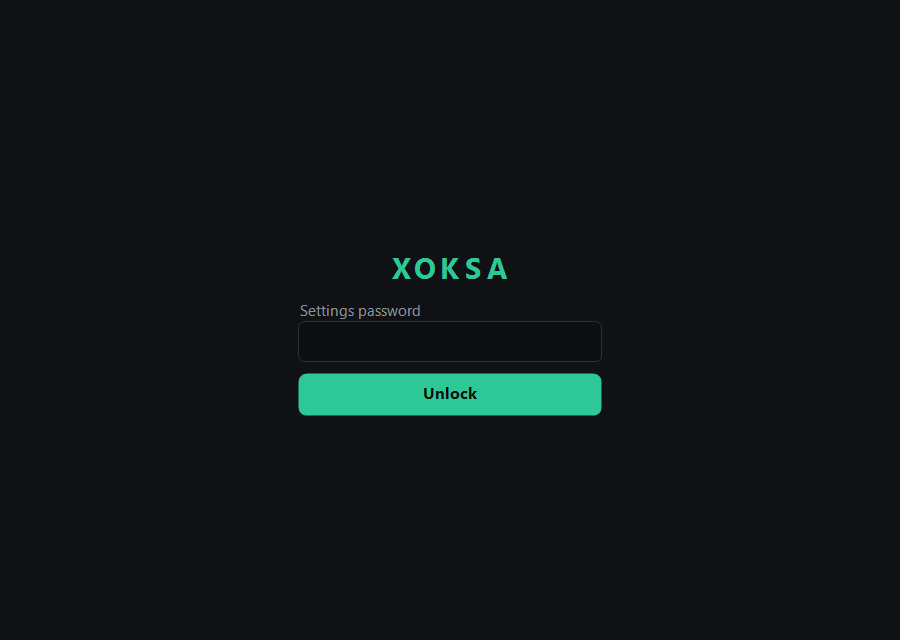

### 1.4 Language

The settings app **may open in English even on a Japanese PC** (the desktop WebView can't reliably detect the OS language). **Choose the language you want here and save, and from then on it opens in that language.** If it opened in English and you want Japanese, switch it to "Japanese" here and save. Both the app's display and the analysis results follow the language you choose.

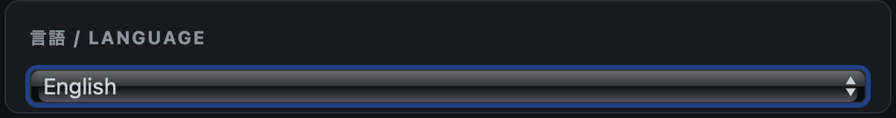

→ The following screens are shown in the language you chose.

### 1.5 AI (analysis commentary)

XOKSA can add AI commentary and chat to the analysis it computes. There are two ways to do this; you can use either one.

- **Cloud AI** (OpenAI, Google Gemini, Anthropic Claude, etc.) — using it requires an "API key." An API key is **your own personal access key (a string of characters)** for that AI service, and it is **pay-as-you-go (billed by usage).** You issue it on each service's site and paste it into the settings app. The pages to get a key (pick one) are:
  - OpenAI: <https://platform.openai.com/>
  - Google Gemini: <https://aistudio.google.com/>
  - Anthropic Claude: <https://console.anthropic.com/>
- **AI on your own PC (Ollama)** — Ollama is an AI that runs on your PC (install it from <https://ollama.com/> beforehand; free). No API key is needed. Enter the host and port in the settings app and press "**Fetch models**" (this also checks the connection), and **you can pick from the list of models you have installed** (no need to type a model name by hand).

You enter both the cloud API key and Ollama on the settings-app screen below.

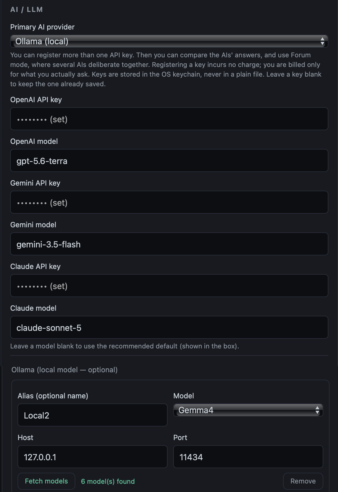

→ AI commentary and chat are added to the analysis.

### 1.6 News (Brave)

Related news is fetched using a Brave Search API key (get it → <https://brave.com/search/api/>). Paste the issued string into the settings app.

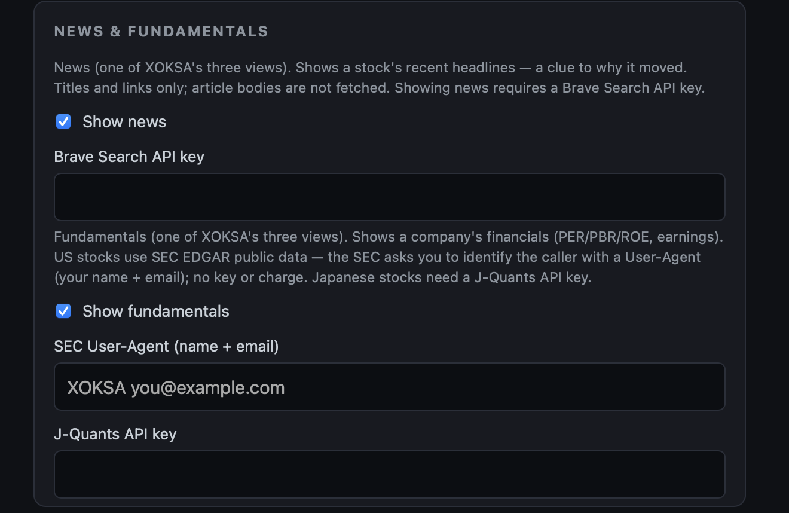

→ News related to a symbol can be fetched.

### 1.7 Company information (fundamentals)

- **US stocks** — SEC needs no registration. Just enter a string in the form "app-name email-address" (a User-Agent; e.g. `XOKSA you@example.com`).
  - (The SEC User-Agent field is on the "News & Fundamentals" card in 1.6.)
- **Japanese stocks** — a J-Quants API key (get it → <https://jpx-jquants.com/>).
  - (The J-Quants field is on the same card.)

→ Company information such as earnings can be fetched.

### 1.8 Company-name display (Japanese stock-name file)

**Japanese stocks only** (US tickers already show the company name, so US-only users can skip this). A Japanese stock shows only a numeric code, so you can attach the company name to each code. **This is an optional setting — not required — and the company names in the file are written in Japanese.**

**Get the file** — from the JPX (Japan Exchange Group) "Listed Securities List" page, download the securities-list file `data_j.xls`.
Entry point → <https://www.jpx.co.jp/markets/statistics-equities/misc/01.html>

**Set it** — in the settings app's "News & Fundamentals" card (1.6), use the "**Japanese stock name file (Excel/CSV, optional)**" field: press "**Browse…**" and pick the `data_j.xls` you downloaded. **XOKSA reads the Excel file directly — no conversion to CSV is needed.** A UTF-8 CSV also works (column 2 = code, column 3 = name).


→ Japanese stocks show the company name, not just the code.

### 1.9 Connecting

You are done setting up once **1.5 (AI) is filled in** — news, company information, and company names can be added later. Then:

1. In the settings app, press "**Save**".
2. Press "**Quit**" to close it. (If anything is still unsaved, it asks first.)
3. The settings app closes and you are back at the connection screen from 1.2.
4. Press "**Connect**" there.


→ The dashboard opens (no symbol yet).

### 1.10 Entering a symbol to confirm

In the **search box** (with a magnifier icon) at the top left of the dashboard, type a ticker and press Enter (e.g. US stocks like `NVDA` or `AAPL`; Japanese stocks like `7203` (Toyota)). **If the indicators, scores, news, company information, and market data appear, your setup succeeded.**

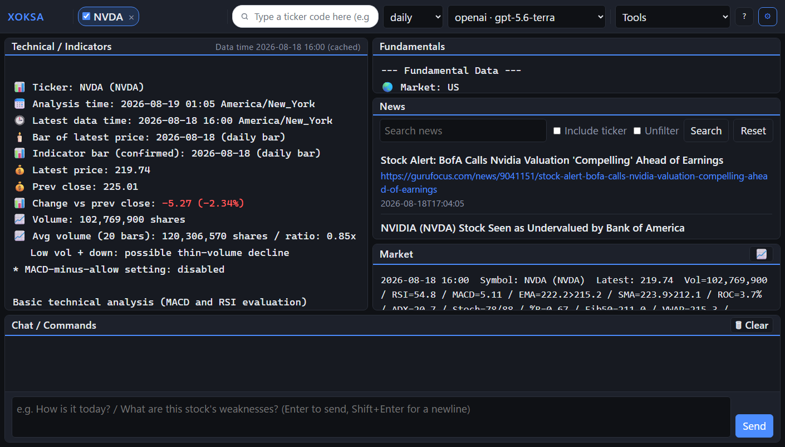

→ XOKSA is now ready to use.

---

## 2. The configuration file (xoksa.env)

xoksa.env is the **central configuration file** that holds all of XOKSA's settings in one place. Almost everything about how XOKSA behaves is decided by this single file — the language, the timeframe analyzed, the indicators used and their thresholds / weights / calculation parameters, the investment stance, the chat defaults, the LLM and model used, news / fundamentals / proxy / logs, and the notification channels and alert conditions. There are dozens of items, and the settings app is what assembles them from a screen (you can also edit them by hand).

**API keys and the keychain.** API keys are stored in the OS credential store (Windows: Credential Manager / macOS: Keychain / Linux: Secret Service). Entering them in the settings app or registering them with `xoksa --update-key` puts them here. **They are not written to xoksa.env.** However, if you write an item of the same name in xoksa.env (e.g. `OPENAI_API_KEY=sk-…`), **the xoksa.env value takes priority over the keychain.** Notification-channel secrets (webhook URL / LINE token) are keychain-only.

**Where it lives.** It is placed at the one location below, and the CLI, the settings app, and the desktop **share the same file** (independent of the working folder).

- Windows: `%APPDATA%\xoksa\xoksa.env`
- macOS: `~/Library/Application Support/xoksa/xoksa.env`
- Linux: `~/.config/xoksa/xoksa.env`

**Editing by hand.** One line per `KEY=value`. From `#` to the end of the line is a comment and is ignored; put a `#` at the start of a line and that setting is turned off and reverts to its default. Unknown keys or empty values are ignored and the default is used; when a value's format is invalid (letters where a number is expected, etc.), only that item falls back to its default (the app does not stop). After editing, **restart to apply.**

**All items and defaults** — a full list of every parameter and its default is collected in the [Appendix: all xoksa.env items and defaults](#appendix-env-en) at the end.

---

## 3. Detailed settings (each item in the settings app)

You can start using XOKSA with just the Quick Start, but the settings app has items you can fine-tune. **Only the items you touch are saved**; the rest are used at their defaults. Here is each item, shown alongside its screen.

### 3.1 AI / LLM
Configure the AI you use. The Quick Start set up one; here you can go further.
- **Enter multiple AIs and compare / Forum mode** — if you enter keys for several providers, you can have each AI explain the same analysis and **compare their answers** (each AI has a different focus). Furthermore, in **Forum mode**, several AIs **deliberate** while taking each other's opinions into account. You get a more multifaceted view than with just one.
- **Registering multiple Ollamas** — when you have more than one environment running Ollama (e.g. your local PC and a separate PC with a larger model), you can register each. Give each registration an **alias** (the "Alias (optional name)" field; e.g. `local`, `gpu`), and in chat you can specify the name like `/llm ollama:gpu` to switch which Ollama you use on the spot.


→ You can compare and deliberate across multiple AIs, and use local AIs selectively.

### 3.2 Chat notifications
While XOKSA is running, it can send a one-line notification to Slack / Discord / Google Chat / LINE when a condition is met. This is set up in two places.
1. **The destination channel** (this notification card) — register the kind, name, and secret. How to make the secret is on each service's side.
2. **The condition (alert)** — set it in `xoksa.env` as `ALERT_*`, or with `/alert` in the dashboard chat (e.g. RSI at 30 or below). It is not on this card.

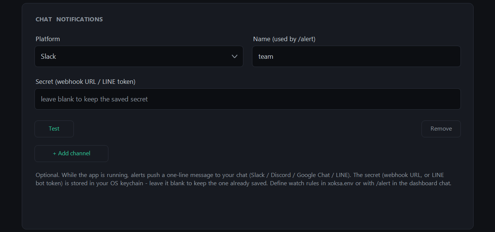
→ When the market reaches your condition, a notification arrives in your chat.

#### 3.2.1 Creating a notification channel

All XOKSA needs is the **secret** — a webhook URL, or for LINE a channel access token.
LINE also needs a destination id.

**One channel is enough.** How much setup they take differs a lot.

| Channel | Steps | What you need |
| :--- | --: | :--- |
| **Discord** | 2 | Admin rights on a server |
| **Slack** | 6 | A free workspace |
| **Google Chat** | 3 | **A Google Workspace account** (a personal Gmail cannot create one) |
| **LINE** | 13 | A LINE account, and **a developer registration** |

**If you have no preference, use Discord or Slack.**

**Discord**

1. Server Settings → Integrations → Webhooks → New Webhook
2. Pick the channel to post to and **copy the webhook URL**

**Slack**

1. Create a workspace at [slack.com/get-started](https://slack.com/get-started) (free)
2. [api.slack.com/apps](https://api.slack.com/apps) → **Create New App** → **Blank app**
3. Name the app, pick the workspace, **Create**
4. Left menu **Incoming Webhooks** → turn the toggle **On**
5. **Add New Webhook** → pick the channel → **Allow**
6. **Copy the `https://hooks.slack.com/services/…` URL** that appears

> Use the URL that starts with **`/services/`**. Slack also issues Workflow Builder URLs that
> start with `/workflows/`; those take a different payload, so XOKSA cannot post to them.

**Google Chat**

1. Open the space you want to be notified in
2. Space name → **Apps & integrations** → **Add webhooks**
3. Name it, create it, and **copy the URL**

**LINE**

The path is long and **LINE's screens change**. Follow
[LINE's own Messaging API guide](https://developers.line.biz/en/docs/messaging-api/getting-started/)
for the current steps. What follows is only what XOKSA needs, and the points where people get stuck.

**You do not end up with a second LINE account.** You gain one friend — the bot that sends you the
notifications. You will be asked to verify a phone number; that verifies the LINE account you
already have.

**XOKSA needs exactly two values.**

- **The long-lived channel access token** → the secret
- **Your own user id** (it starts with `U`) → the destination id

**Answers for the choices that have no fitting option.**

| Field | What to pick |
| :--- | :--- |
| Purpose of use | **Other** (all seven options are about marketing; notifications are not there) |
| Main way of using it | **Sending messages** |
| Company name / industry | `Individual` / `Individual (other)` |
| Privacy policy / terms URL | **Leave blank** (optional) |
| Webhook URL | **Leave blank** — XOKSA only sends; it never receives |

**The bot adds itself as a friend** when the official account is created.

> LINE caps how many messages you may send per month, depending on the plan. A lot of alerts can
> reach that cap, and notifications then stop.

#### 3.2.2 Registering it in XOKSA

**The settings app (recommended).** Add a channel on the notification card and enter the kind, the
name and the secret (plus the destination id for LINE). **You can send a test before saving.**

**From the command line.** The secret goes into the OS keychain:

```
xoksa --update-key
```

Pick `NOTIFY_<n>_SECRET` and type the value. **It is not echoed, and it never reaches your shell
history.** The rest goes in `xoksa.env`:

```
NOTIFY_1_KIND=slack
NOTIFY_1_NAME=Alerts
```

LINE also needs the destination id:

```
NOTIFY_1_KIND=line
NOTIFY_1_NAME=Alerts
NOTIFY_1_TO=U0123456789abcdef0123456789abcdef
```

**The secret is never written to `xoksa.env`.** It lives in the keychain only.

#### 3.2.3 Checking that it arrives

The **Test** button in the settings app is the easiest. From the command line:

```
'{"kind":"slack","secret":"<webhook URL>"}' | xoksa test-notify
```

It worked when this single line arrives in the channel:

```
🔔 XOKSA test notification: this channel is configured correctly.
```

#### 3.2.4 What to know about notifications

**A notification is best-effort; delivery is not guaranteed.** A push to a chat platform trades
delivery certainty for speed — a use that needs certain delivery belongs to another channel, such
as email. When a send fails XOKSA does not retry; it records the failure in the diagnostics log.

**The absence of a notification does not mean the condition did not occur.** An exhausted send
quota, a revoked token, and an outage on the platform all look the same from here.

### 3.3 Indicators (thresholds, weights, calculation parameters)
You can adjust the on/off of the indicators used in the analysis, their thresholds, each indicator's weight, and the calculation parameters. **The defaults are enough**, so it's fine to touch these once you're used to it. For the meaning of each value, see the [Indicator Guide](analysis-guide.md).
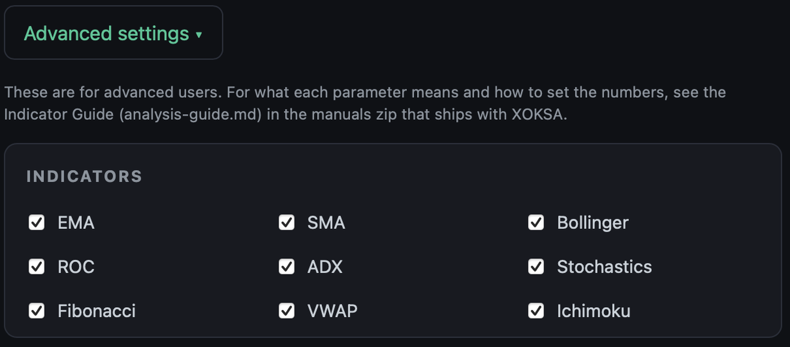
→ You can adjust it to fit your own analysis style.

---

## 4. Changing settings

### 4.1 Changing in the settings app
Open "**Settings…**" on the connection screen and enter your password. Edit the item you want to fix, press "**Save**", and then **reconnect** to apply it. When you are done, press "**Quit**" — if anything is still unsaved, it asks before closing.
→ You can change the language, AI, notifications, and so on at any time.

### 4.2 When changes take effect
Changes are loaded **when XOKSA launches / connects**. **Saving alone does not immediately apply to a running engine.** On the desktop, "Connect" applies them (connecting restarts the engine). A new **port** or **access token** needs an engine started after the change — the Connection card's "**Restart engine**" does exactly that.

### 4.3 Items not in the settings app
Fine-grained items not on the form (e.g. chat defaults, log settings, detailed alert conditions) are edited directly in `xoksa.env`. For the file's location and how to write it, see "2. The configuration file (xoksa.env)." After editing, **restart** to apply.

### 4.4 Adding or replacing AI keys
Adding an AI or swapping a key is also done in the AI item of the settings app. For a key field, **blank = keep the current key**; entering a new value replaces it.

---

## 5. Troubleshooting

When something doesn't work, look it up by symptom.

**Stuck on install or launch (Windows)**
If "Windows protected your PC" appears, press "More info" → "Run anyway."

**Stuck on install or launch (Mac)**
If macOS says the app "cannot be opened" or "is damaged", the download is incomplete or was modified: delete it, download the `.dmg` again, and compare its SHA-256 with the value on the download page (`shasum -a 256 <file>`). Do not bypass the message with `xattr -d com.apple.quarantine` — a genuine XOKSA build does not need it.

**You don't know the "Settings" password**
The initial password is `XOKSA_password`. If you forget a password you set yourself, you can reset it to a new one with `xoksa settings-password --set` (a command).

**You changed something but it isn't applied**
After changing a setting, reconnect (connecting restarts the engine and applies the change).

**AI commentary doesn't appear**
- For cloud AI: check that the API key is entered correctly, and check each service's balance / usage limit (it is pay-as-you-go).
- For Ollama: check that Ollama is running.

**News / company information doesn't appear**
Check that the key for that data is entered — Brave for news, J-Quants for Japanese-stock company information, and the SEC User-Agent for US stocks.

**Company names don't appear or are garbled (Japanese stocks)**
Check that the **stock-name file** (1.8; `ALIAS_CSV` in `xoksa.env`) is set correctly. If it's garbled, re-save it as UTF-8, or specify the original `.xls` as is.

**Can't connect**
With auto-start on, the error message on the connection screen states the cause (port in use, authentication required, and so on) — the full list is in the [Command-Line Reference §6](command-reference.md). When connecting to an engine you started yourself with `xoksa serve`, check that the address matches it (default `127.0.0.1:8787`).

**A communication error appears (a network that uses a proxy)**
XOKSA **accesses external services over the internet (HTTPS)** — market data, news, cloud AI, and company information. On a network where this external access can't get out without going through a proxy, set the proxy in `xoksa.env` (the values are those of your own environment).

```
HTTPS_PROXY=http://192.168.0.10:8080
```

`HTTPS_PROXY` is the setting name that points to "the proxy used for that **outbound HTTPS traffic**," and it is standard for the proxy URL itself to start with `http://` (you connect to the proxy over HTTP, and it relays the outbound HTTPS). XOKSA's internal traffic (`127.0.0.1`, such as browser ↔ engine) does not go through the proxy.

---

<a id="appendix-env-en"></a>

## Appendix: all xoksa.env items and defaults

**Language / analysis**
| Setting | Meaning | Default |
| :-- | :-- | :-- |
| `LANG` | Output language (`en` / `ja`) | en |
| `ANALYSIS_MODE` | Analysis timeframe (daily/60m/30m/15m/5m/1m/weekly/monthly) | daily |

**Thresholds**
| Setting | Meaning | Default |
| :-- | :-- | :-- |
| `BUY_RSI` | RSI buy-signal threshold (below = oversold) | 30.0 |
| `SELL_RSI` | RSI sell-signal threshold (above = overbought) | 70.0 |
| `MACD_DIFF_LOW` | MACD histogram weak-signal boundary | 2.0 |
| `MACD_DIFF_MID` | Same, strong-signal boundary | 10.0 |
| `MACD_DIFF_EXTREME` | Extreme-divergence boundary when RSI overbought coincides | 100.0 |
| `MACD_MINUS_OK` | Whether to allow a buy even when the MACD histogram is negative | false |

**Indicators used** (indicators set to `True` are computed and saved)
| Setting | Meaning | Default |
| :-- | :-- | :-- |
| `EMA` | Whether to compute the exponential moving average and include it in the score | True |
| `SMA` | Whether to include the simple moving average | True |
| `FIBONACCI` | Whether to include Fibonacci retracement | True |
| `STOCHASTICS` | Whether to include stochastics | True |
| `ADX` | Whether to include the Average Directional Index (trend strength) | True |
| `ROC` | Whether to include Rate of Change (momentum) | True |
| `BOLLINGER` | Whether to include Bollinger Bands | True |
| `VWAP` | Whether to include the Volume-Weighted Average Price | True |
| `ICHIMOKU` | Whether to include Ichimoku | True |

**Indicator weights** (influence on the composite score; larger = stronger)
| Setting | Meaning | Default |
| :-- | :-- | :-- |
| `WEIGHT_BASIC` | Weight of the RSI + MACD basic indicators | 2.0 |
| `WEIGHT_EMA` | EMA weight | 1.0 |
| `WEIGHT_SMA` | SMA weight | 1.0 |
| `WEIGHT_BOLLINGER` | Bollinger weight | 1.0 |
| `WEIGHT_ROC` | ROC weight | 1.0 |
| `WEIGHT_ADX` | ADX weight | 1.0 |
| `WEIGHT_STOCHASTICS` | Stochastics weight | 1.0 |
| `WEIGHT_FIBONACCI` | Fibonacci weight | 1.0 |
| `WEIGHT_VWAP` | VWAP weight | 1.0 |
| `WEIGHT_ICHIMOKU` | Ichimoku weight | 1.0 |

**Indicator calculation parameters** (if unset, the defaults below are used)
| Setting | Meaning | Default |
| :-- | :-- | :-- |
| `EMA_SHORT_PERIOD` | Short EMA period (< `EMA_LONG_PERIOD`) | 5 |
| `EMA_LONG_PERIOD` | Long EMA period | 20 |
| `SMA_SHORT_PERIOD` | Short SMA period (< `SMA_LONG_PERIOD`) | 5 |
| `SMA_LONG_PERIOD` | Long SMA period (also the volume-average window) | 20 |
| `ADX_PERIOD` | ADX smoothing period | 14 |
| `ROC_PERIOD` | ROC lookback | 10 |
| `STOCHASTICS_PERIOD` | Stochastics %K period | 14 |
| `BOLLINGER_PERIOD` | Bollinger moving-average period | 20 |
| `BOLLINGER_STDDEV_MULTIPLIER` | σ multiplier | 2.0 |
| `BB_BANDWIDTH_SQUEEZE_PCT` | Band-width % at which a squeeze warning is shown | 8.0 |
| `ICHIMOKU_TENKAN_PERIOD` | Tenkan-sen (< kijun) | 9 |
| `ICHIMOKU_KIJUN_PERIOD` | Kijun-sen | 26 |
| `VWAP_PERIOD` | VWAP window in non-intraday mode | 14 |
| `FIBONACCI_NEUTRAL_RATIO` | Fibonacci neutral band, as a share of the 50%→38.2% distance (0.0-0.5) | 0.05 |

**Investment stance**
| Setting | Meaning | Default |
| :-- | :-- | :-- |
| `STANCE` | buyer / seller / holder (affects signal interpretation and the prompt frame) | holder |

**Chat (`--chat`)**
| Setting | Meaning | Default |
| :-- | :-- | :-- |
| `CHAT_DEFAULT_TICKER` | Auto-load at launch when no symbol is given (up to 5, comma-separated) | (empty) |
| `CHAT_ANALYSIS_MODE` | Chat timeframe | follows ANALYSIS_MODE |
| `CHAT_MEMORY` | Context amount per turn (low/mid/high) | mid |
| `CHAT_GUARD` | Strength of the investment-advice constraint (high/mid/low) | high |
| `DEBATE` | Retention of other LLMs' opinions (off/summary/claims) | summary |
| `AUTORELOAD` | Auto-reload of intraday chat | false |
| `AUTORELOAD_NOTIFY` | Show a notice on auto-reload | false |
| `READ_DEPTH` | Depth of data read (shallow/mid/deep) | mid |
| `KNOWLEDGE_SCOPE` | How far to step into general knowledge beyond the input (narrow/mid/wide) | mid |
| `RESPONSE_SHAPE` | Answer format (talk/points/scenario) | talk |
| `FORECAST_MODE` | Forecast strength (off/soft/bold; confirmed values are never rewritten) | soft |

**LLM common**
| Setting | Meaning | Default |
| :-- | :-- | :-- |
| `llm_provider` | LLM used (openai/gemini/claude/ollama) | openai |
| `llm_timeout_seconds` | Request timeout in seconds | 120 |
| `llm_temperature` | Response randomness (0.0–1.0) | 0.7 |
| `llm_top_p` | Nucleus sampling | 0.9 |
| `llm_max_output_tokens` | Max response tokens | 16384 |
| `EXTRA_NOTE` | Extra note appended to all prompts (optional) | (empty) |

**Per-provider models**
| Setting | Meaning | Default |
| :-- | :-- | :-- |
| `openai_model` | OpenAI model | gpt-5.6-terra |
| `gemini_model` | Gemini model | gemini-3.5-flash |
| `claude_model` | Claude model | claude-sonnet-5 |
| `claude_max_tokens` | Claude max tokens | 16384 |

**Ollama (local LLM; when `llm_provider=ollama`; no key needed)** — the server can define 1–16, and the lowest number is the default at launch
| Setting | Meaning | Default |
| :-- | :-- | :-- |
| `OLLAMA_<n>_ALIAS` | Alias for server n (any name; switch with `/llm ollama:<alias>`) | (empty) |
| `OLLAMA_<n>_HOST` | Host of server n | (empty) |
| `OLLAMA_<n>_PORT` | Port of server n | (empty) |
| `OLLAMA_<n>_MODEL` | Model of server n | (empty) |
| `OLLAMA_TIMEOUT_SECONDS` | Timeout in seconds | 300 |
| `OLLAMA_TEMPERATURE` | Randomness | 0.2 |
| `OLLAMA_TOP_P` | Nucleus sampling | 0.9 |
| `OLLAMA_TOP_K` | Top-k sampling | 40 |
| `OLLAMA_REPEAT_PENALTY` | Repetition suppression | 1.1 |
| `OLLAMA_NUM_CTX` | Context-window tokens | 32768 |
| `OLLAMA_NUM_PREDICT` | Max generated tokens | 8192 |
| `OLLAMA_THINK` | Thinking amount (low/medium/high; supported models only) | (unset) |
| `OLLAMA_SEED` | Random seed | 42 |
| `OLLAMA_NO_GUARD` | Disable the integrity guard | false |
| `OLLAMA_KEEP_ALIVE` | How long to keep the model in memory | 10m |
| `OLLAMA_DEBUG` | Print request/response details to stderr | false |
| `OLLAMA_BENCH_MODELS` | Models compared by `/bench` (comma-separated) | (empty) |
| `OLLAMA_BENCH_FORMAT` | `/bench` output format (table/csv/json) | table |

**News**
| Setting | Meaning | Default |
| :-- | :-- | :-- |
| `NO_NEWS` | Skip news fetching entirely | false |
| `SHOW_NEWS` | Show fetched titles in the terminal | false |
| `NEWS_FILTER` | Narrow to only symbol-related articles | false |
| `NEWS_COUNT` | Number fetched | 30 |
| `NEWS_FRESHNESS` | Freshness (pd day / pw week / pm month / py year) | pm |
| `CUSTOM_NEWS_QUERY` | Override the auto-generated query | (empty) |
| `NO_ALIAS` | Don't use the alias CSV for company-name display | false |

**Logs**
| Setting | Meaning | Default |
| :-- | :-- | :-- |
| `SAVE_TECHNICAL_LOG` | Save analysis results to a log | false |
| `LOG_FORMAT` | Log format (json/csv) | json |
| `LOG_DIR` | Output directory | log |
| `CSV_APPEND` | Append to CSV instead of overwriting | false |
| `LOG_FLAT` | Write one analysis as flat JSON with no nesting | false |

**Prompt character limits**
| Setting | Meaning | Default |
| :-- | :-- | :-- |
| `MAX_NOTE_LENGTH` | Outlook-note section | 400 |
| `MAX_SHORTTERM_LENGTH` | Short-term summary | 200 |
| `MAX_MIDTERM_LENGTH` | Mid-term summary | 200 |
| `MAX_NEWS_LENGTH` | News section | 1000 |
| `MAX_REVIEW_LENGTH` | Overall-review section | 2000 |

**Proxy** (authenticated URLs are unsupported; Ollama 127.0.0.1 is always bypassed)
| Setting | Meaning | Default |
| :-- | :-- | :-- |
| `HTTP_PROXY` | HTTP proxy URL (CONNECT tunnel) | (empty) |
| `HTTPS_PROXY` | HTTPS proxy URL (CONNECT tunnel) | (empty) |
| `NO_PROXY` | Hosts that bypass the proxy (comma-separated) | 127.0.0.1,localhost |

**Debug**
| Setting | Meaning | Default |
| :-- | :-- | :-- |
| `DEBUG_PROMPT` | Save the prompt to a file instead of sending it | false |
| `NO_LLM` | Skip the LLM call (technical only) | false |

**Company-name alias**
| Setting | Meaning | Default |
| :-- | :-- | :-- |
| `ALIAS_CSV` | Path to the CSV for company-name display | (empty) |

**Fundamentals**
| Setting | Meaning | Default |
| :-- | :-- | :-- |
| `FUNDAMENTAL` | Always fetch even without `--fundamental` | false |
| `JQUANTS_API_KEY` | Japanese stocks, J-Quants (v2); keychain recommended for the key | (empty) |
| `SEC_USER_AGENT` | US stocks, SEC EDGAR (`app-name email` format; required) | (empty) |

**Notification channels** (1–16; secrets are keychain-only)
| Setting | Meaning | Default |
| :-- | :-- | :-- |
| `NOTIFY_<n>_KIND` | Channel kind (slack/discord/gchat/line) | (empty) |
| `NOTIFY_<n>_NAME` | Display name shown in the `/alert` list | (empty) |
| `NOTIFY_<n>_TO` | LINE destination id (LINE only) | (empty) |

**Alerts** (1–16)
| Setting | Meaning | Default |
| :-- | :-- | :-- |
| `ALERT_<n>_TICKER` | Symbol to watch (e.g. AAPL, 7203.T) | (empty) |
| `ALERT_<n>_WHEN` | Condition (`<indicator><op><number>`; e.g. `rsi<=30`) | (empty) |
| `ALERT_<n>_MODE` | Bar to watch (1m/5m/15m/30m/60m) | (empty) |
| `ALERT_<n>_NOTIFY` | Channel number to fire | 1 |
| `ALERT_<n>_EXPLAIN` | Add a one-line LLM comment | false |

---

<a id="ja"></a>

# 📘 XOKSA セットアップガイド

XOKSA は、株価のテクニカル分析・スコア・チャートを自動で計算して見せてくれるアプリです。**1 がクイックスタート**（まず使い始める）、**2〜5 が詳細**です。画面は Windows のものですが、Mac 版もインストール手順以外は同じ見た目です。

---

## 1. クイックスタート

入れて起動し、設定画面で必要なものを入力するだけで使えます。下の順に進めれば設定は終わります。

### 1.1 ダウンロードとインストール

ダウンロードページは Releases のページです：**https://github.com/Kozo2000/XOKSA/releases/latest**。OS ごとに1つずつファイルが並んでいます（Mac は `.dmg`、Windows は `.msi`）。必要なファイル名をクリックします。マニュアル一式は同じページの `xoksa-manuals-<版数>.zip` として配布します。好きな場所に展開すれば、オフラインで読めます。


**Windows の場合**
1. ダウンロードページ（→ Releases のリンク）で、Windows 用のインストーラ（「.msi」で終わるファイル）を1つダウンロードします。
2. そのファイルをダブルクリックすると、インストーラ（英語表示）が開きます。「**Next**」で進めていき、最後に「**Finish**」を押します（「Launch XOKSA」にチェックが入っていれば、そのまま XOKSA が起動します）。

→ XOKSA 一式（分析エンジン・デスクトップ画面・設定アプリの3つ）が入ります。


**Mac（Apple Silicon）の場合**
1. ダウンロードページ（→ Releases のリンク）で、Mac 用のディスクイメージ（「.dmg」で終わるファイル）を1つダウンロードします。
2. そのファイルをダブルクリックすると、**XOKSA** と **アプリケーション** フォルダが並んだウィンドウが開きます。XOKSA をアプリケーションへドラッグし、終わったらディスクイメージを取り出します（Finder のサイドバーで「XOKSA」の横の ⏏ を押す）。

→ 同じ3つが XOKSA.app の中に入るので、ほかに入れるものはありません。


### 1.2 XOKSA の起動

**Windows の場合** — スタートメニュー（とデスクトップ）にできた「XOKSA」のアイコンをダブルクリックして起動します。


**Mac の場合** — アプリケーションフォルダ（または Launchpad）から XOKSA を開きます。初回に確認を求められたら「**開く**」を押します。開くのは上と同じ接続画面です。

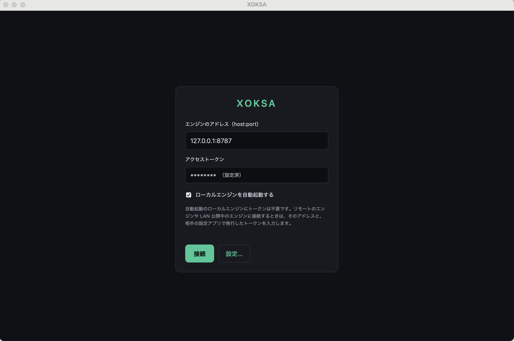

### 1.3 設定アプリの起動

最初の画面（接続画面）で「**設定…**」ボタンを押すと、設定アプリが開きます（英語表示のときは「Settings…」）。初回はパスワードを聞かれます。

> ⚠️ **初期パスワードは `XOKSA_password` です。**
> まずこれを入力してログインします。**入ったら、設定アプリの「アクセス」で自分のパスワードに必ず変更してください**（初期パスワードのまま使わないこと）。

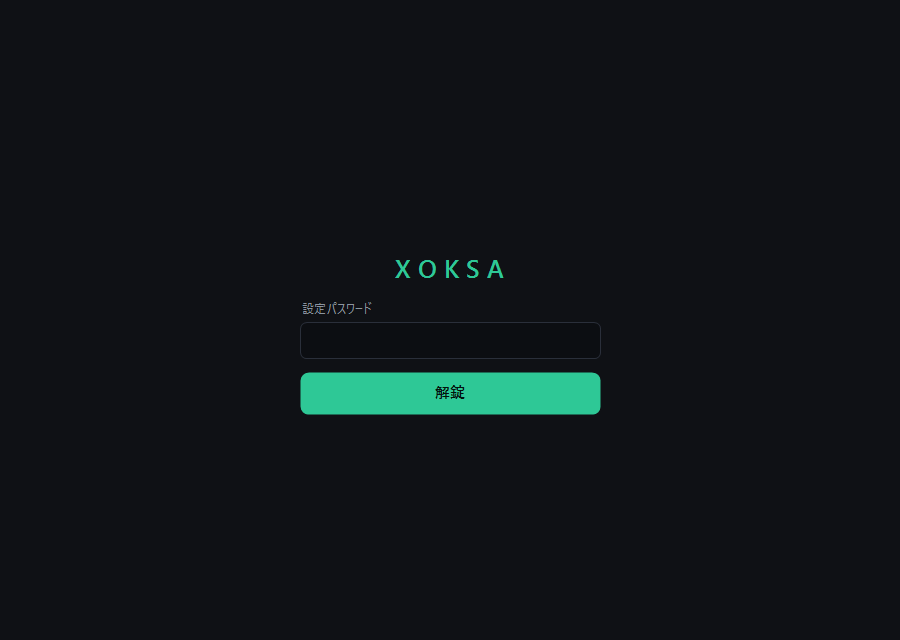

### 1.4 言語

設定アプリは、**日本語の PC でも、最初は英語で開くことがあります**（デスクトップの WebView では OS の言語を確実には判別できないため）。**この「言語」で使う言語を選んで保存すると、以降はその言語で開きます**。英語で開いていたら、ここで「日本語」に切り替えて保存してください。アプリの表示も分析結果も、選んだ言語になります。

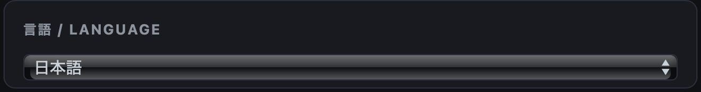

→ 以降の画面が、選んだ言語で表示されます。

### 1.5 AI（分析の解説）

XOKSA は、計算した分析に AI の解説やチャットを付けられます。使い方は2通り、どちらか一方で使えます。

- **クラウドの AI**（OpenAI・Google Gemini・Anthropic Claude など） — 使うには「API キー」が要ります。API キーとは、その AI サービスを使うための**あなた専用の利用鍵（文字列）**で、**従量制（使った分だけ課金）**です。各サービスのサイトで発行し、設定アプリに貼り付けます。キーの取得ページ（どれか1つ）は次のとおりです。
  - OpenAI：<https://platform.openai.com/>
  - Google Gemini：<https://aistudio.google.com/>
  - Anthropic Claude：<https://console.anthropic.com/>
- **自分の PC の AI（Ollama）** — Ollama は、あなたの PC 上で動く AI です（<https://ollama.com/> から入れておく・無料）。API キーは要りません。設定アプリでホスト・ポートを入れて「**モデル取得（接続確認）**」を押すと、**入っているモデルの一覧から選べます**（モデル名を手で打つ必要はありません）。

下の設定アプリ画面で、クラウドの API キーも Ollama も入力します。

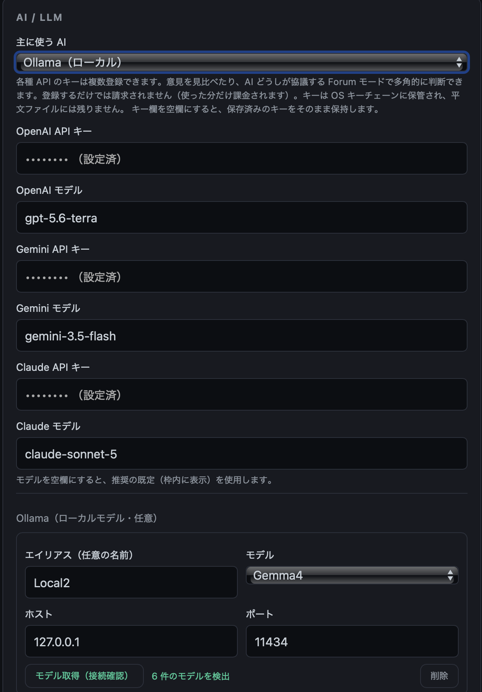

→ 分析に AI の解説・チャットが付きます。

### 1.6 ニュース（Brave）

関連ニュースの取得に、Brave Search の API キーを使います（取得ページ → <https://brave.com/search/api/>）。発行した文字列を設定アプリに貼り付けます。

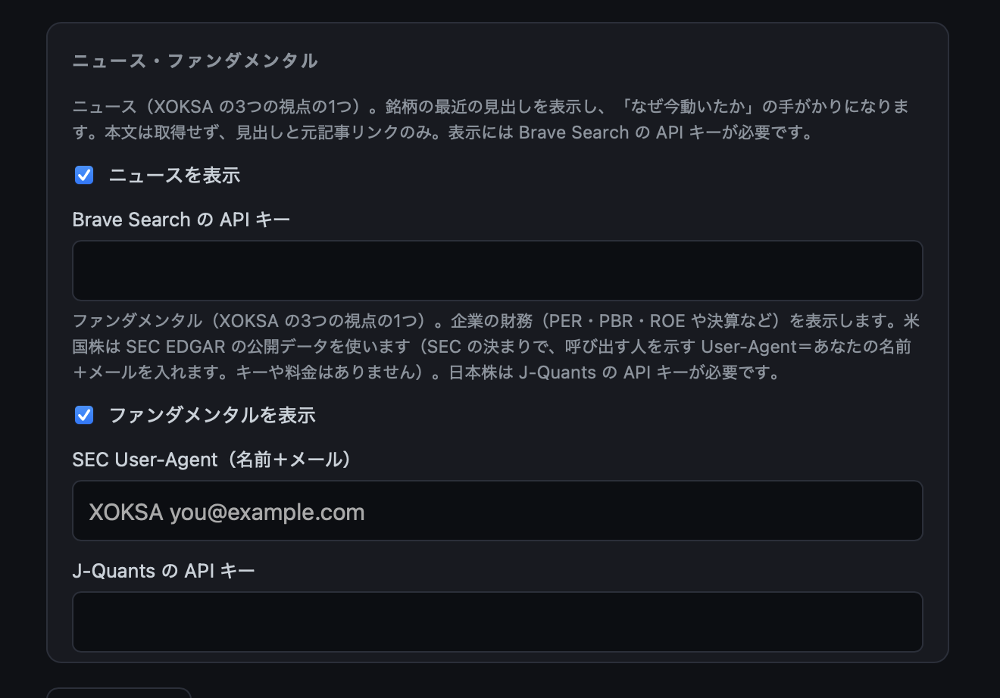

→ 銘柄に関連するニュースが取れます。

### 1.7 企業情報（ファンダメンタル）

- **日本株** — J-Quants の API キー（取得ページ → <https://jpx-jquants.com/>）。
  - （J-Quants の入力欄は 1.6 の「ニュース・ファンダメンタル」画面と同じカードです）
- **米国株** — SEC は登録不要。「アプリ名 メールアドレス」の形式の文字列（User-Agent。例：`XOKSA you@example.com`）を入れるだけです。
  - （SEC User-Agent の入力欄も同じカードです）

→ 業績などの企業情報が取れます。

### 1.8 会社名表示（日本株の銘柄名ファイル）

日本株はコードだけだと銘柄が分かりにくいので、コードに会社名を添えて表示できます（任意・日本株のみ）。

**取得** — JPX（日本取引所グループ）の「東証上場銘柄一覧」ページから、銘柄一覧ファイル `data_j.xls` をダウンロードします。
入口 → <https://www.jpx.co.jp/markets/statistics-equities/misc/01.html>

**設定** — 設定アプリの「ニュース・ファンダメンタル」カード（1.6）にある「**日本株の銘柄名ファイル（Excel/CSV・任意）**」欄で、「**参照…**」を押してダウンロードした `data_j.xls` を選びます。**Excel のまま直接読み込めます（CSV へ変換する必要はありません）。** UTF-8 の CSV でも構いません（2列目＝コード・3列目＝会社名）。


→ 銘柄コードだけでなく、日本語の会社名が表示されます。

### 1.9 接続

設定は、**1.5（AI）まで入っていれば完了**です——ニュース・企業情報・銘柄名は後から追加できます。そのうえで、次の順に進みます。

1. 設定アプリで「**保存**」を押します。
2. 「**終了**」を押して閉じます（保存していない変更があれば、先に確認が出ます）。
3. 設定アプリが閉じ、1.2 の接続画面に戻ります。
4. そこで「**接続**」を押します。

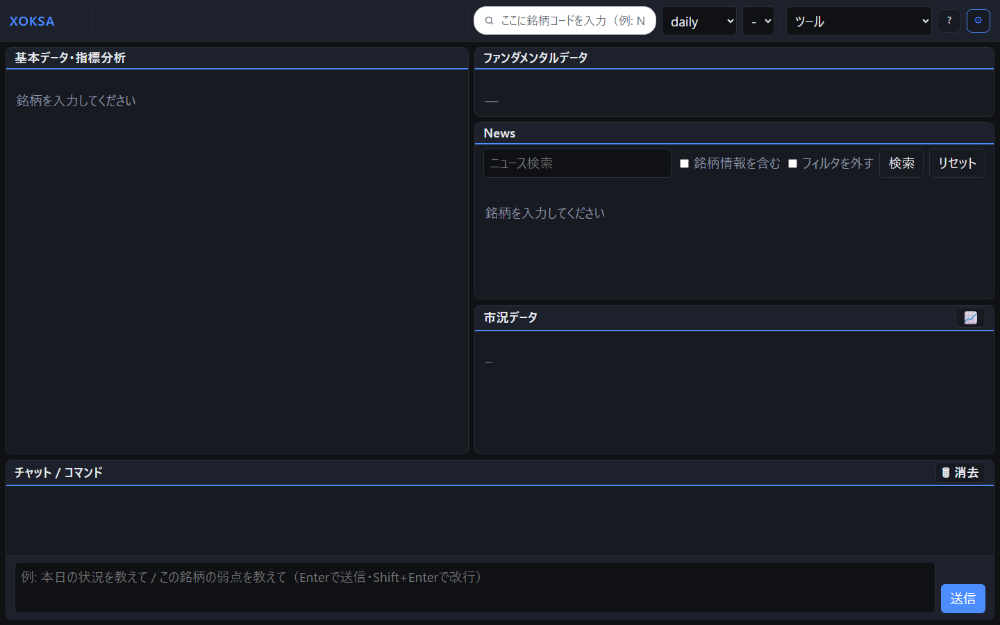

→ ダッシュボードが開きます（まだ銘柄は空です）。

### 1.10 銘柄を入れて確認

ダッシュボード左上の**検索ボックス**（虫めがねアイコン）に銘柄コードを入れて Enter を押します（例：`9432`（NTT）などの日本株、`NVDA` などの米国株）。**指標・スコア・ニュース・企業情報・市況が表示されれば、導入は成功です。**

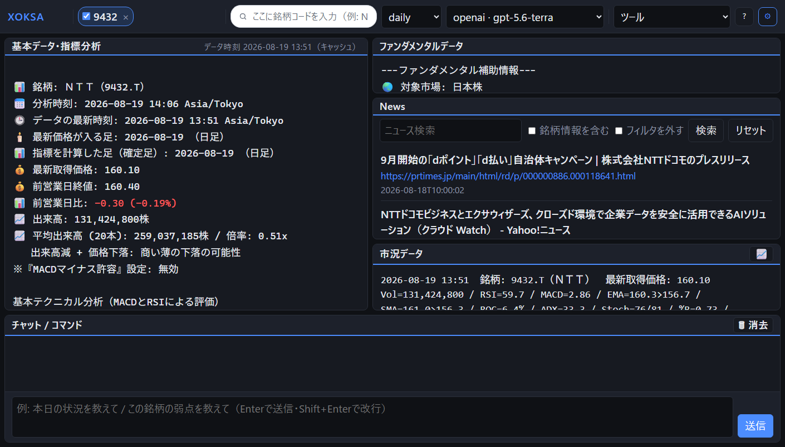

→ これで XOKSA が使えるようになりました。

---

## 2. 設定ファイル（xoksa.env）

xoksa.env は XOKSA の設定を一手に持つ**中枢の設定ファイル**です。XOKSA の挙動は、次に挙げるもののほぼすべてがこの1ファイルで決まります——言語、分析する足種、使う指標とそのしきい値／重み／計算パラメータ、投資スタンス、チャットの既定、使う LLM とモデル、ニュース／ファンダ／プロキシ／ログ、通知チャンネルとアラート条件。項目は数十あり、これらを画面から組み立てるのが設定アプリです（手で直接編集することもできます）。

**API キーとキーチェーン.** API キーは、OS の資格情報保管庫（Windows：資格情報マネージャー／macOS：Keychain／Linux：Secret Service）に保管されます。設定アプリで入力するか `xoksa --update-key` で登録すると、ここに入ります。**xoksa.env には書きません。** ただし xoksa.env に同名の項目（例 `OPENAI_API_KEY=sk-…`）を書いた場合は、**xoksa.env の値がキーチェーンより優先**されます。通知チャンネルの secret（Webhook URL／LINE トークン）はキーチェーン専用です。

**保存場所.** 次の1か所に置かれ、CLI・設定アプリ・デスクトップが**同じファイルを共有**します（作業フォルダに依存しません）。

- Windows：`%APPDATA%\xoksa\xoksa.env`
- macOS：`~/Library/Application Support/xoksa/xoksa.env`
- Linux：`~/.config/xoksa/xoksa.env`

**手で編集するとき.** 1行 `KEY=値`。`#` から行末はコメント（注釈）で無視され、行頭に `#` を付ければその設定はオフになり既定値に戻ります。知らないキーや空の値は無視されて既定値が使われ、値の形式が不正（数値のはずが文字など）なときはその項目だけ既定値にフォールバックします（アプリは止まりません）。編集後は**再起動で反映**されます。

**全項目と既定値** — 全パラメータと既定値の一覧は、末尾の[付録：xoksa.env 全項目と既定値](#appendix-env)にまとめています。

---

## 3. 詳しい設定（設定アプリの各項目）

クイックスタートだけでも使い始められますが、設定アプリには細かく調整できる項目があります。**触った項目だけ保存**され、残りは既定のままで使えます。ここでは各項目を、画面とあわせて説明します。

### 3.1 AI・LLM
使う AI を設定します。クイックスタートでは1つ設定しましたが、ここではさらに使い込めます。
- **複数の AI を入れて比べる／Forum モード** — 複数のプロバイダのキーを入れておくと、同じ分析を各 AI に説明させて**答えを見比べ**られます（AI ごとに着眼点が違うため）。さらに **Forum モード**では、複数の AI が互いの意見を踏まえて**協議**します。1社だけより多角的に見られます。
- **Ollama の複数登録** — Ollama を動かす環境が複数あるとき（例：手元の PC と、モデルの大きい別の PC）、それぞれを登録しておけます。各登録に **エイリアス（自分で分かる呼び名。例：`local`・`gpu`）** を付けておくと、チャットで `/llm ollama:gpu` のように呼び名を指定して、使う Ollama をその場で切り替えられます。


→ 複数 AI の比較・協議や、ローカル AI の使い分けができます。

### 3.2 チャット通知
XOKSA の起動中に、条件を満たしたら Slack／Discord／Google Chat／LINE へ1行の通知を送れます。設定は2か所に分かれます。
1. **送り先チャンネル**（この通知カード）— 種類・名前・secret を登録します。secret の作り方は各サービス側で。
2. **通知する条件（アラート）** — ダッシュボードの 🔔 アラート画面、チャットの `/alert`、または `xoksa.env` の `ALERT_*` で設定します（例：RSI が 30 以下）。通知カードにはありません。

ルールは**16件まで**です。見張るのはルールに書いた銘柄なので、その銘柄を画面に出しておく必要はありません。画面や `/alert` から追加・削除したものはその場で反映され、`xoksa.env` にも保存されます。一方、**`xoksa.env` を直接編集した場合は、エンジンを再起動するまで反映されません**（アラートのルールは起動時に一度だけ読み込むため）。下の「エンジンを再起動」から反映できます。

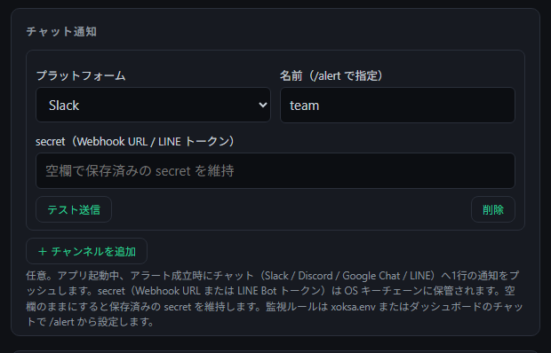
→ 相場が条件に達したとき、チャットに通知が届きます。

#### 3.2.1 通知チャンネルの作り方

XOKSA が要るのは **secret（Webhook URL、または LINE のトークン）だけ**です。LINE のみ、宛先 id も要ります。

**どれか 1 つで足ります。** 設定の手間はかなり違います。

| チャンネル | 手順の段数 | 必要なもの |
| :--- | --: | :--- |
| **Discord** | 2 | サーバーの管理権限 |
| **Slack** | 6 | 無料ワークスペース |
| **Google Chat** | 3 | **Google Workspace 契約**（個人の Gmail では作れません） |
| **LINE** | 13 | LINE アカウント。**開発者登録が要ります** |

**迷うなら Discord か Slack** です。LINE は日本でいちばん使われていますが、設定はいちばん重くなります。

**Discord**

1. サーバー設定 → 連携サービス → ウェブフック → 新しいウェブフック
2. 投稿先チャンネルを選び、**ウェブフック URL をコピー**

**Slack**

1. [slack.com/get-started](https://slack.com/get-started) でワークスペースを作る（無料）
2. [api.slack.com/apps](https://api.slack.com/apps) → **Create New App** → **Blank app**
3. アプリ名を入れ、ワークスペースを選んで **Create**
4. 左メニュー **Incoming Webhooks** → トグルを **On**
5. **Add New Webhook** → 投稿先チャンネルを選ぶ → **許可する**
6. 一覧に出た **`https://hooks.slack.com/services/…` をコピー**

> **`/services/` で始まる URL** を使ってください。Slack には Workflow Builder 用の
> `/workflows/` から始まる URL もありますが、形式が違うため XOKSA からは送信できません。

**Google Chat**

1. 通知を受けたいスペースを開く
2. スペース名 → **アプリと統合** → **Webhook を追加**
3. 名前を付けて作成し、**URL をコピー**

**LINE**

手順が長く、**LINE 側の画面は変わります**。最新の手順は
[LINE Developers の公式ドキュメント](https://developers.line.biz/ja/docs/messaging-api/getting-started/)
を見てください。ここには XOKSA に必要なものと、迷いやすい箇所だけ書きます。

**まず安心してください。LINE のアカウントは増えません。** 友だちが 1 つ（通知を送ってくる Bot）
増えるだけです。途中で電話番号認証を求められますが、これは既にお持ちの LINE アカウントの
本人確認であって、新しいアカウントを作る操作ではありません。

**XOKSA に要るのは 2 つだけです。**

- **チャネルアクセストークン（長期）** → secret
- **あなたのユーザー ID**（`U` で始まる）→ 宛先 id

**途中で迷う選択肢の答え。** どれも「当てはまるものが無い」ので、次のとおりで構いません。

| 項目 | 選ぶもの |
| :--- | :--- |
| 運用目的 | **その他**（7 つとも集客・販促の選択肢で、通知用途はありません） |
| 主な使い方 | **メッセージ配信用** |
| 会社・事業者名 ／ 業種 | `個人` ／ `個人（その他）` |
| プライバシーポリシー・利用規約 URL | **空欄**（任意） |
| Webhook URL | **空欄**（XOKSA は送るだけで、受信しません） |

**Bot の友だち追加は自動**です。公式アカウントを作った時点で、作成者の LINE に追加されます。

> LINE には**月あたりの送信数の上限**があります（プランによります）。アラートを多く設定すると
> 上限に達し、通知が止まることがあります。

#### 3.2.2 XOKSA への登録

**設定アプリ（おすすめ）.** 通知カードでチャンネルを追加し、種類・名前・secret（LINE は宛先 id も）
を入れます。**保存する前にテスト送信できます。**

**コマンドで入れる場合.** secret はキーチェーンに入れます。

```
xoksa --update-key
```

`NOTIFY_<n>_SECRET` を選んで入力してください。**入力は画面に表示されず、コマンド履歴にも残りません。**

残りは `xoksa.env` に書きます。

```
NOTIFY_1_KIND=slack
NOTIFY_1_NAME=通知
```

LINE のときは宛先 id も要ります。

```
NOTIFY_1_KIND=line
NOTIFY_1_NAME=通知
NOTIFY_1_TO=U0123456789abcdef0123456789abcdef
```

**secret は `xoksa.env` に書きません。** キーチェーン専用です。

#### 3.2.3 届くか確かめる

設定アプリの**テスト**ボタンがいちばん簡単です。コマンドなら次のとおりです。

```
'{"kind":"slack","secret":"<Webhook URL>"}' | xoksa test-notify
```

チャンネルに次の 1 行が届けば成功です。

```
🔔 XOKSA test notification: this channel is configured correctly.
```

#### 3.2.4 通知について知っておくこと

**通知は best-effort であり、到達保証はありません。** チャット基盤への送信は、速度を優先して
到達の確実性を抑えた経路です（確実な到達が要る用途は、メールなど別の手段に属します）。
送信が失敗しても XOKSA は再送せず、診断ログに記録するだけです。

**通知が届かないことをもって、条件が成立しなかったと判断しないでください。** 送信数の上限、
トークンの失効、チャット基盤側の障害は、いずれもこの形で起こります。

### 3.3 指標（閾値・重み・計算パラメータ）
分析に使う指標の ON／OFF、しきい値、各指標の重み、計算パラメータを調整できます。**既定のままで十分**なので、慣れてから触れば大丈夫です。各値の意味は[指標ガイド](analysis-guide.md)を参照してください。
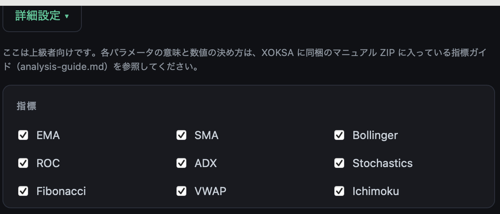
→ 自分の分析スタイルに合わせて調整できます。

---

## 4. 設定の変更

### 4.1 設定アプリでの変更
接続画面の「**設定…**」を開き、パスワードを入力します。直したい項目を編集して「保存」を押し、そのあと**接続し直す**と反映されます。終わったら「**終了**」を押します——保存していない変更があるときは、閉じる前に確認が出ます。
→ いつでも言語・AI・通知などを変えられます。

### 4.2 反映のタイミング
変更は、XOKSA が**起動／接続するとき**に読み込まれます。**保存しただけでは、動いているエンジンにはすぐ反映されません**。デスクトップは「接続」で反映されます（接続でエンジンが再起動します）。**ポート**や**アクセストークン**の変更は、変更後に起動したエンジンにだけ反映されます——「接続」カードの「**エンジンを再起動**」がその操作です。

### 4.3 設定アプリに無い項目
フォームに無い細かい項目（例：チャットの既定、ログ設定、アラートの細かい条件など）は、`xoksa.env` を直接編集します。ファイルの場所と書き方は「2. 設定ファイル（xoksa.env）」を参照してください。編集後は**再起動**で反映されます。

### 4.4 AI キーの追加・差し替え
AI を増やす・キーを入れ替えるときも、設定アプリの AI 項目で行います。キー欄は**空白＝今のキーを保持**、新しい値を入れると差し替わります。

---

## 5. 困ったとき

うまくいかないときは、症状から探してください。

**インストール・起動でつまづく（Windows）**
「WindowsによってPCが保護されました」と表示されたら、「詳細情報」→「実行」を押します。

**インストール・起動でつまづく（Mac）**
「開けません」「壊れています」と表示される場合は、ダウンロードが不完全か、ファイルが改変されています。いったん削除して `.dmg` をダウンロードし直し、ダウンロードページに載っている SHA-256 と照合してください（`shasum -a 256 <ファイル名>`）。`xattr -d com.apple.quarantine` で警告を回避しないでください——正規の XOKSA では不要です。

**「設定」のパスワードが分からない**
初期パスワードは `XOKSA_password` です。自分で変えたパスワードを忘れたときは、`xoksa settings-password --set`（コマンド）で新しいパスワードに再設定できます。

**変更したのに反映されない**
設定を変えたら、接続し直してください（接続でエンジンが再起動し、変更が反映されます）。

**AI の解説が出ない**
- クラウド AI の場合：API キーが正しく入っているか、各サービスの残高・利用上限を確認してください（従量課金です）。
- Ollama の場合：Ollama が起動しているか確認してください。

**ニュース・企業情報が出ない**
そのデータ用のキーが入っているか確認してください——ニュースは Brave、日本株の企業情報は J-Quants、米国株は SEC の User-Agent。

**会社名が出ない・文字化けする（日本株）**
**銘柄名ファイル**（1.8。`xoksa.env` では `ALIAS_CSV`）が正しく指定されているか確認してください。文字化けするときは UTF-8 で保存し直すか、元の `.xls` をそのまま指定します。

**接続できない**
自動起動の場合は、接続画面のエラーメッセージが原因（ポート使用中・認証要求など）を表示します——一覧は[コマンドリファレンス §6](command-reference.md) を参照してください。自分で `xoksa serve` を起動して接続する場合は、そのアドレス（既定 `127.0.0.1:8787`）と一致しているかを確認してください。

**通信エラーが出る（プロキシを使うネットワーク）**
XOKSA は、市場データ・ニュース・クラウド AI・企業情報といった**外部サービスへインターネット経由（HTTPS）でアクセス**します。この外部アクセスがプロキシを通さないと出られないネットワークでは、`xoksa.env` にプロキシを設定します（値は自分の環境のもの）。

```
HTTPS_PROXY=http://192.168.0.10:8080
```

`HTTPS_PROXY` は「その**外部向け HTTPS 通信**に使うプロキシ」を指す設定名で、プロキシ URL 自体が `http://` で始まるのは標準です（プロキシへは HTTP で接続し、そこが外部への HTTPS を中継する仕組み）。XOKSA 内部の通信（ブラウザ↔エンジンなどの `127.0.0.1`）はプロキシを通りません。

---

<a id="appendix-env"></a>

## 付録：xoksa.env 全項目と既定値

**言語・分析**
| 設定 | 意味 | 既定 |
| :-- | :-- | :-- |
| `LANG` | 出力言語（`en` / `ja`） | en |
| `ANALYSIS_MODE` | 分析の足種（daily/60m/30m/15m/5m/1m/weekly/monthly） | daily |

**しきい値**
| 設定 | 意味 | 既定 |
| :-- | :-- | :-- |
| `BUY_RSI` | RSI 買いシグナルのしきい（下回ると売られすぎ） | 30.0 |
| `SELL_RSI` | RSI 売りシグナルのしきい（上回ると買われすぎ） | 70.0 |
| `MACD_DIFF_LOW` | MACD ヒストグラムの弱シグナル境界 | 2.0 |
| `MACD_DIFF_MID` | 同・強シグナル境界 | 10.0 |
| `MACD_DIFF_EXTREME` | RSI 買われすぎ併発時の極端乖離境界 | 100.0 |
| `MACD_MINUS_OK` | MACD ヒストグラムが負でも買いを許すか | false |

**使う指標**（`True` にした指標が、計算・保存されます）
| 設定 | 意味 | 既定 |
| :-- | :-- | :-- |
| `EMA` | 指数移動平均を計算・スコアに含めるか | True |
| `SMA` | 単純移動平均を含めるか | True |
| `FIBONACCI` | フィボナッチ・リトレースメントを含めるか | True |
| `STOCHASTICS` | ストキャスティクスを含めるか | True |
| `ADX` | 平均方向性指数（トレンドの強さ）を含めるか | True |
| `ROC` | 変化率（モメンタム）を含めるか | True |
| `BOLLINGER` | ボリンジャーバンドを含めるか | True |
| `VWAP` | 出来高加重平均価格を含めるか | True |
| `ICHIMOKU` | 一目均衡表を含めるか | True |

**指標の重み**（合成スコアへの影響。大きいほど強い）
| 設定 | 意味 | 既定 |
| :-- | :-- | :-- |
| `WEIGHT_BASIC` | RSI＋MACD の基礎指標の重み | 2.0 |
| `WEIGHT_EMA` | EMA の重み | 1.0 |
| `WEIGHT_SMA` | SMA の重み | 1.0 |
| `WEIGHT_BOLLINGER` | ボリンジャーの重み | 1.0 |
| `WEIGHT_ROC` | ROC の重み | 1.0 |
| `WEIGHT_ADX` | ADX の重み | 1.0 |
| `WEIGHT_STOCHASTICS` | ストキャスの重み | 1.0 |
| `WEIGHT_FIBONACCI` | フィボナッチの重み | 1.0 |
| `WEIGHT_VWAP` | VWAP の重み | 1.0 |
| `WEIGHT_ICHIMOKU` | 一目均衡表の重み | 1.0 |

**指標の計算パラメータ**（未設定なら下の既定値で動作）
| 設定 | 意味 | 既定 |
| :-- | :-- | :-- |
| `EMA_SHORT_PERIOD` | 短期 EMA 期間（< `EMA_LONG_PERIOD`） | 5 |
| `EMA_LONG_PERIOD` | 長期 EMA 期間 | 20 |
| `SMA_SHORT_PERIOD` | 短期 SMA 期間（< `SMA_LONG_PERIOD`） | 5 |
| `SMA_LONG_PERIOD` | 長期 SMA 期間（出来高平均窓も兼ねる） | 20 |
| `ADX_PERIOD` | ADX 平滑期間 | 14 |
| `ROC_PERIOD` | ROC ルックバック | 10 |
| `STOCHASTICS_PERIOD` | ストキャス %K 期間 | 14 |
| `BOLLINGER_PERIOD` | ボリンジャー移動平均期間 | 20 |
| `BOLLINGER_STDDEV_MULTIPLIER` | σ 倍率 | 2.0 |
| `BB_BANDWIDTH_SQUEEZE_PCT` | スクイーズ警告を出すバンド幅％ | 8.0 |
| `ICHIMOKU_TENKAN_PERIOD` | 転換線（< kijun） | 9 |
| `ICHIMOKU_KIJUN_PERIOD` | 基準線 | 26 |
| `VWAP_PERIOD` | 非日中モードの VWAP 窓 | 14 |
| `FIBONACCI_NEUTRAL_RATIO` | フィボの中立帯。50%→38.2% 距離に対する割合（0.0〜0.5） | 0.05 |

**投資スタンス**
| 設定 | 意味 | 既定 |
| :-- | :-- | :-- |
| `STANCE` | buyer／seller／holder（シグナル解釈とプロンプト枠に影響） | holder |

**チャット（`--chat`）**
| 設定 | 意味 | 既定 |
| :-- | :-- | :-- |
| `CHAT_DEFAULT_TICKER` | 銘柄指定なしで起動時に自動ロード（最大5・カンマ区切り） | （空） |
| `CHAT_ANALYSIS_MODE` | チャットの足種 | ANALYSIS_MODE に従う |
| `CHAT_MEMORY` | 1ターンの文脈量（low/mid/high） | mid |
| `CHAT_GUARD` | 投資助言の制約強度（high/mid/low） | high |
| `DEBATE` | 他 LLM 意見の保持（off/summary/claims） | summary |
| `AUTORELOAD` | 日中チャットの自動リロード | false |
| `AUTORELOAD_NOTIFY` | 自動リロード時に通知表示 | false |
| `READ_DEPTH` | データを読み込む深さ（shallow/mid/deep） | mid |
| `KNOWLEDGE_SCOPE` | 入力外の一般知識に踏み出す幅（narrow/mid/wide） | mid |
| `RESPONSE_SHAPE` | 回答形式（talk/points/scenario） | talk |
| `FORECAST_MODE` | 予測の強さ（off/soft/bold・確定値は書き換えない） | soft |

**LLM 共通**
| 設定 | 意味 | 既定 |
| :-- | :-- | :-- |
| `llm_provider` | 使う LLM（openai/gemini/claude/ollama） | openai |
| `llm_timeout_seconds` | リクエストのタイムアウト秒 | 120 |
| `llm_temperature` | 応答のランダム性（0.0–1.0） | 0.7 |
| `llm_top_p` | nucleus サンプリング | 0.9 |
| `llm_max_output_tokens` | 応答の最大トークン | 16384 |
| `EXTRA_NOTE` | 全プロンプトに付ける補足文（任意） | （空） |

**プロバイダ別モデル**
| 設定 | 意味 | 既定 |
| :-- | :-- | :-- |
| `openai_model` | OpenAI モデル | gpt-5.6-terra |
| `gemini_model` | Gemini モデル | gemini-3.5-flash |
| `claude_model` | Claude モデル | claude-sonnet-5 |
| `claude_max_tokens` | Claude の最大トークン | 16384 |

**Ollama（ローカル LLM。`llm_provider=ollama` のとき。キー不要）** — サーバは 1〜16 を定義でき、最小番号が起動時の既定
| 設定 | 意味 | 既定 |
| :-- | :-- | :-- |
| `OLLAMA_<n>_ALIAS` | サーバ n のエイリアス（任意の名前。`/llm ollama:<alias>` で切替） | （空） |
| `OLLAMA_<n>_HOST` | サーバ n のホスト | （空） |
| `OLLAMA_<n>_PORT` | サーバ n のポート | （空） |
| `OLLAMA_<n>_MODEL` | サーバ n のモデル | （空） |
| `OLLAMA_TIMEOUT_SECONDS` | タイムアウト秒 | 300 |
| `OLLAMA_TEMPERATURE` | ランダム性 | 0.2 |
| `OLLAMA_TOP_P` | nucleus サンプリング | 0.9 |
| `OLLAMA_TOP_K` | top-k サンプリング | 40 |
| `OLLAMA_REPEAT_PENALTY` | 繰り返し抑制 | 1.1 |
| `OLLAMA_NUM_CTX` | 文脈窓トークン | 32768 |
| `OLLAMA_NUM_PREDICT` | 生成最大トークン | 8192 |
| `OLLAMA_THINK` | 思考量（low/medium/high・対応モデルのみ） | （未設定） |
| `OLLAMA_SEED` | 乱数シード | 42 |
| `OLLAMA_NO_GUARD` | 整合性ガードを無効化 | false |
| `OLLAMA_KEEP_ALIVE` | モデルをメモリに保持する時間 | 10m |
| `OLLAMA_DEBUG` | 要求／応答詳細を stderr に出す | false |
| `OLLAMA_BENCH_MODELS` | `/bench` 比較対象モデル（カンマ区切り） | （空） |
| `OLLAMA_BENCH_FORMAT` | `/bench` 出力形式（table/csv/json） | table |

**ニュース**
| 設定 | 意味 | 既定 |
| :-- | :-- | :-- |
| `NO_NEWS` | ニュース取得を丸ごと省略 | false |
| `SHOW_NEWS` | 取得タイトルを端末に表示 | false |
| `NEWS_FILTER` | 銘柄関連の記事だけに絞る | false |
| `NEWS_COUNT` | 取得件数 | 30 |
| `NEWS_FRESHNESS` | 鮮度（pd 日／pw 週／pm 月／py 年） | pm |
| `CUSTOM_NEWS_QUERY` | 自動生成クエリを上書き | （空） |
| `NO_ALIAS` | 会社名表示にエイリアス CSV を使わない | false |

**ログ**
| 設定 | 意味 | 既定 |
| :-- | :-- | :-- |
| `SAVE_TECHNICAL_LOG` | 分析結果をログ保存 | false |
| `LOG_FORMAT` | ログ形式（json/csv） | json |
| `LOG_DIR` | 出力先ディレクトリ | log |
| `CSV_APPEND` | CSV を上書きせず追記 | false |
| `LOG_FLAT` | 1分析を入れ子なしフラット JSON で書く | false |

**プロンプト文字数上限**
| 設定 | 意味 | 既定 |
| :-- | :-- | :-- |
| `MAX_NOTE_LENGTH` | 見通しノート節 | 400 |
| `MAX_SHORTTERM_LENGTH` | 短期サマリ | 200 |
| `MAX_MIDTERM_LENGTH` | 中期サマリ | 200 |
| `MAX_NEWS_LENGTH` | ニュース節 | 1000 |
| `MAX_REVIEW_LENGTH` | 全体レビュー節 | 2000 |

**プロキシ**（認証付き URL は非対応。Ollama 127.0.0.1 は常にバイパス）
| 設定 | 意味 | 既定 |
| :-- | :-- | :-- |
| `HTTP_PROXY` | HTTP 用プロキシ URL（CONNECT トンネル） | （空） |
| `HTTPS_PROXY` | HTTPS 用プロキシ URL（CONNECT トンネル） | （空） |
| `NO_PROXY` | プロキシを通さないホスト（カンマ区切り） | 127.0.0.1,localhost |

**デバッグ**
| 設定 | 意味 | 既定 |
| :-- | :-- | :-- |
| `DEBUG_PROMPT` | プロンプトを送らずファイルに保存 | false |
| `NO_LLM` | LLM 呼び出しを省略（テクニカルのみ） | false |

**会社名エイリアス**
| 設定 | 意味 | 既定 |
| :-- | :-- | :-- |
| `ALIAS_CSV` | 会社名表示用 CSV のパス | （空） |

**ファンダメンタル**
| 設定 | 意味 | 既定 |
| :-- | :-- | :-- |
| `FUNDAMENTAL` | `--fundamental` なしでも常に取得 | false |
| `JQUANTS_API_KEY` | 日本株 J-Quants（v2）※キーはキーチェーン推奨 | （空） |
| `SEC_USER_AGENT` | 米国株 SEC EDGAR（`アプリ名 メール` 形式・必須） | （空） |

**通知チャンネル**（1〜16。secret はキーチェーン専用）
| 設定 | 意味 | 既定 |
| :-- | :-- | :-- |
| `NOTIFY_<n>_KIND` | チャンネル種別（slack/discord/gchat/line） | （空） |
| `NOTIFY_<n>_NAME` | `/alert` 一覧に出る表示名 | （空） |
| `NOTIFY_<n>_TO` | LINE の宛先 id（LINE のみ） | （空） |

**アラート**（1〜16。**17番以降は読み込まれません**。直接編集したときは再起動が必要です）
| 設定 | 意味 | 既定 |
| :-- | :-- | :-- |
| `ALERT_<n>_TICKER` | 監視する銘柄（例 7203.T, AAPL） | （空） |
| `ALERT_<n>_WHEN` | 条件（`<指標><op><数値>`・例 `rsi<=30`） | （空） |
| `ALERT_<n>_MODE` | 監視する足（1m/5m/15m/30m/60m） | （空） |
| `ALERT_<n>_NOTIFY` | 発火するチャンネル番号 | 1 |
| `ALERT_<n>_EXPLAIN` | LLM の一言解説を付ける | false |
