# XOKSA User Guide

[日本語ドキュメントはこちら。](#ja)

> **Language sync:** English and Japanese descriptions are both authoritative. If a requirement, restriction, exception, command behavior, or operational rule appears in only one language, treat it as applying to both; the missing side is a documentation defect to be updated.

This guide covers **how to actually use XOKSA once it is installed** (for installation, see the [Setup Guide](setup.md)). It walks through reading the screen, asking questions in chat, selecting a chart interval, backtesting, having a second AI critique an answer, and notifications. For the full list of options, see the [Command Reference](command-reference.md).

---

## 1. Reading the screen

Type a ticker code (e.g. `NVDA`) into the **search box** at the top and press Enter. The analysis for that ticker appears in each area. The screen is divided into the six areas below (the numbers match the figure).

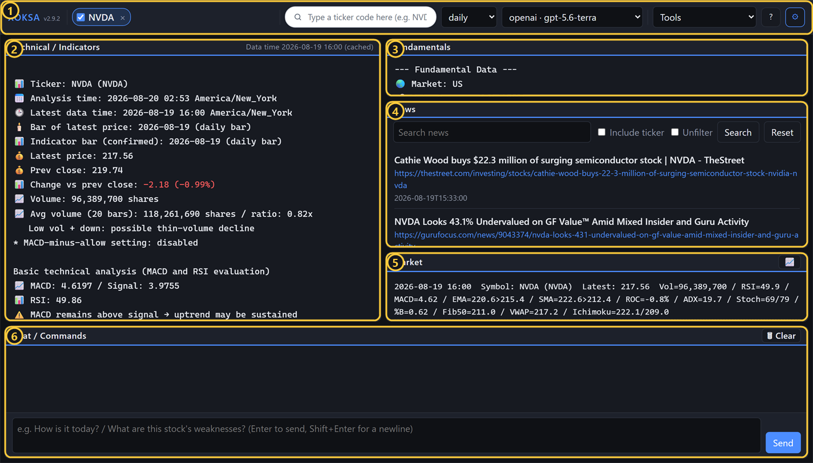

**① Top (header) — controls**
- **Search box** (magnifier icon) — enter a ticker code and press Enter to analyse.
- **Timeframe** (`daily` / `1m` / `5m` / `15m` / `30m` / `60m` / `weekly` / `monthly`) — the unit of time to analyse. Switching it re-fetches the data for that bar and analyses again.
- **AI selection** — the AI (provider / model) used for commentary and chat.
- **Tools** — Basic, Multi-timeframe, Backtest and Alerts open from here (see below).
- **? Help** — the list of chat commands (see below).
- **⚙ Settings** — display (theme, font size, language) and update (auto-refresh, refresh now).

**Ticker chips**

When you enter a ticker code in the search box and press Enter, "ticker chips" line up at the top.

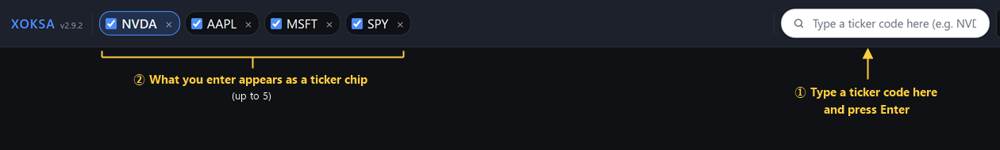

Each chip has three parts.

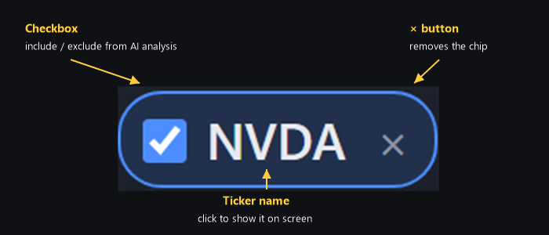

- **Checkbox** — checked tickers are what the AI analysis and chat work on. Check several to compare them together. At least one must stay checked. Unchecking keeps the ticker on the chip; it is only dropped from the AI's target set.
- **Ticker name** — click it to show that ticker in the panels. The ticker currently shown has a **blue border**.
- **×** — removes the chip.

**② Technical / Indicators (left)**

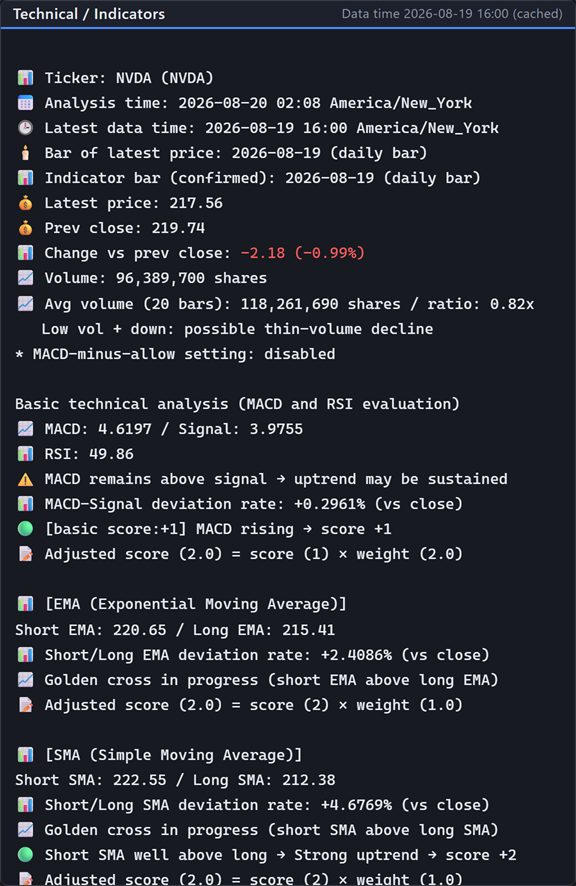

Price and the technical indicators. "Data time" at the top is the latest time of the source data (Yahoo).

**③ Fundamentals (top right)**

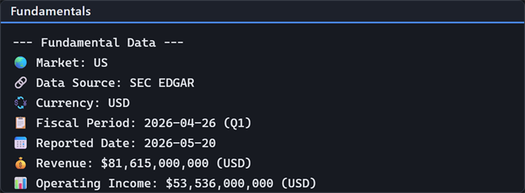

The company's fundamental data.

**④ News (right)**

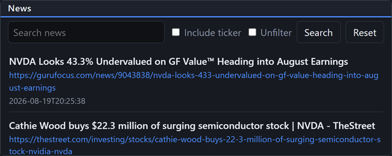

Related headlines (click one for the source article in a new tab). You can also search the news.

**⑤ Market (bottom right)**

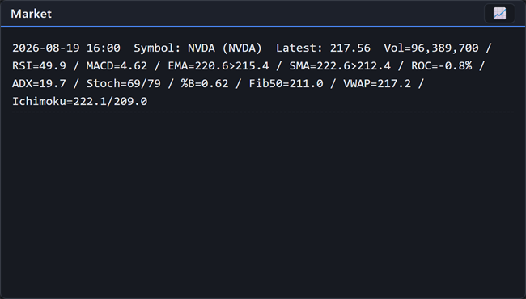

A market summary. 📈 opens the chart in a separate window.

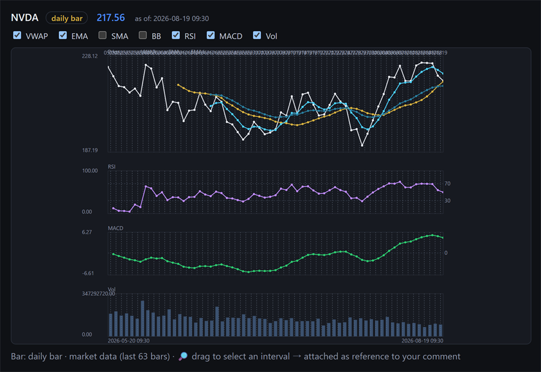

**⑥ Chat / Commands (bottom)**
The box for your questions. Type something like "How is it likely to move today?" and press Enter (see below).

---

## 2. Chat

Once a ticker is selected, type your question in the **Chat / Commands** box at the bottom and press Enter (Shift+Enter for a newline). The answer is based on the figures and news on screen. It covers whichever tickers are checked. The AI that answers is chosen in **AI selection** at the top.

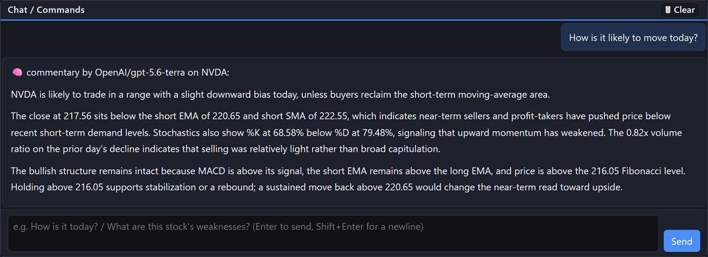

- You can keep asking on top of the previous answer (e.g. "So when is a good time to buy?").
- Examples: "How is it likely to move today?" / "What are its weaknesses?" / "Why is it falling?"

**Asking about a chart interval**

Open the chart in a separate window with 📈 in the Market area, then drag to select the interval you care about.

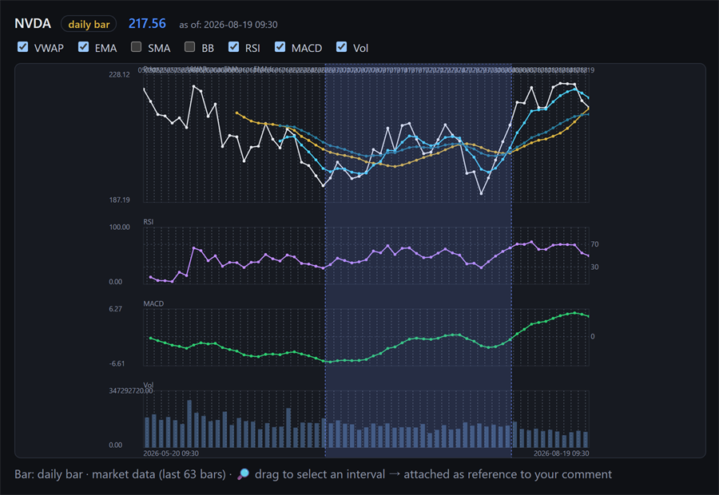

The selection appears as a 📎 chip above the chat box.

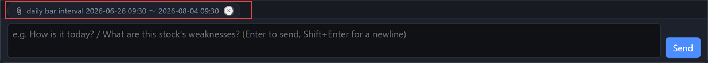

Type your question and send it, and that interval goes along as a reference. Remove the attachment with the chip's ×; it clears automatically once you send.

**Comparing several tickers**

Check several tickers to compare them together. XOKSA does not go looking for stocks to recommend. What it does here is compare the candidates *you* chose on the same basis, so you can narrow them down.

As an example, check four: NVDA, AAPL, MSFT and SPY.

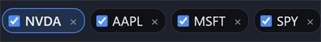

Then ask "Which one should I prioritise?" and the answer lines all four up.

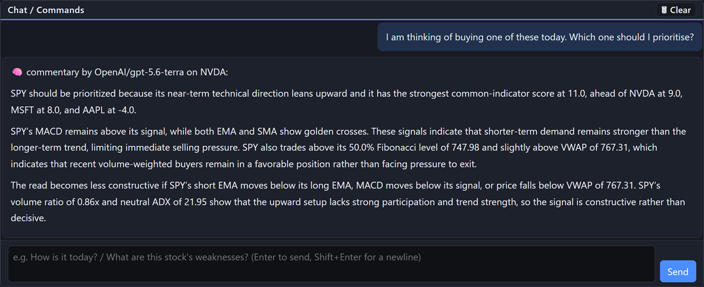

**Chat commands**

Commands starting with `/` are available. The list opens from **?** (Help) at the top right, and **clicking a line puts it in the chat box** — you do not need to memorise them.

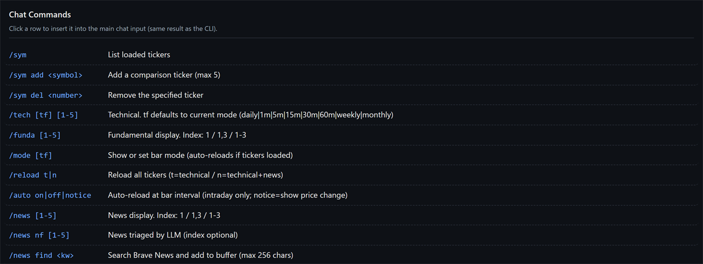

For example, `/status` shows the current state of the chat.

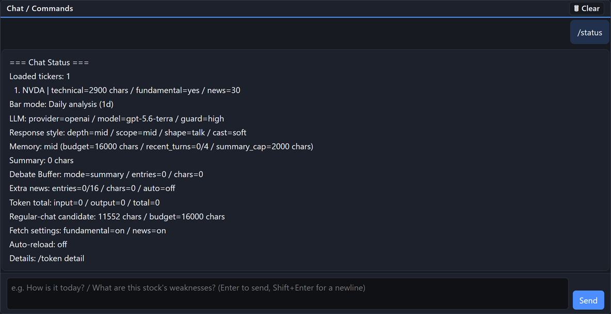

**Having another AI critique the answer**

Reading an answer does not tell you which parts are backed by XOKSA's data. `/crit` is a chat command that has a different AI critique the previous AI's answer. Instead of doubting the whole answer, you can set aside just the weakly grounded parts. It also allows a workflow such as letting a small local AI answer and a cloud AI critique it.

The critiquing AI checks that answer against XOKSA's data and lists only the statements that need attention.

- Statements that contradict XOKSA's data in value or direction
- Claims based on grounds that cannot be confirmed in XOKSA's data
- Statements implying the article body was read (bodies are not fetched)
- Numeric comparisons where the data timestamps may differ

First, clear the **Auto-refresh** checkbox in ⚙ Settings. If the figures change while the analysis is running, that difference shows up in the critique too.

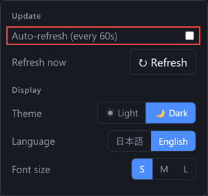

Start by asking one AI and getting an answer. Here a local Ollama model answers.

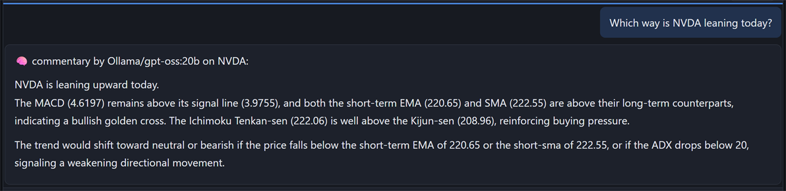

Switch to a different AI with **AI selection** at the top.

Then send `/crit`. The critique starts with the AI and model it targets and the original question.

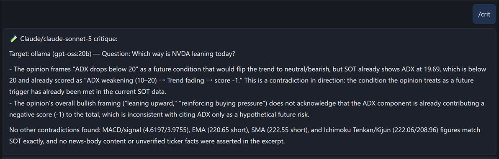

You can keep the conversation going for anything you want to know.

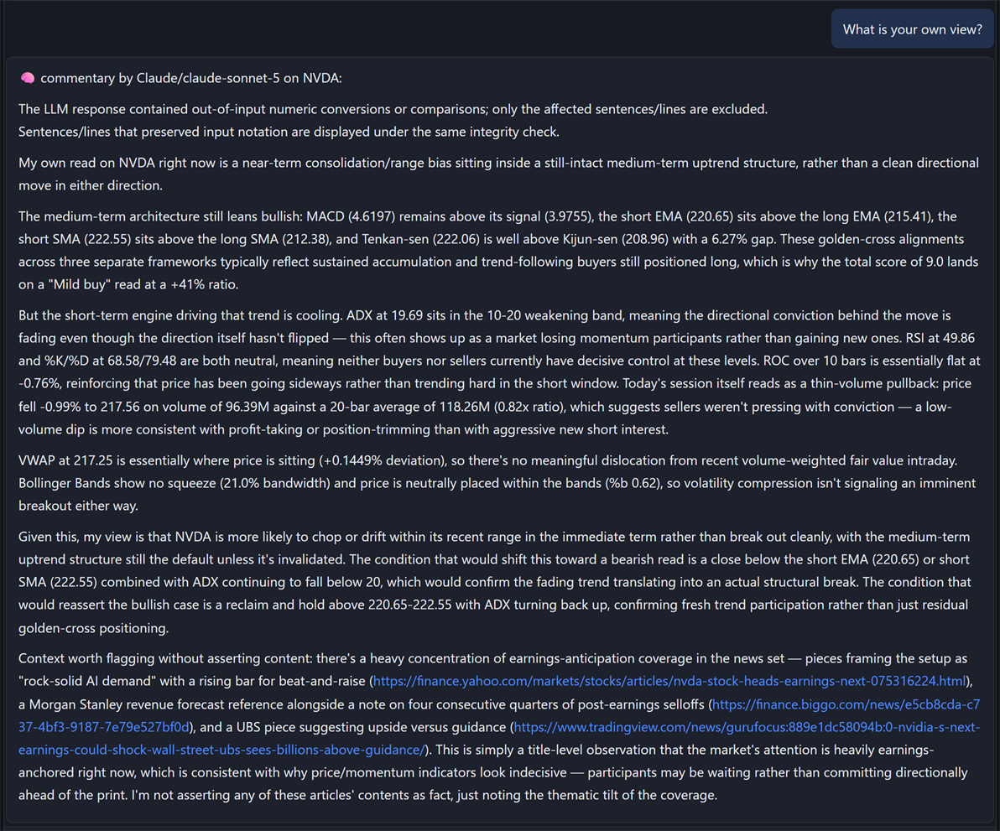

**Putting several AIs in a meeting**

`/forum` puts the same topic to several AIs and has them discuss it. You set the topic, the participants each give their view, and the chair runs the meeting and sums it up.

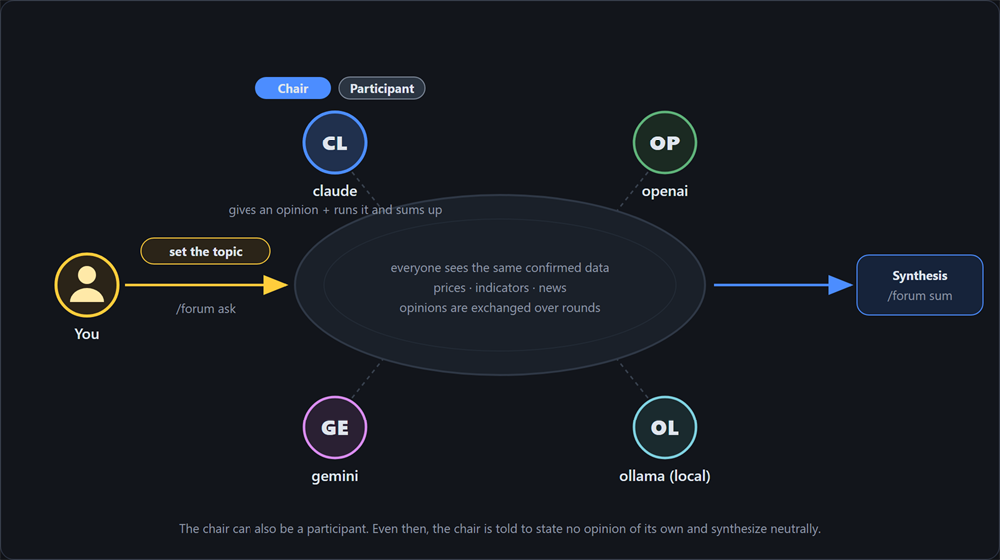

The chair can also be a participant. Even then the two roles are kept apart: as chair it is told to state no opinion of its own and to lay out each participant's position, the points of agreement, and the points of disagreement neutrally. It does not behave like a human chairing a meeting and pushing their own proposal through.

First decide the participants and the chair, then set the topic. The number after `ask` is the number of rounds.

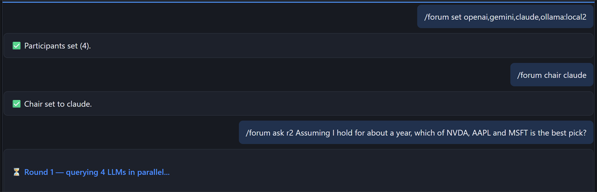

Each participant reads the same confirmed data and gives its view, its reasoning, and its concerns.

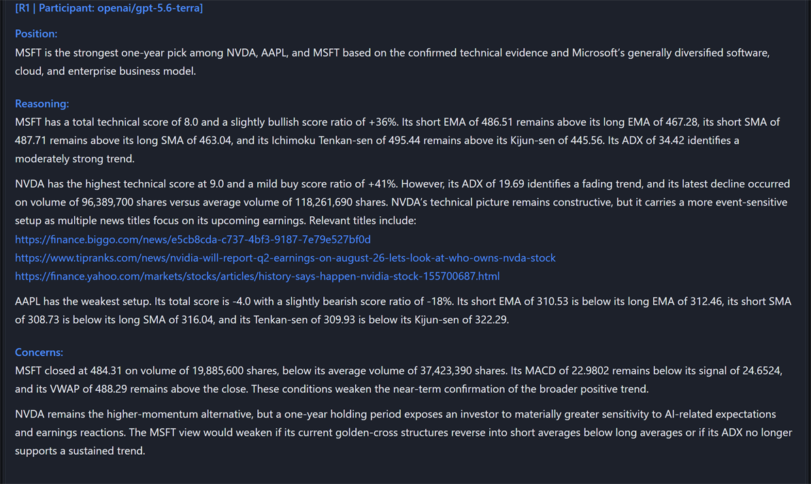

After each round the chair lays out the positions, the agreements and the disagreements, then poses the questions to settle in the next round.

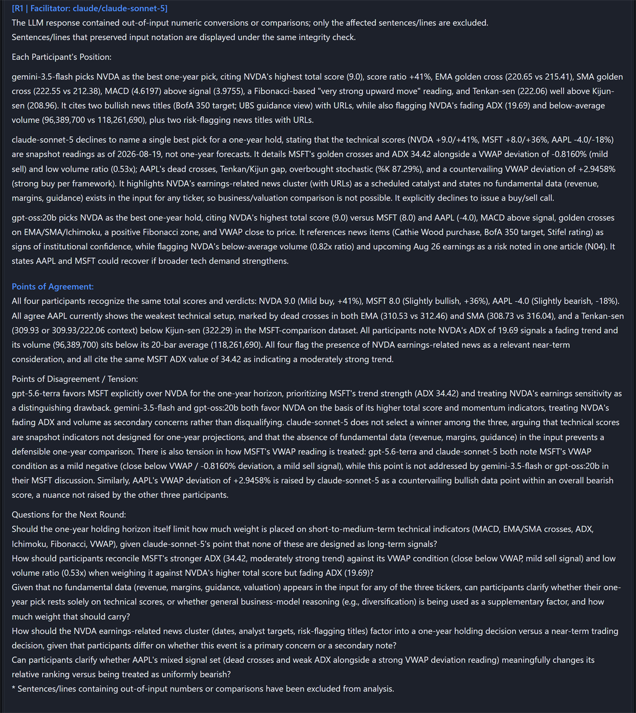

On the last round it gives a conclusion instead of questions for a further round.

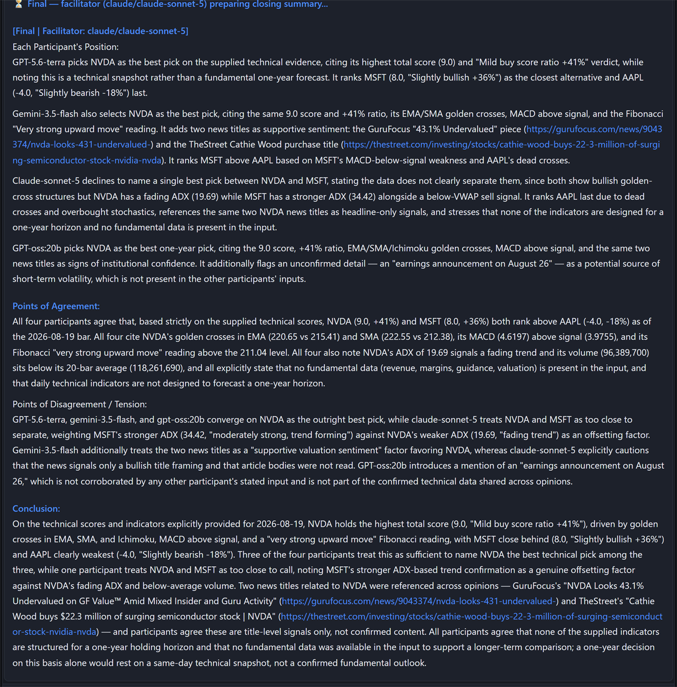

Sending `/forum sum` has the chair sum up the discussion so far again.

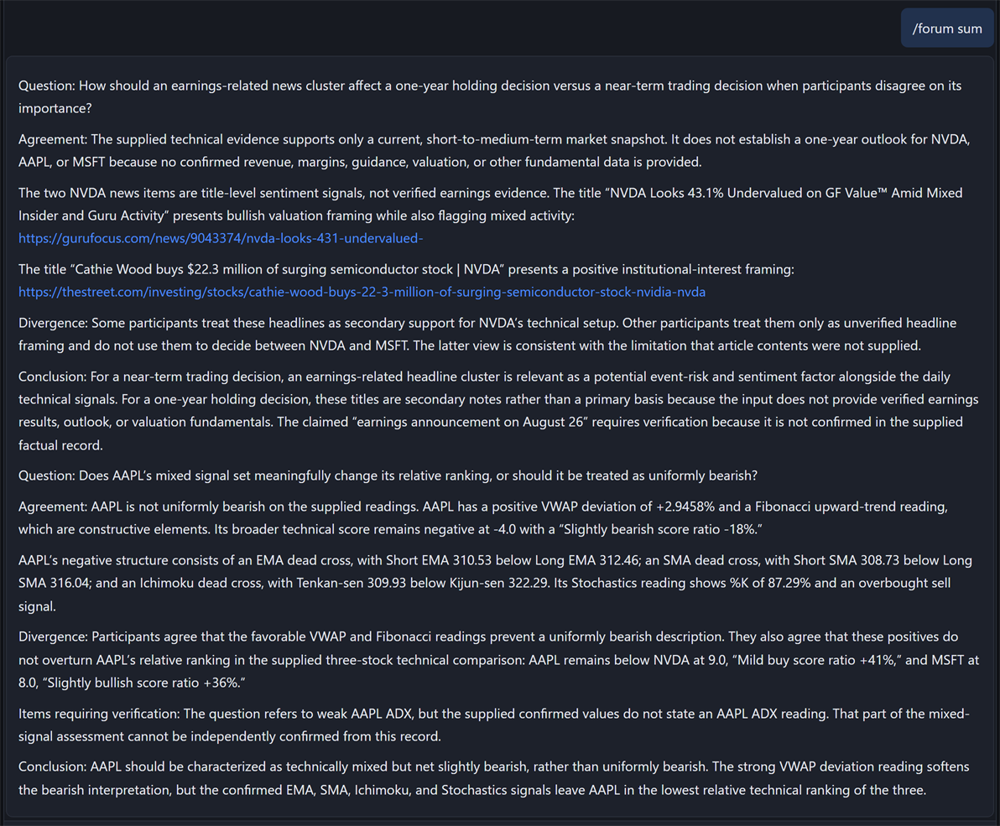

- `/forum` — show the participants, the chair and the usage
- `/forum set <p,...>` — set the participants
- `/forum chair 
` — set the chair (`reset` clears it)
- `/forum ask [rN] <topic>` — set the topic (`rN` sets the number of rounds)
- `/forum sum` — have the chair sum up
- `/forum log` — show the minutes
- `/forum clear` — clear the minutes and the debate buffer

---

## 3. Tools

**Tools** in the header opens the features. Picking one runs it there and then, and the control returns to "Tools".

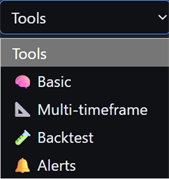

### 3.1 🧠 Basic

Analyses the checked tickers on the selected timeframe. The result appears in the chat box. It is the same as sending `/basic` in chat.

The result has these six sections.

- 📊 Key points for investors (within 400 chars)
- 📉 Short-term outlook (within 200 chars)
- 📆 Mid-term outlook (within 200 chars)
- 📚 Fundamental supplementary information (within 800 chars)
- 📰 News highlights (within 1000 chars)
- 📝 Overall assessment (within 2000 chars)

The names of the short-term and mid-term sections follow the timeframe. On daily bars they are "Short-term outlook (1 week)" and "Mid-term outlook (1 month)". The fundamental section appears when fundamental data is available for that ticker.

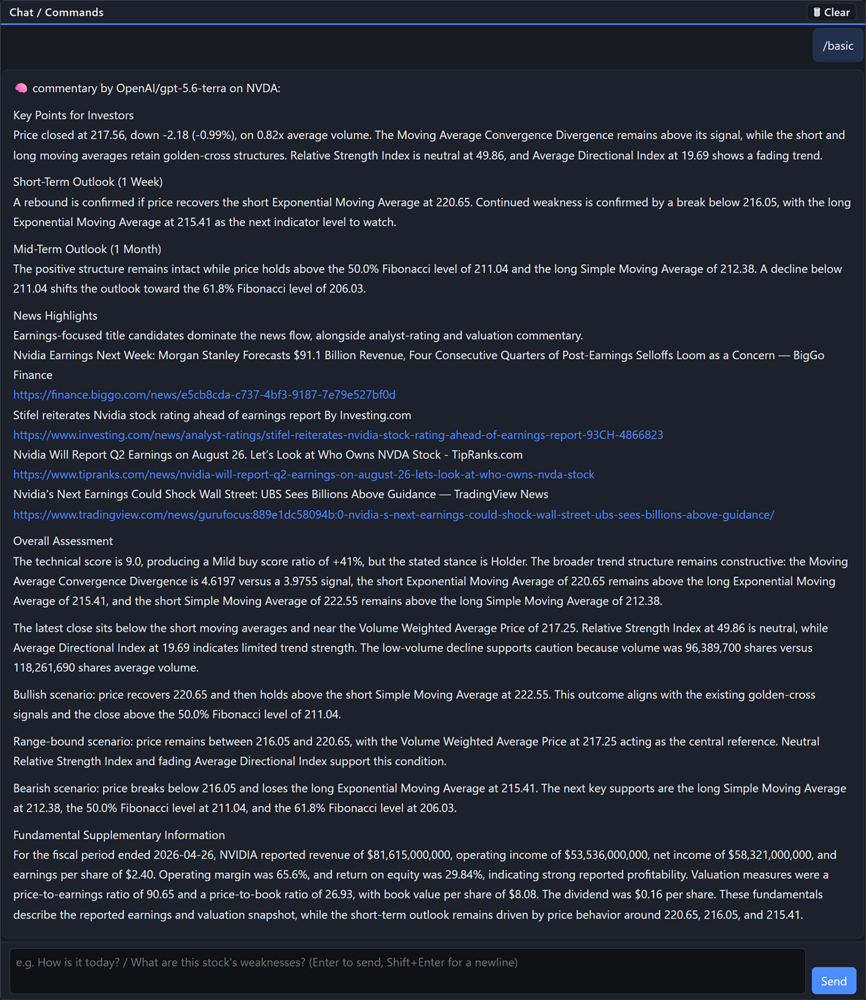

### 3.2 📐 Multi-timeframe

Fetches the monthly MACD, the daily Bollinger Bands and the 5-minute price together, and has the AI read all three. It is for seeing whether the long and short bars point the same way.

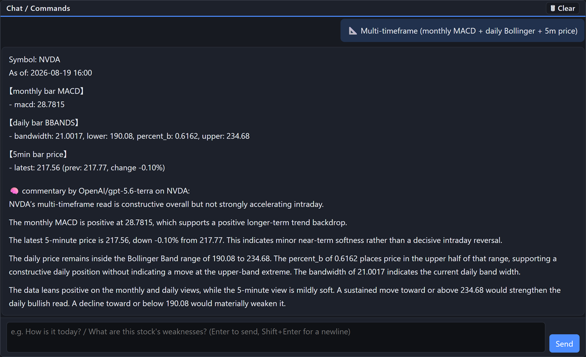

### 3.3 🧪 Backtest

Set buy and sell conditions and try them on past data.

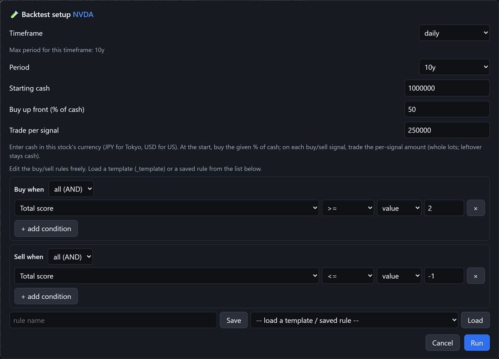

- Timeframe and period — picking a timeframe shows the maximum period available for it.
- Starting cash — entered in this stock's currency (JPY for Tokyo, USD for US).
- Buy up front (% of cash) — this share is bought at the start.
- Trade per signal — this amount is traded each time a signal appears (whole lots; the remainder stays as cash).
- Buy when / Sell when — combine an indicator with a comparison. Conditions can be added.
- Rules can be saved under a name, and a template (`_template`) or a saved rule can be loaded.
- An indicator needs enough bars before it has a value. Where a bar cannot produce one, a condition using that indicator simply does not hold there. So if a rule trades nothing, one thing worth checking is whether the period is too short for the indicator it uses — lengthen the period, or use a shorter indicator setting. (Of course a rule can also trade nothing simply because its conditions never met.)

Running it puts the result in the chat box. The rule's result is shown next to what simply buying and holding over the same period would have produced.

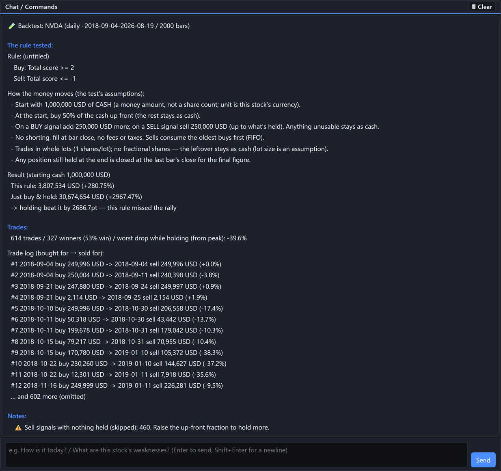

### 3.4 🔔 Alerts

Pushes a one-line message to a chat app when a condition you set holds.

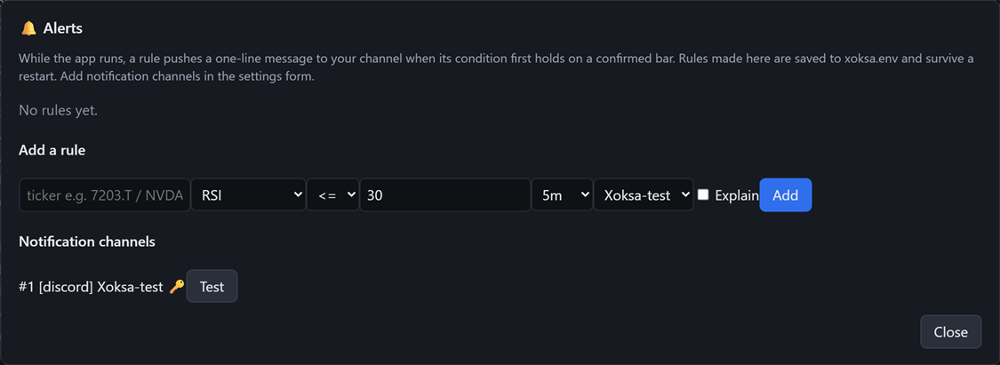

- Pick the ticker, indicator, condition, timeframe and destination, then "Add". You can also attach a short explanation.
- **You can keep up to 16 rules.** When it is full, deleting one frees a slot.
- What is watched is the ticker written in the rule. **You do not need that symbol on screen.** The watch continues while you look at another symbol, and while the dashboard is closed.
- The notification fires while the app is running, and stops when you quit it. What it evaluates is the **latest fetched bar** — on Japanese intraday timeframes that includes the **still-forming** one. It does not wait for the bar to close, so the notification goes out the moment the condition is met within the bar.
- Rules you create are saved and survive a restart. The same holds for rules made with `/alert add` in chat.
- The enabled/disabled switch lives **only while the app runs**. Leave a rule disabled and restart, and it comes back enabled.
- Notification channels are added in the settings app. "Test" checks that a channel works.

This is how a notification arrives.

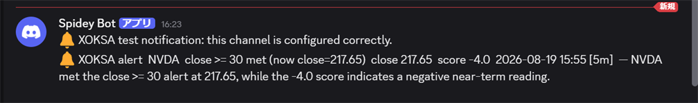

> The language of the notification follows `LANG` in `xoksa.env` (the setting app's **Language**), not the dashboard's display language.

---

## 4. What to read next

That covers reading the screen, chat and the tools. To go further, see:

- [Analysis Guide](analysis-guide.md) — what each indicator means, how the total score is produced, and strategies you can use.
- [Command Reference](command-reference.md) — every chat command and CLI option.
- [Setup & Integration Guide](setup.md) — installation, API keys, and using the output (CSV / JSON).

If you are interested in the internals or security, there are developer documents:

- [Design Philosophy and Architecture](../dev-prog/design-philosophy.md)
- [System Architecture Overview](../dev-prog/system-design.md)
- [Security Design](../dev-prog/security-design.md)
- [Security, Reliability & Shipping Inspection](../dev-prog/security-assessment.md)
- [Source Code Map](../dev-prog/source-map.md)

---

# XOKSA ユーザーズガイド

このガイドは、XOKSA を**導入したあとの実際の使い方**です（導入は[セットアップガイド](setup.md)）。画面の見方から、チャットでの質問、チャートの範囲選択、バックテスト、複数 AI での検討、通知まで、シーンごとに順を追って説明します。各コマンドの詳しい一覧は[コマンドリファレンス](command-reference.md)を参照してください。

---

## 1. 画面の見方

画面上部の**検索ボックス**に銘柄コード（例：`9432`＝NTT／`NVDA`）を入力して Enter。その銘柄の分析が各区画に表示されます。画面は次の6区画に分かれています（番号は下図に対応）。

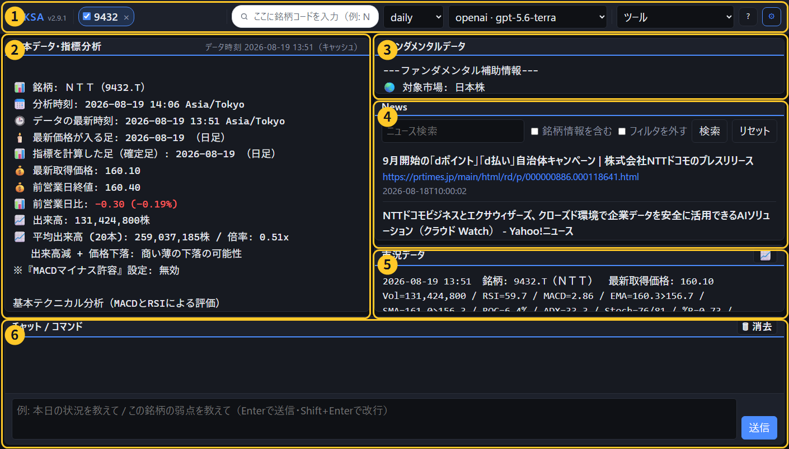

**① 上部（ヘッダー）— 操作**
- **検索ボックス**（虫めがねアイコン）— 銘柄コードを入れて Enter で分析。
- **足種**（`daily`／`1m`／`5m`／`15m`／`30m`／`60m`／`weekly`／`monthly`）— 分析する時間の単位（日足・時間足・分足など）。切り替えると、その足でデータを取り直して分析し直します。
- **AI の選択** — 解説やチャットに使う AI（プロバイダ／モデル）を選びます（セットアップで入れた AI から切り替え）。
- **ツール** — 基本分析・マルチタイムフレーム・バックテスト・アラートをここから開きます（後述）。
- **? ヘルプ** — チャットで使えるコマンドの一覧（後述）。
- **⚙ 設定** — 表示（テーマ・文字サイズ・言語）と更新（自動更新・今すぐ更新）。

**銘柄チップ**

検索ボックスに銘柄コードを入力して Enter すると、上部に「銘柄チップ」が並びます。

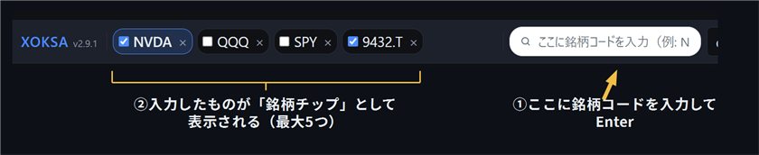

各チップには3つの部品があります。

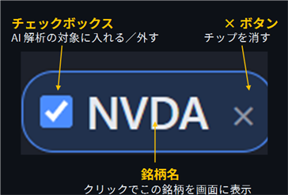

- **チェックボックス** — チェックした銘柄が AI 解析・チャットの対象になります。複数チェックすれば、まとめて見比べ・検討できます。最低1つは必要です（全部は外せません）。外しても銘柄はチップに残ります（AI の対象から外れるだけ）。
- **銘柄名** — クリックすると、その銘柄が画面（各パネル）に表示されます。いま表示中の銘柄は**青枠**で示されます。
- **×** — そのチップを消します。

**② 基本データ・指標分析（左）**

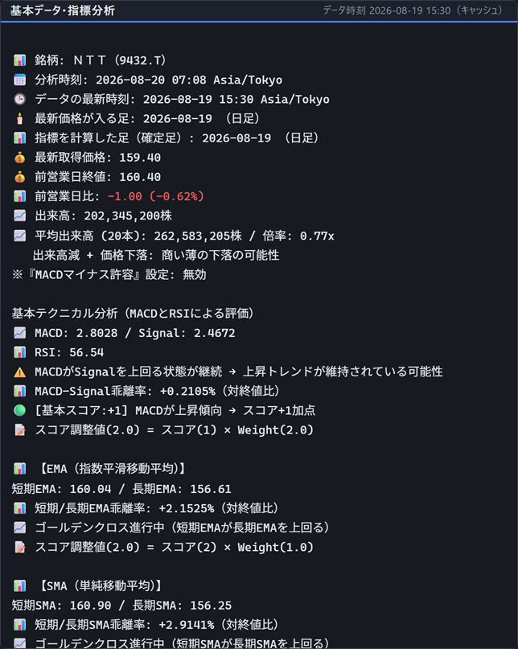

価格と各種テクニカル指標の分析。上部「データ時刻」は元データ（Yahoo）の最新時刻。

**③ ファンダメンタルデータ（右上）**

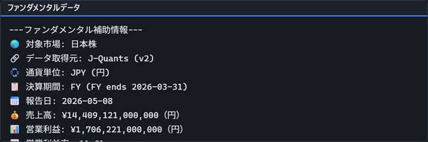

企業のファンダメンタル情報。

**④ News（右）**

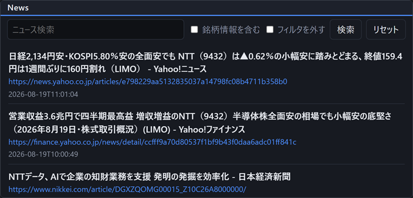

関連ニュースの見出し（クリックで別タブの元記事）。ニュース検索もできます。

**⑤ 市況データ（右下）**

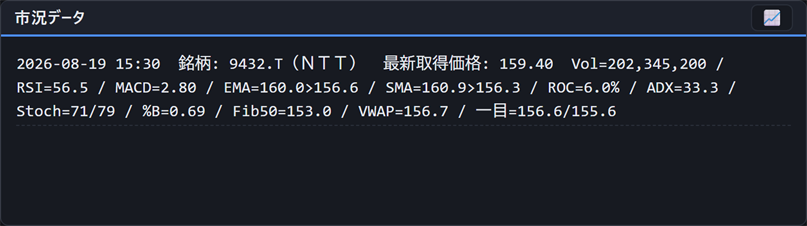

市況サマリ。📈 で別ウィンドウのチャート。

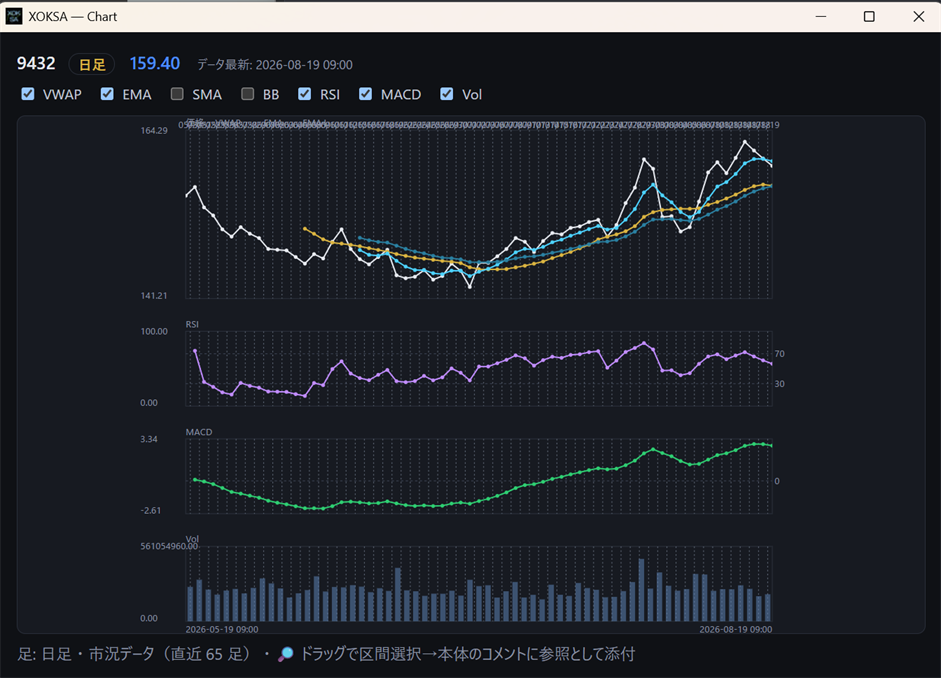

**⑥ チャット / コマンド（下）**
質問を打つ欄。「今日の状況を教えて」のように入力して Enter（後述）。

---

## 2. チャット

銘柄を選んだら、下の「**チャット / コマンド**」欄に質問を打って Enter（改行は Shift+Enter）。画面に出ている数値・ニュースをもとに答えが返ります。対象は、いまチップで選んでいる銘柄です。回答する AI は上部の「**AI の選択**」で選べます。

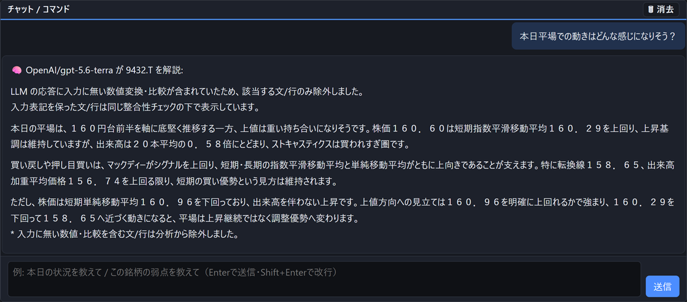

- 前の答えを踏まえて続けて聞けます（例「では買い時は？」）。
- 質問の例：「今日の状況を教えて」／「弱点は？」／「なぜ下げている？」

**チャートの区間を指定して聞く**

市況データ欄の 📈 でチャートを別ウィンドウに開き、気になる区間をドラッグで選びます。

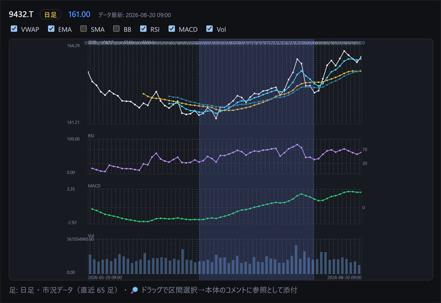

選ぶと、チャット欄の上に 📎 のチップが付きます。

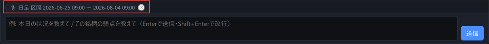

この状態で質問を打って送ると、その区間が参照として一緒に渡ります。添付はチップの × で外せます。送信すると自動的に外れます。

**複数の銘柄を比べる**

チップで複数の銘柄をチェックすると、まとめて比較できます。XOKSA が銘柄を探して推薦するのではありません。ここでは、あなたが候補として選んだ銘柄を同じ基準で比較し、検討対象を絞る作業を支援します。

例として、通信3社と TOPIX 連動型 ETF の4つをチェックします。

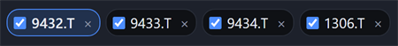

この状態で「どの銘柄を優先すべき？」と聞くと、4銘柄を並べて答えます。

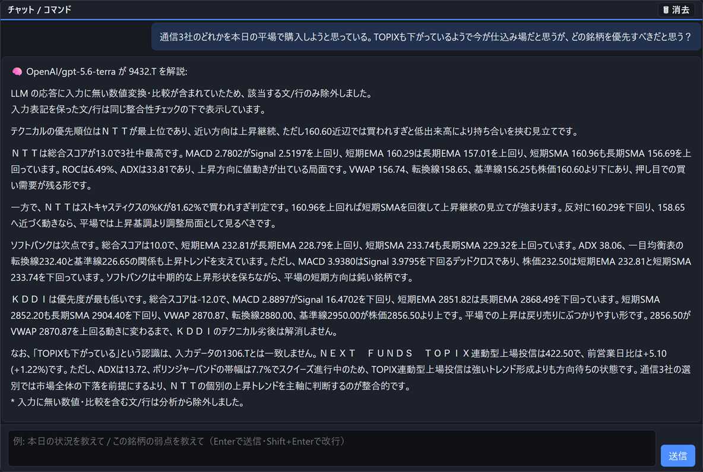

**チャットコマンド**

`/` で始まるチャットコマンドが使えます。一覧は右上の **?**（ヘルプ）で開けて、**行をクリックするとチャット欄に入ります**（全部を覚える必要はありません）。

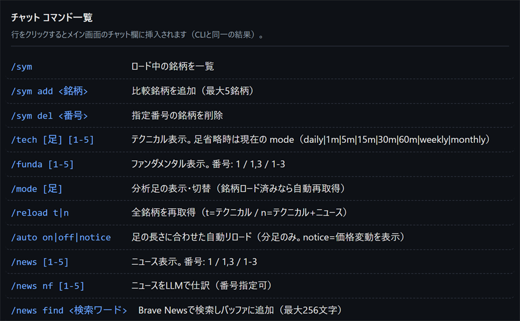

例えば `/status` を送ると、いまのチャットの状態が出ます。

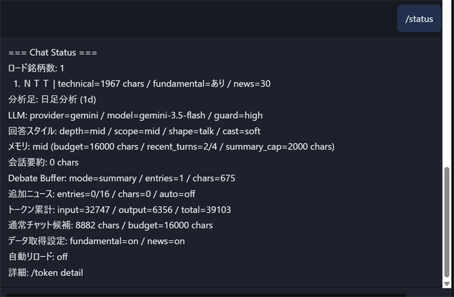

**別の AI に批評させる**

AI の答えのうち、どこが xoksa のデータで裏づけられているかは、読むだけでは分かりません。`/crit` は、直前の AI の答えを別の AI に批評させるチャットコマンドです。答え全体を疑う代わりに、根拠の弱い箇所だけを外して読めます。ローカルの小さな AI に答えさせ、クラウドの AI に批評させる、といった使い方もできます。

批評する AI は、その答えを xoksa のデータと突き合わせ、問題のある記述だけを挙げます。

- xoksa のデータと数値や方向が食い違う記述
- xoksa のデータでは確認できない根拠にもとづく主張
- ニュース本文を読んだかのような記述（本文は取得していません）
- データ時点がずれている可能性のある比較

先に ⚙ 設定で「自動更新」のチェックを外します。分析中に数値が変わると、その差も批評に出ます。

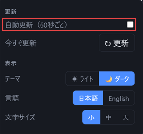

まず、ある AI に質問して答えをもらいます。ここではローカルの Ollama に答えさせています。

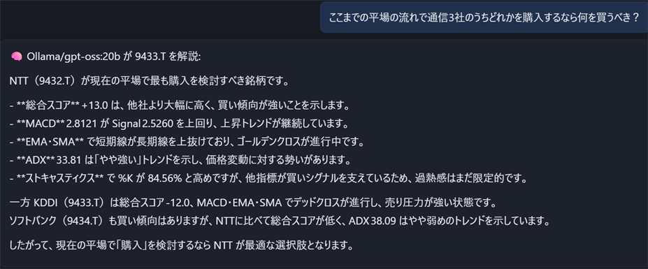

上部の「AI の選択」で、別の AI に切り替えます。

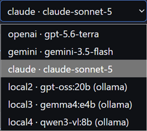

切り替えたら `/crit` を送ります。批評は、対象にした AI とモデル、元の質問に続けて表示されます。

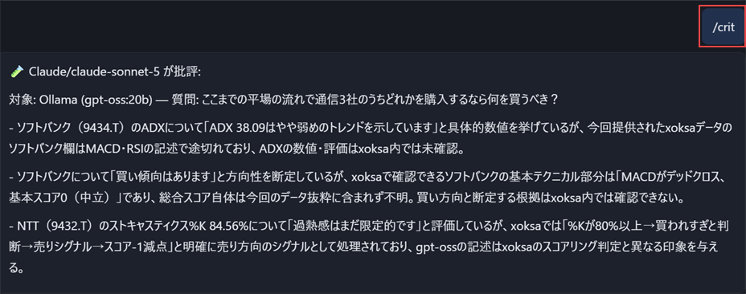

知りたいことは、継続して会話することができます。

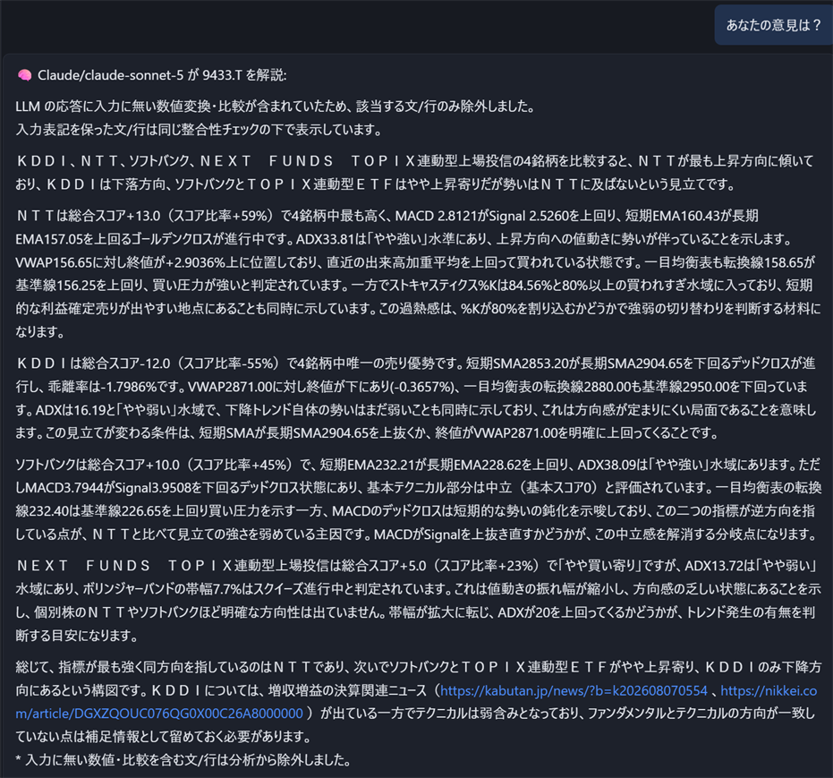

**複数の AI に会議させる**

`/forum` は、複数の AI に同じ議題を投げて議論させる機能です。議題はあなたが出し、参加者がそれぞれの見解を述べ、Chair（まとめ役）が進行して総括します。

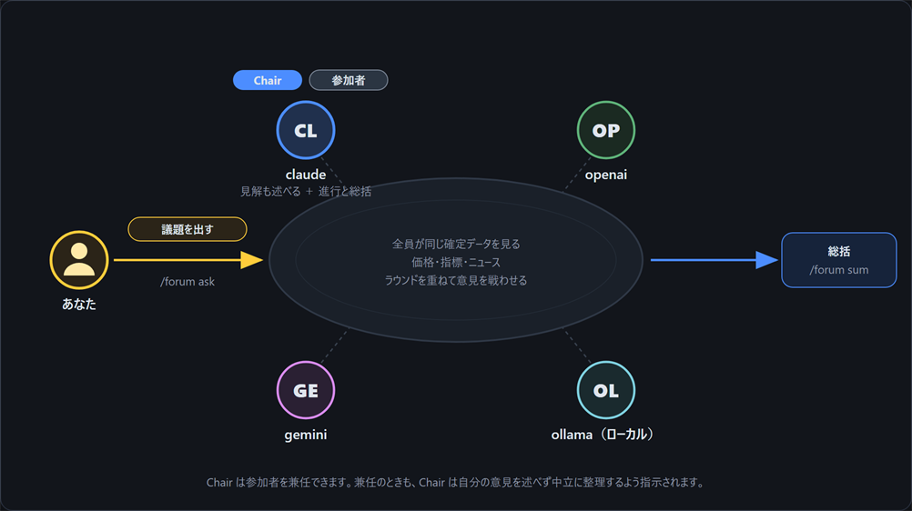

Chair は参加者を兼任できます。そのときも Chair としての役割は分けられていて、自分の意見を述べず、各参加者の立場・合意点・対立点を中立に整理するよう指示されます。人が議長を兼ねたときのような「自分の案を通す」動きにはなりません。

まず参加者と Chair を決めて、議題を出します。`ask` のあとの数字はラウンド数です。

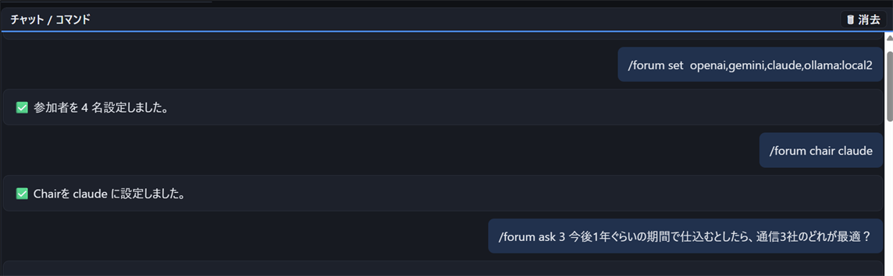

各参加者が、同じ確定データを見て見解・根拠・懸念点を述べます。

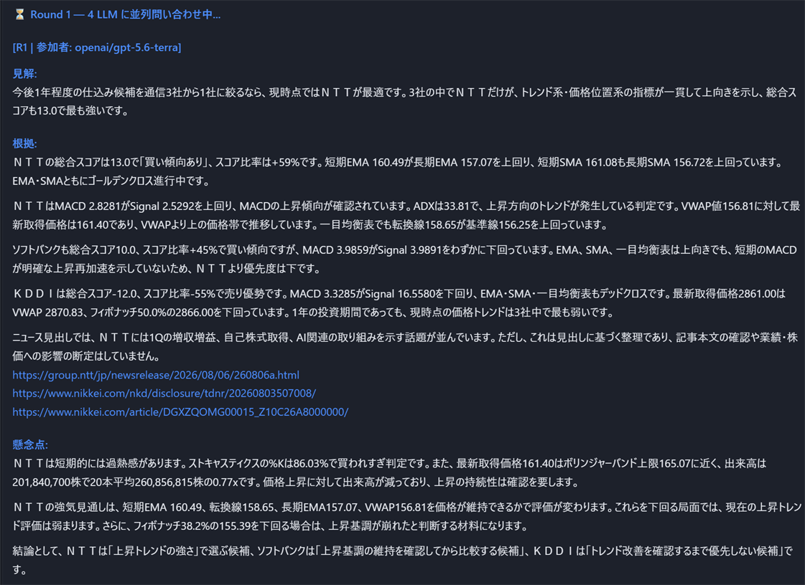

ラウンドごとに Chair が、各参加者の立場・合意点・対立点をまとめ、次のラウンドで詰める問いを出します。

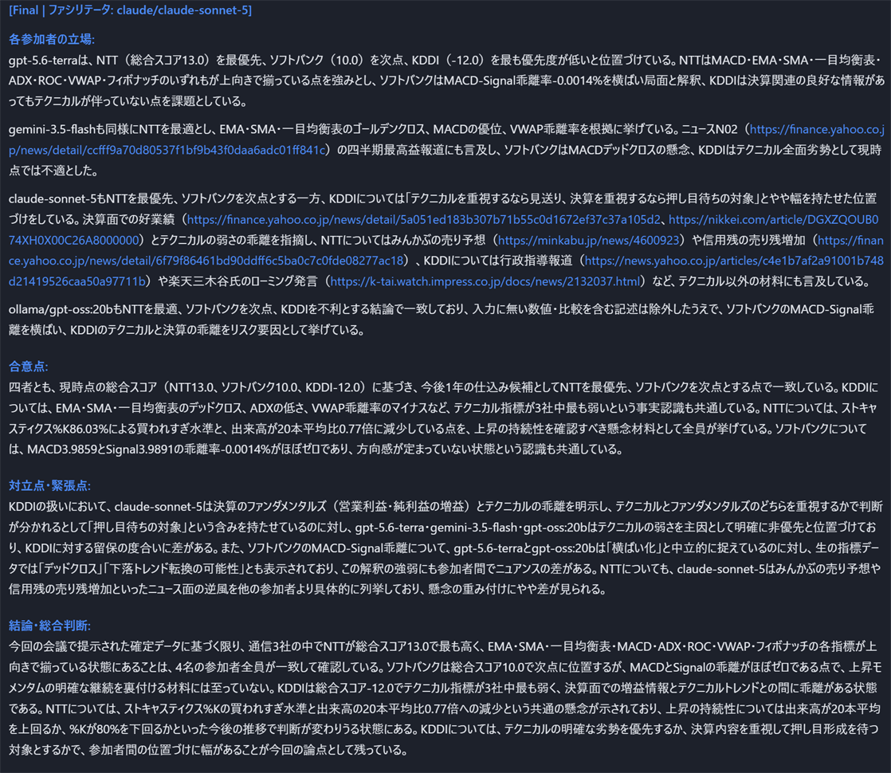

最終ラウンドでは、次への問いに代えて結論・総合判断を出します。

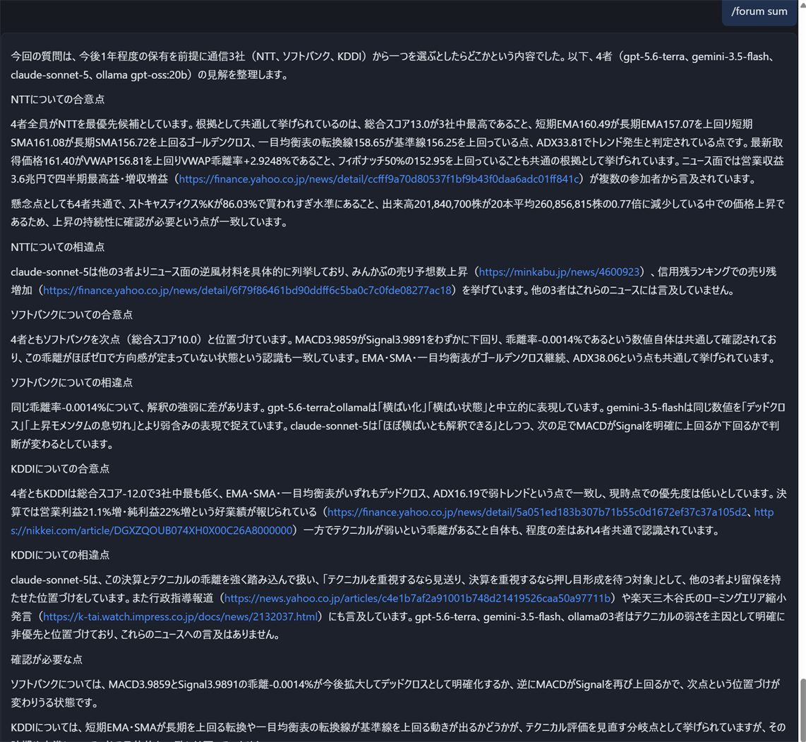

`/forum sum` を送ると、それまでの議論を Chair が改めて総括します。

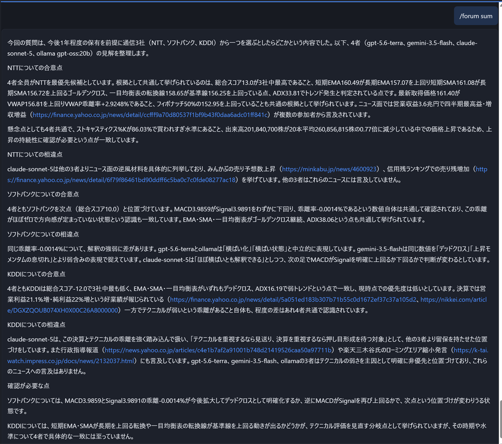

- `/forum` — 参加者・Chair・使い方を表示
- `/forum set <p,...>` — 参加者を決める
- `/forum chair 
` — まとめ役を決める（`reset` で初期化）
- `/forum ask [rN] <議題>` — 議題を出す（`rN` でラウンド数）
- `/forum sum` — Chair が総括する
- `/forum log` — 議事録を表示する
- `/forum clear` — 議事録と検討バッファを消す

---

## 3. ツール

ヘッダーの「ツール」から機能を開きます。選ぶとその場で実行され、表示は「ツール」に戻ります。

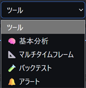

### 3.1 🧠 基本分析

チェックしている銘柄を、選んでいる足種で分析します。結果はチャット欄に出ます。チャットで `/basic` を送るのと同じです。

出てくる項目は次の6つです。

- 📊 投資家が注意すべきポイント（400文字以内）
- 📉 短期目線（200文字以内）
- 📆 中期目線（200文字以内）
- 📚 ファンダメンタル補助情報（800字以内）
- 📰 ニュースハイライト（1000字以内）
- 📝 総評（2000字以内）

短期目線と中期目線の名前は足種で変わります。5分足なら「5分足ベースの短期目線」「数営業日目線」、日足なら「1週間の短期目線」「1ヶ月の中期目線」です。ファンダメンタル補助情報は、その銘柄のファンダメンタルデータが取れているときに出ます。

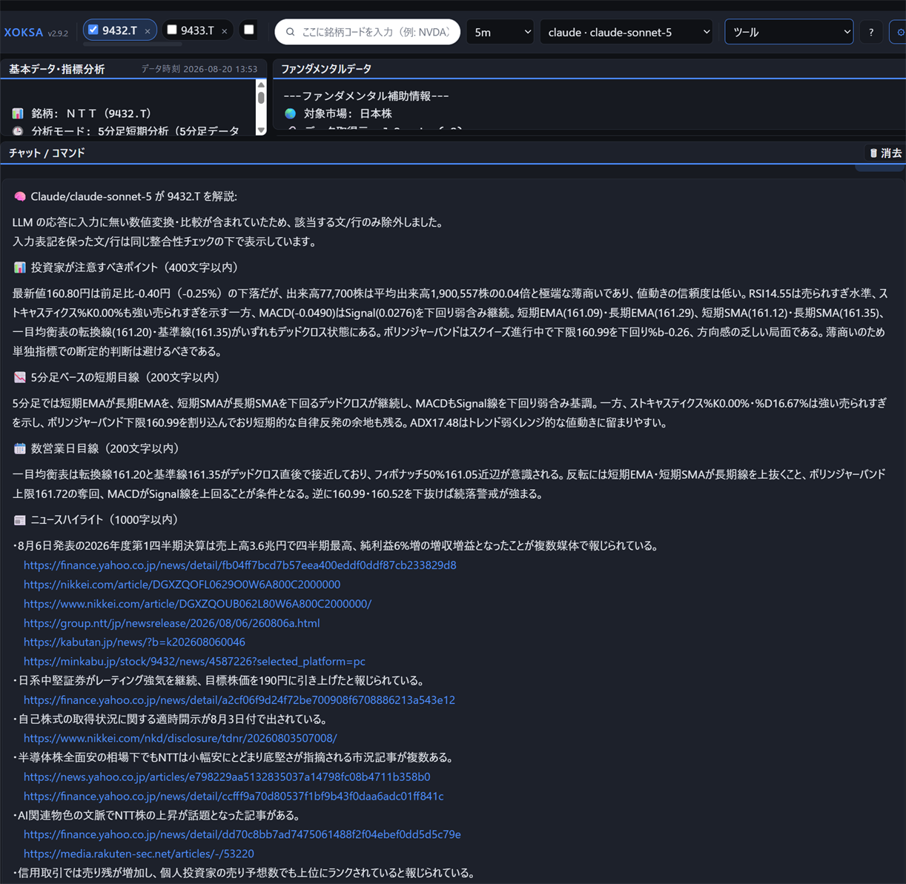

### 3.2 📐 マルチタイムフレーム

月足の MACD、日足のボリンジャーバンド、5分足の価格をまとめて取り、その3つを AI が解説します。長い足と短い足で向きが揃っているかを見るためのものです。

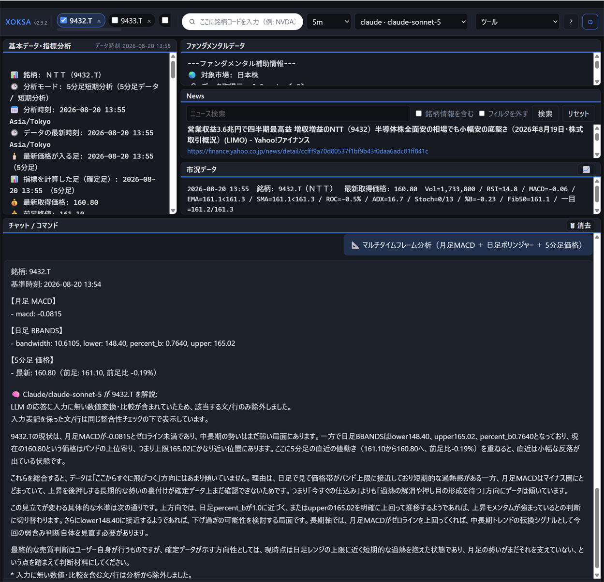

### 3.3 🧪 バックテスト

買い・売りの条件を決めて、過去のデータで試します。

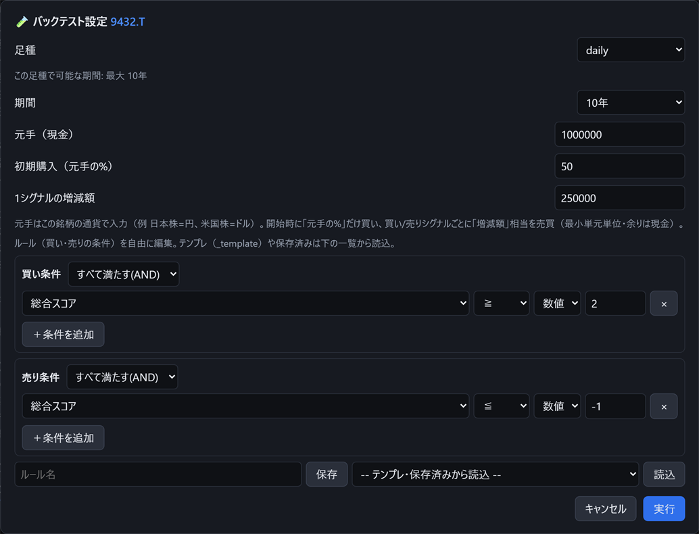

- 足種と期間 — 足種を選ぶと、その足で使える最大期間が表示されます。
- 元手（現金） — その銘柄の通貨で入力します（日本株なら円、米国株ならドル）。
- 初期購入（元手の%） — 開始時にこの割合だけ買います。
- 1シグナルの増減額 — シグナルが出るたびに、この金額相当を売買します（最小単元単位、余りは現金のまま）。
- 買い条件・売り条件 — 指標と比較を組み合わせます。条件は追加できます。
- ルール名を付けて保存でき、テンプレ（`_template`）や保存済みを読込から呼び出せます。
- 指標は、値が出るまでに一定の本数が必要です。その足で値が出せない場合、その指標を使った条件はそこでは成立しません。売買が1回も起きないときは、指標に対して期間が短すぎないか確認してみてください（期間を長くする、または指標の設定を短くする）。もちろん、本数が足りていても条件が一度も成立しなければ 0 件になります。

実行すると、結果がチャット欄に出ます。試したルールの成績と、同じ期間を「ただ買って持ち続けた」場合の成績が並びます。

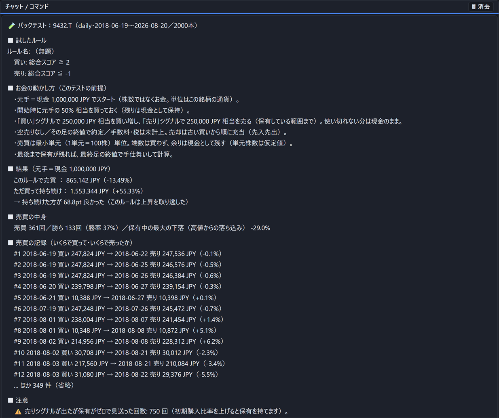

### 3.4 🔔 アラート

決めた条件が成立したときに、チャットアプリへ1行で通知します。

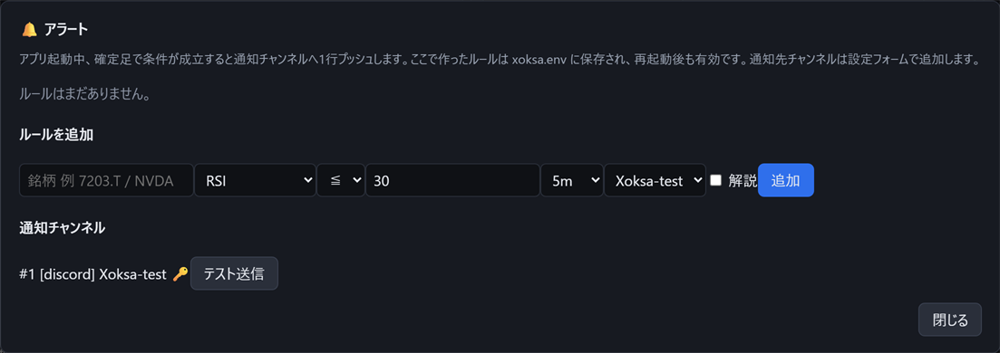

- 銘柄・指標・条件・足種・通知先を選んで「追加」。「解説」を付けることもできます。
- **ルールは16件までです。**いっぱいのときは、どれか削除すると空きができます。
- 見張るのはルールに書いた銘柄です。**その銘柄を画面に出しておく必要はありません。**別の銘柄を見ていても、ダッシュボードを閉じていても監視は続きます。
- 通知は、アプリが動いている間に出ます。アプリを終了すると止まります。判定に使うのは**取得した最新の足**で、日本株の分足では**まだ形成中の足**を含みます。足が閉じるのを待たないので、足の途中で条件に触れた時点で通知が出ます。
- 作ったルールは保存され、再起動後も有効です。チャットの `/alert add` で作った場合も同じです。
- 「有効／無効」の切り替えは**起動中だけ**です。無効にしたまま再起動すると、有効に戻ります。
- 通知先のチャンネルは設定フォームで追加します。「テスト送信」で疎通を確認できます。

通知はこのように届きます。

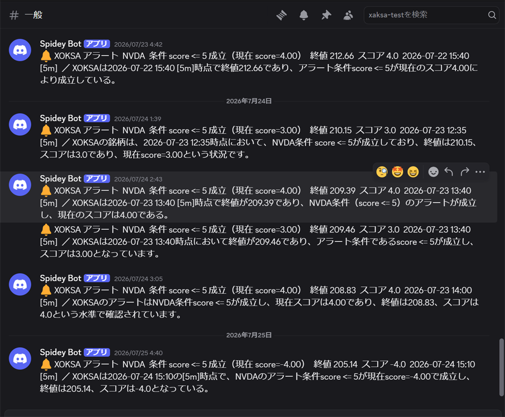

> 通知の言語は、ダッシュボードの表示言語ではなく `xoksa.env` の `LANG`（設定アプリの「言語」）に従います。

> `xoksa.env` の `ALERT_*` を手で書き換えたときは、**再起動するまで反映されません**。アラートのルールは起動時に一度だけ読み込みます。設定アプリの「エンジンを再起動」で反映できます。

---

## 4. 次に読むもの

ここまでで、画面の見方・チャット・ツールはひととおり使えます。さらに踏み込むときは、次を参照してください。

- [分析ガイド](analysis-guide.md) — 各指標の意味、総合スコアの出し方、実戦での使い方。
- [コマンドリファレンス](command-reference.md) — チャットコマンドと CLI の全オプション。
- [セットアップ・連携ガイド](setup.md) — 導入、API キー、出力（CSV / JSON）の活用。

内部の設計やセキュリティに関心があれば、開発者向けの文書があります。

- [設計思想とアーキテクチャ](../dev-prog/design-philosophy.md)
- [システム・アーキテクチャ概要](../dev-prog/system-design.md)
- [セキュリティ設計](../dev-prog/security-design.md)
- [セキュリティ・信頼性・出荷検査](../dev-prog/security-assessment.md)
- [ソースコードマップ](../dev-prog/source-map.md)
